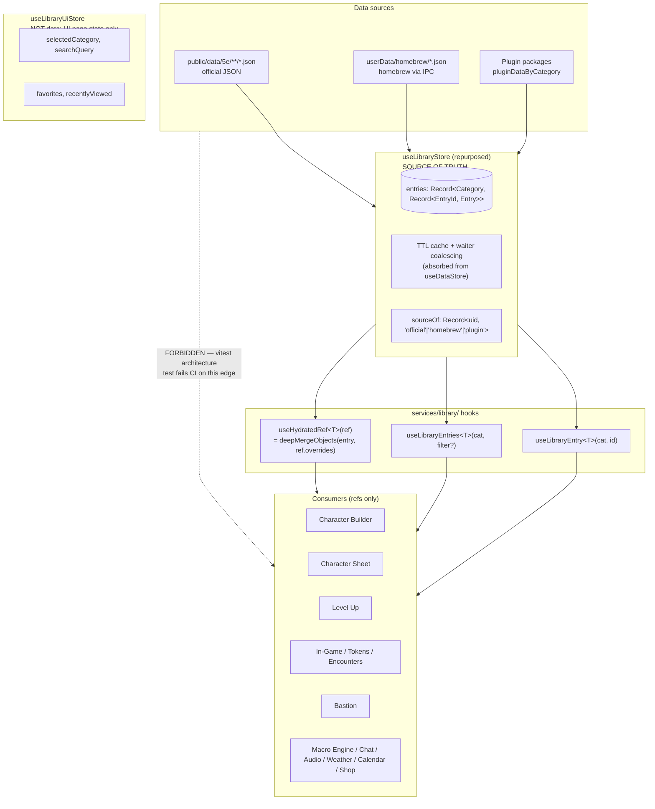

# Phase 15 — Library as Single Source of Truth

## Context

Phase 15 is a data-layer consistency sweep plus a store-architecture rewrite. The library becomes the only canonical store for D&D content data. Every consumer — Character Builder, Character Sheet, Level Up flow, in-game token / NPC / spell / condition UIs, Bastion management, encounter builder, dice macro autocomplete, chat tab-complete, anywhere D&D content appears — becomes a consumer that holds references (`{ entryId, entryType, overrides? }`), never embedded JSON.

The motivation:

1. One developer fix reaches every consumer. When a developer corrects a spell description, fixes monster CR, or rebalances a magic item, the change propagates instantly to every character record, encounter slot, token detail panel, and chat tab-complete result — no reload, no migration.
2. The guarantee survives customization. When a player renames a magic item to "Pew Pew" or tweaks a homebrew's nested component, the developer's later fix to unrelated fields still reaches that player via shallow + recursive-object merge at the override boundary (arrays replace atomically).
3. No parallel data, no drift. Inline copies of library data on character / campaign / encounter records become impossible — both by convention (everywhere uses `EntryRef`) and by enforcement (a vitest architecture test fails the build on raw `public/data` imports outside the library service layer).

Three concrete drift scenarios Phase 15 eliminates: errata propagation (WotC errata to a magic item reaches every player carrying it on next render), homebrew rebalance (DM tightens a spell's damage and every character + encounter + macro using it reflects the change on next read), and condition wording (a fix to *Frightened*'s description reaches every active token tooltip, sheet panel, chat status, and encounter preview within one render frame).

## Depends on / blocks

- Depends on: existing v3 migration framework in `src/main/storage/migrations.ts`
- Blocks: Phase 16 Sub-Phase E Step 14 (CompendiumModal merge — absorbed); Phase 22 H4 (service-layer bypasses — absorbed); Phase 23 Sub-Phase F M2 (attunement mismatch — absorbed); Phase 25 H2 (homebrew Zod schemas — absorbed); Phase 25 H4 / M2 (storage unify + builder integration — absorbed); Phase 26 Step 10/11 (encounter shape coordinates); Phase 31 (library + character shards depend on this store shape); Phase 35 (IPC schema reuse imports `schemas/registry.ts`); Phase 36 (Pi-hosted library swaps the loader source under the same architecture)

## Files touched

| Path | Role |
|------|------|
| `src/renderer/src/types/library.ts` | New `EntryRef`, `DeepPartial`, `LibraryEntry<T>`, `MergedEntry<T>`, `isEntryRef`, per-category typed entry interfaces |
| `src/renderer/src/types/character-common.ts` | Move `SpellEntry`, `WeaponEntry`, `ArmorEntry` to library-side shape; drop legacy `attuned` from item shape |
| `src/renderer/src/types/character-5e.ts` | Rewrite `Character5e` with `*Ref(s)` fields + `state` siblings keyed by `instanceId` |
| `src/renderer/src/services/library/schemas/*.schema.ts` (new dir, ~55 files) | One Zod schema per `LibraryCategory` extending `BaseLibraryEntrySchema` |
| `src/renderer/src/services/library/schemas/registry.ts` (new) | `SCHEMA_REGISTRY`, `validateEntry`, `safeValidateEntry` |
| `src/renderer/src/services/library/use-library-entry.ts` (new) | `useLibraryEntry`, `useLibraryEntries`, `useHydratedRef` hydration hooks |
| `src/renderer/src/services/library/merge.ts` (new) | `deepMergeObjects` — recursive object merge, atomic array replace |
| `src/renderer/src/services/library/library-boundary.test.ts` (new) | Vitest architecture spec — fails CI on raw `public/data` imports / fetches / inlined library-shape literals outside allowlist |
| `src/renderer/src/services/library/README.md` (new) | Contract doc for hydration hooks + override discipline |
| `src/renderer/src/services/library-service.ts` | Plug 60+ load functions into new store via `loadCategory` action instead of `useDataStore.cache` |
| `src/renderer/src/services/data-provider.ts` | Stays — 83 `load5eX()` exports become thin wrappers around `useLibraryStore.loadCategory` + `getEntries` for non-React imperative access |
| `src/renderer/src/services/adventure-loader.ts` | Migrate `fetch('/data/5e/...')` to `useLibraryStore.loadCategory(...)` (Sub-Phase G removes from boundary allowlist) |
| `src/renderer/src/services/macro-engine.ts` | Variable resolution walks live library via refs |
| `src/renderer/src/services/chat-commands/*` | Tab-complete hits `useLibraryEntries`; existing `services/library/content-index.ts` absorbed |
| `src/renderer/src/stores/use-library-store.ts` | Rewrite as truth store (was UI-only). Holds `entries`, `sourceOf`, `cacheMeta`, `loaded`; exposes `getEntry`, `getEntries`, `loadCategory`, `refresh`, `upsertHomebrew`, `deleteHomebrew`, `loadHomebrew`, `loadPluginContent` |
| `src/renderer/src/stores/use-library-ui-store.ts` (new) | UI state spun out — `selectedCategory`, `searchQuery`, `recentlyViewed`, `favorites`, setters |
| `src/renderer/src/stores/use-data-store.ts` | Deleted in Sub-Phase H after all consumers migrate |
| `src/renderer/src/stores/use-plugin-store.ts` | Stays for plugin metadata; library entries route through `useLibraryStore.entries` with `sourceOf[uid]='plugin'` + `pluginId` tag |
| `src/renderer/src/stores/builder/slices/*` | Builder state rewritten to `*Ref(s)` shape |
| `src/renderer/src/stores/level-up/*` | Level-up slices read library, persist refs |
| `src/renderer/src/stores/bastion-store/*` | Facilities / services / hirelings rewritten to refs + state |
| `src/renderer/src/components/builder/5e/*` (~20 files + tests) | Replace direct JSON imports with hydration hooks |
| `src/renderer/src/components/sheet/5e/*` (~88 files) | Same conversion; reads instance state from `character.state.*` |
| `src/renderer/src/components/levelup/5e/*` | Same |
| `src/renderer/src/components/game/**` (DM, player, sidebar, modals, overlays, bottom, map, modal-groups) | Same; token/encounter records hold refs + state |
| `src/renderer/src/components/bastion/*` (new directory) | New Bastion UI (`BastionDashboard`, `FacilityList`, `FacilityDetail`, `BastionEventsPanel`, `BastionHirelingList`, `BastionOrdersPanel`, `BastionRoomEditor`) |
| `src/renderer/src/components/library/MigrationReportModal.tsx` (new) | First-launch v4-migration report with re-link flow |
| `src/renderer/src/data/personality-tables.ts` (+ test) | Deleted in Sub-Phase H; contents move to library |
| `src/main/storage/migrations.ts` | Bump `CURRENT_SCHEMA_VERSION` to 4; add `MIGRATIONS[4]` calling `migrateCharacter5eToRefs` for `gameSystem === 'dnd5e'` |
| `src/shared/migrations/v4-character-refs.ts` (new) | Shared migration core — pure, used by main `MIGRATIONS[4]` and renderer `BACKUP_MIGRATIONS[4]` |
| `src/main/storage/snapshot.ts` (new) | Writes `<savefile>.pre-phase-15.bak` once at v3→v4 step; idempotent |
| `src/renderer/src/services/io/import-export.ts` | Add `BACKUP_MIGRATIONS[4]` calling shared migration core |
| `src/main/ipc/*` | New `getMigrationReport()` channel |
| `AGENTS.md` | Add "Data layer rules" section linking `services/library/README.md` |
| `CLAUDE.md` | Add data-layer sub-bullet under "When adding new dnd-app files" |
| `docs/phases/bastion-data-rule.md` (new) | Bastion contributor rules |
| `docs/SUGGESTIONS-LOG-DNDAPP.md` | Append `info` entry summarizing Phase 15 invariants |

## Sub-phase summary

| # | Sub-phase | Theme |
|---|-----------|-------|
| 15a | Foundation | Truth store, hydration hooks, schemas, migration v4, build guard |
| 15b | Character Builder sweep | Every builder file reads via hooks; builder state holds refs |
| 15c | Character Sheet sweep | `Character5e` rewritten with refs + `state`; every sheet file ref-shaped |
| 15d | Level Up sweep | Class/subclass features sourced from library; multiclass via `classRefs` |
| 15e | In-Game sweep | Tokens, encounters, modals, overlays read via hooks; encounter slots ref-shaped |
| 15f | Bastion | Store refactored to refs; new `components/bastion/` UI shipped ref-shaped |
| 15g | Misc / Macro / Chat / Audio / Weather / Calendar / Shop | Macro engine + chat tab-complete + UI config consumers; allowlist shrinks to `services/library/**` |
| 15h | Cleanup | Delete legacy parallel-data files; cut v3.0.0 release |

Serial order: `15a → 15b → 15c → 15d → 15e → 15f → 15g → 15h`. Each sub-phase ends with the 4-gate suite green (`npm run lint && npx tsc --noEmit -p tsconfig.web.json && npx tsc --noEmit -p tsconfig.node.json && npx vitest run`), commit, lightweight tag (`phase-15a-done`, …), then advance. No pre-releases; a single `v3.0.0` cuts after 15h via `dnd-app/scripts/release/cut.mjs`. The major bump is warranted — `MIGRATIONS[4]` changes the on-disk save schema.

## Architecture / data flow

**Reading the diagram.** Three data sources feed exactly one store. Loaders absorb into `useLibraryStore.entries[category][entryId]` and tag the entry's uid in `sourceOf` so consumers can audit provenance without branching on it (lint forbids `if (source === 'homebrew')` branches in consumer code). Three hooks are the only reads consumers make: `useLibraryEntry`/`useLibraryEntries` return raw entries (the library page itself, the "Add Monster from Library" drawer, tab-complete); `useHydratedRef` takes an `EntryRef` and returns the merged entry — 95% of consumers use this. The dotted forbidden edge is the regression class Phase 15 closes; the vitest architecture test enforces it.

**Override + state contract.** Two distinct things on a consumer record:

| Concept | Lives where | Example | Sync behavior |
|---|---|---|---|
| Reference + overrides | `EntryRef { entryId, entryType, overrides?: DeepPartial<Entry> }` | `{ entryType: 'magic-items', entryId: 'wand-of-magic-missiles', overrides: { name: 'Pew Pew' } }` | Persists with the consumer record; broadcast on player-intent changes |
| Instance state | Sibling field on the consumer record | `state: { currentCharges: 5, attuned: true }` | Persists with the consumer record; high-frequency sync hot path during play |

Overrides express player intent that should persist and propagate. Instance state expresses runtime per-entity values that mutate every round of play. Never mix. A current-HP value never goes in `overrides`; a renamed magic item never goes in `state`.

**Merge semantics.** `useHydratedRef` walks `ref.overrides` recursively. Plain object values merge key-by-key with the corresponding library value; arrays replace atomically; primitives replace; `undefined` skips. This delivers "one fix everywhere" at full depth for object-typed fields while keeping array-typed fields as "if the player customized this list, they own it."

## Sub-phase details

### 15a — Foundation

**Files:**
- `src/renderer/src/types/library.ts` (currently lacks `EntryRef`, `DeepPartial`, `LibraryEntry<T>`, `MergedEntry`, `isEntryRef`)
- `src/renderer/src/services/library/schemas/` (new dir; one `*.schema.ts` per `LibraryCategory` plus `registry.ts`; ~55 files)
- `src/renderer/src/stores/use-library-store.ts:29-152` (currently holds UI state only: `selectedCategory`, `searchQuery`, `recentlyViewed`, `favorites`)
- `src/renderer/src/stores/use-library-ui-store.ts` (new — receives spun-out UI state)
- `src/renderer/src/services/library-service.ts` (1148-line loader/normalizer — route results to new store via `loadCategory`)
- `src/renderer/src/services/library/use-library-entry.ts` (new — `useLibraryEntry`, `useLibraryEntries`, `useHydratedRef`)
- `src/renderer/src/services/library/merge.ts` (new — `deepMergeObjects`)
- `src/main/storage/migrations.ts:1` (currently `CURRENT_SCHEMA_VERSION = 3`; bump to 4; add `MIGRATIONS[4]`)
- `src/shared/migrations/v4-character-refs.ts` (new — shared migration core)
- `src/main/storage/snapshot.ts` (new — `snapshotIfFirstMigration`)
- `src/renderer/src/services/io/import-export.ts` (add `BACKUP_MIGRATIONS[4]`)
- `src/renderer/src/components/library/MigrationReportModal.tsx` (new)
- `src/renderer/src/services/library/library-boundary.test.ts` (new — ~120-line vitest spec; <500ms budget)
- `src/renderer/src/services/library/README.md` (new)

**Steps:**

1. Add `EntryRef<T>`, `DeepPartial<T>`, `LibraryEntry<T>` per-category mapped type, `MergedEntry<T>`, `isEntryRef` to `src/renderer/src/types/library.ts`. Move `SpellEntry`/`WeaponEntry`/`ArmorEntry` from `character-common.ts` to library-side shape.
2. Add `BaseLibraryEntry` + `BaseLibraryEntrySchema` (id, name, source enum, optional `createdAt`/`updatedAt`/`pluginId`) — every per-category schema extends. Absorbs Phase 25 H2.
3. Create one schema file per `LibraryCategory` under `src/renderer/src/services/library/schemas/` (`spell.schema.ts`, `monster.schema.ts`, `item.schema.ts`, `feat.schema.ts`, …~55 files) using `.passthrough()`. `item.schema.ts` enforces `requiresAttunement: boolean` only — rejects the legacy `attuned` field on library entries (instance state lives elsewhere).
4. Create `schemas/registry.ts` exporting `SCHEMA_REGISTRY: Record<LibraryCategory, z.ZodSchema>`, `validateEntry(category, raw)`, `safeValidateEntry(category, raw)`.
5. Add snapshot test `schemas/registry.test.ts` walking `src/renderer/public/data/5e/**/*.json`, dispatching to schemas by filename, asserting all entries parse.
6. Spin UI state out of `use-library-store.ts:29-152` into new `src/renderer/src/stores/use-library-ui-store.ts`. Update Library page (`pages/LibraryPage.tsx`) and `components/library/*` imports.
7. Rewrite `src/renderer/src/stores/use-library-store.ts` as truth store with `entries`, `sourceOf`, `cacheMeta`, `loaded`; expose `getEntry`, `getEntries`, `loadCategory`, `refresh`, `clearAll`, `upsertHomebrew`, `deleteHomebrew`, `loadHomebrew`, `loadPluginContent`. Absorb TTL cache + waiter coalescing from `use-data-store.ts`.
8. Plug `library-service.ts` (60+ load functions) into the new store via `loadCategory`. Each function reroutes from `useDataStore.cache` to `useLibraryStore.entries[category]`.
9. Flip every `from .*use-data-store` import to `useLibraryStore`. Mechanical translation: `useDataStore.get(category, loader)` → `useLibraryStore.loadCategory(category)` + `getEntries(category)`. Leave `use-data-store.ts` in place (deletion is 15h).
10. Create `src/renderer/src/services/library/use-library-entry.ts` exporting the three hydration hooks, each composing a `useCallback`-stabilized selector.
11. Create `src/renderer/src/services/library/merge.ts` with `deepMergeObjects` + `isPlainObject` helper. Tests in `merge.test.ts` cover flat replace, nested object merge, array atomic replace, two-level deep merge, undefined skip, empty-override identity.
12. Bump `CURRENT_SCHEMA_VERSION` from 3 to 4 at `src/main/storage/migrations.ts:1`. Add `MIGRATIONS[4]` that delegates to `migrateCharacter5eToRefs` for `gameSystem === 'dnd5e'`.
13. Create `src/shared/migrations/v4-character-refs.ts` (pure, only `crypto.randomUUID`) implementing the inline-data-to-refs conversion per the field table. Includes orphan path (`entryId: 'orphan:<uuid>'` + full original as `overrides`), bare-id fallback for `species`/`background` (set ref to null + migration report entry), ambiguous-equipment fallback (best-guess category + warning), attunement migration (Design C — single `magicItemRefs` list keyed by stable `instanceId`, reuse legacy `MagicItemEntry5e.id`; lift `attuned`/`charges` to `state`), and pre-existing homebrew migration (walk `userData/homebrew/*.json`, validate against `SCHEMA_REGISTRY`, write failures to `userData/homebrew/incompatible/`).
14. Mirror `MIGRATIONS[4]` as `BACKUP_MIGRATIONS[4]` in `src/renderer/src/services/io/import-export.ts`; both call the shared core.
15. Create `src/main/storage/snapshot.ts` with `snapshotIfFirstMigration(saveFilePath, targetVersion)` — writes `<savefile>.pre-phase-15.bak` exactly once when stepping past v3; idempotent. Wire into `migrateData` at the v3→v4 boundary.
16. Migration accumulates `PerCharacterReport[]` and writes to `app.getPath('userData') + '/migration-report.json'`.
17. Add IPC channel `getMigrationReport()` returning the report JSON.
18. Create `src/renderer/src/components/library/MigrationReportModal.tsx` reading via IPC. Layout: header, summary, per-character orphan list with "Re-link" picker, "Don't show this again" checkbox writing `migrationReportDismissed: true` to app-level settings.
19. Create `src/renderer/src/services/library/library-boundary.test.ts` (~120 lines). Allowlist: `src/renderer/src/services/library/`, `src/renderer/src/stores/use-library-store.ts`, `src/renderer/src/services/library-service.ts`, `src/renderer/src/services/adventure-loader.ts` (last is 15g cleanup). Three checks: no consumer imports `public/data/**`; no consumer fetches `/data/5e/**`; no consumer literal has ≥3 library-shape keys (`name`, `description`, `damage`, `traits`, `level`, `school`, `hit_die`, `ability_score_increase`, `casting_time`, `range`). Inline opt-out `// boundary-allow: <reason>` (reason required after the colon). Budget: <500ms; split if it grows past.
20. Create `src/renderer/src/services/library/README.md` documenting the `EntryRef` contract, reads via hooks, merge behavior, forbidden patterns, inline opt-out, and the rule that React uses hooks while services + main-process use `data-provider`.

**Acceptance:** `useLibraryEntry`, `useLibraryEntries`, `useHydratedRef` exist with unit tests against a mocked store. `useLibraryStore` exposes the listed read + load + homebrew/plugin APIs. `useLibraryUiStore` exists and the Library page renders unchanged. Schemas exist for every `LibraryCategory`; snapshot test passes against all of `public/data/5e/**`. `MIGRATIONS[4]` covers the full Character5e inline-field set; round-trip + orphan + idempotency + `.bak` non-overwrite tests pass. `MigrationReportModal` renders against a mocked report; `getMigrationReport` IPC resolves. Boundary test currently passes (no offenders yet — 15b–15g keep it passing). `services/library/README.md` committed. 4-gate green; tag `phase-15a-done`.

### 15b — Character Builder sweep

**Files:**
- `src/renderer/src/components/builder/5e/*` (~20 source files + tests: `CharacterBuilder5e.tsx`, `DetailsTab5e.tsx`, `ContentTabs5e.tsx`, `MainContentArea5e.tsx`, `CharacterSummaryBar5e.tsx`, `MulticlassLevelBar5e.tsx`, `GearTab5e.tsx`, `EquipmentShop5e.tsx`, `HigherLevelEquipment5e.tsx`, `SpellsTab5e.tsx`, `SpellPicker5e.tsx`, `CantripPicker5e.tsx`, `SpellSummary5e.tsx`, `LanguagesTab5e.tsx`, `SpecialAbilitiesTab5e.tsx`, `BackstoryEditor5e.tsx`, `PersonalityEditor5e.tsx`, `AppearanceEditor5e.tsx`, `gear-tab-types.ts`)
- `src/renderer/src/stores/builder/slices/builder-spells.ts`, `selection-slice.ts`, `core-slice.ts`, `character-details-slice.ts`, and any slice importing `public/data/5e/**`

**Steps:**

1. Convert direct JSON imports to hooks. Replace `import speciesData from '/public/data/5e/origins/species.json'` + `.find(...)` with `useLibraryEntry('species', builderState.speciesId)`. Apply across every builder component.
2. Rewrite builder local-state shape in `stores/builder/slices/*`: replace inline shapes with `speciesRef: EntryRef<'species'> | null`, `classRefs: Array<{ classRef, level, subclassRef? }>`, `backgroundRef`, `featRefs`, `knownSpellRefs`, `equipmentRefs`. Move prepared-spell state to sibling `state.preparedSpellIds`.
3. Side panel: convert frozen JSON entry reads at pick time to `useLibraryEntry(category, builderState.<X>Ref?.entryId)` so library edits propagate live.
4. Convert consumers of `data/personality-tables.ts` (and any `*-tables.ts` discovered) to `useLibraryEntries('personality-tables' | 'random-tables' | 'trinkets', filter?)`. Replace `rollD4` / hard-coded length with `rollFrom(entries)` using `entries.length`. (The `.ts` file itself is deleted in 15h.)
5. Per-component spec tests: assert no `public/data` import in the file + a library mutation propagates to rendered output (mocked store).

**Acceptance:** Every file under `components/builder/5e/` reads via hydration hooks; `grep -rn "from.*public/data" src/renderer/src/components/builder/5e/` returns zero. Boundary test still passes. Per-component specs green. End-to-end smoke: fresh character built in dev server displays correctly; side panel reacts live when a homebrew entry is edited in another tab. 4-gate green; tag `phase-15b-done`.

### 15c — Character Sheet sweep

**Files:**
- `src/renderer/src/types/character-5e.ts` (rewrite `Character5e` with `*Ref(s)` shape + `state` siblings)
- `src/renderer/src/components/sheet/5e/*` (88 files; full conversion). Key files: `AbilityScoresGrid5e.tsx`, `ArmorManager5e.tsx`, `AttackCalculator5e.tsx`, `AttunementTracker5e.tsx`, `BackgroundPanel5e.tsx`, `CharacterTraitsPanel5e.tsx`, `ClassResourcesSection5e.tsx`, `CombatStatsBar5e.tsx`, `CompanionsSection5e.tsx`, `ConditionsSection5e.tsx`, `DeathSaves5e.tsx`, `EquipmentListPanel5e.tsx`, `MagicItemsPanel5e.tsx`, `SpellcastingSection5e.tsx`, `SpellPrepOptimizer.tsx`, `SpellSlotTracker5e.tsx`, …

**Steps:**

1. Rewrite `Character5e` type (`src/renderer/src/types/character-5e.ts`): all inline-data fields become `*Refs: Array<{ instanceId: string, ref: EntryRef<...> }>` per Design C (keyed by stable `instanceId`, not array index, not `entryId`). `state` block holds `preparedSpellIds`, `weaponEquipped`, `armorEquipped`, `magicItemCharges`, `magicItemAttuned`, all `Record<instanceId, ...>`. `customFeatures` stays inline. `speciesRef`/`backgroundRef` are `EntryRef | null` with null fallback for legacy unmatched ids.
2. For each sheet file: replace inline-data reads with `useHydratedRef(character.<X>Ref)` or `useLibraryEntry(category, id)`. Read runtime state from `character.state.<X>`.
3. Absorb Phase 23 F M2: `AttunementTracker5e.tsx` and `MagicItemsPanel5e.tsx` both read `Object.values(character.state.magicItemAttuned).filter(Boolean).length` for the count.
4. Death-save auto-applied conditions: matcher becomes `conditionRefs.some(r => r.ref.entryId === 'unconscious')`.
5. 3-attuned-max check + per-instance charges + per-instance equipped read from `state.magicItemAttuned`/`state.magicItemCharges`/`state.weaponEquipped`/`state.armorEquipped` (all keyed by `instanceId`).
6. Per-component tests: (a) no `public/data` import, (b) library mutation propagates, (c) instance-state mutations don't touch `overrides`.

**Acceptance:** `Character5e` has the new shape; `MIGRATIONS[4]` produces it from v3 saves. No `public/data` imports in `components/sheet/`. Round-trip: save → load → re-save byte-identical on a v4-shape character. Migration fixture v3 character migrates to v4 with `.bak` written, orphan chips for unmatched entries, expected counts in report JSON. Manual propagation: edit a spell description in the library, sheet's spell card re-renders without reload. 4-gate green; tag `phase-15c-done`.

### 15d — Level Up sweep

**Files:**
- `src/renderer/src/components/levelup/5e/*` (`AsiSelector5e.tsx`, `FeatSelector5e.tsx`, `HpRollSection5e.tsx`, `LevelSection5e.tsx`, `LevelSelectors5e.tsx`, `LevelUpConfirm5e.tsx`, `LevelUpSummary5e.tsx`, `LevelUpWizard5e.tsx`, `SpellSelectionSection5e.tsx`, `SpellSelector5e.tsx`, `SubclassSelector5e.tsx`)
- `src/renderer/src/stores/level-up/apply-level-up.ts`, `level-up-spells.ts`, `feature-selection-slice.ts`, `hp-slice.ts`, `spell-slot-slice.ts`, `types.ts`, `index.ts`

**Steps:**

1. Class progression: replace any `levelup-tables.ts` reads with `useLibraryEntry('classes', classId).features.filter(f => f.level <= currentLevel)`. Subclass features: same pattern on subclass entries.
2. ASI / feat choice: `useLibraryEntries('feats')` populates the picker; chosen value persists as `EntryRef<'feats'>`.
3. Spell slot table: read from the class entry's `spellSlotProgression` field. Expertise / fighting style / cantrip swap: choices persist as refs to corresponding categories.
4. Multiclass: `classRefs: Array<{ instanceId, classRef, level, subclassRef?, levelTaken }>` on `Character5e` (final shape from 15c). Level-up calculator reads from this single list; sheet class summary reads same.
5. Per-component spec tests: assert no `public/data` import and library-mutation propagation.

**Acceptance:** Level Up offers reflect live library entry for each class; a library edit to a class feature shows up next time the wizard opens. Multiclass 5/3/2 renders correctly; switching one class via Level Up rewrites only the relevant `classRefs[]` entry. 4-gate green; tag `phase-15d-done`.

### 15e — In-Game sweep

**Files:**
- `src/renderer/src/components/game/UnifiedStatBlock.tsx`, `GameLayout.tsx`, `GameModalDispatcher.tsx`
- `src/renderer/src/components/game/modals/utility/CompendiumModal.tsx` (absorbs Phase 16 E Step 14)
- `src/renderer/src/components/game/dm/*` and `player/*` (every modal / panel)
- `src/renderer/src/components/game/sidebar/*` — initiative tracker, conditions panel, `EquipmentTab.tsx`, `SpellsTab.tsx` (the last two currently bypass `useDataStore` via direct `window.api.game.load*` calls — absorbs Phase 22 H4)
- `src/renderer/src/components/game/modals/*`, `overlays/*`, `bottom/*`, `map/*`, `modal-groups/*`

**Steps:**

1. Token detail / NPC stat block / spell-cast modal / condition tooltip: `useHydratedRef(token.monsterRef ?? token.npcRef ?? token.playerCharacterRef)`, `useLibraryEntry('spells', castSpellId)`, `useLibraryEntry('conditions', conditionId)` respectively.
2. Initiative tracker: every row holds `EntryRef`; max HP read live from library; current HP from `token.state.currentHP`.
3. "Add Monster from Library" drawer: `useLibraryEntries('monsters' | 'creatures' | 'npcs', filter)`.
4. Encounter records shape: `monsterRefs: Array<{ instanceId, ref, count, startX?, startY?, instanceOverrides? }>`. Two patterns for "N of the same monster": `count: N` for identical stamp-outs vs. separate entries with distinct `instanceId` + `instanceOverrides` for individual customizations. Phase 26 Steps 10/11 use the same shape; field name is `instanceOverrides` (NOT `overrides`).
5. Token shape: `{ id, monsterRef, state: { position, currentHP, currentInitiative, appliedConditionIds, temporaryHP? } }`. Max HP and CR read live from library — library rebalance updates encounter difficulty without rebuilding the encounter.
6. Document array-override edge case: `instanceOverrides.actions = [...]` forks that monster's action list (atomic array replace); document explicitly for encounter authors.
7. Sidebar `EquipmentTab.tsx` + `SpellsTab.tsx`: replace direct `window.api.game.load*` calls with `useLibraryStore.loadCategory` + hooks (absorbs Phase 22 H4).
8. Per-component spec tests: ref-shape rendering, library-mutation propagation, boundary test still green.

**Acceptance:** Token detail panels render via refs; library edit to a monster's stat block reflects in open token panel within one frame. Encounter CR recomputes when referenced monster's CR changes. Renaming via `instanceOverrides.name` doesn't fork library — renamed copy still picks up library edits to other fields. 4-gate green; tag `phase-15e-done`.

### 15f — Bastion

**Files:**
- `src/renderer/src/stores/bastion-store/facility-slice.ts`, `event-slice.ts`, `types.ts`, `index.ts` (currently inline; refactor to refs + state)
- `src/renderer/src/components/bastion/*` (new directory; does not exist today)
- `src/renderer/src/App.tsx` (register route + nav-bar entry)
- `docs/phases/bastion-data-rule.md` (new, ~40 lines)
- `AGENTS.md` (link bastion-data-rule)

**Steps:**

1. Rewrite `stores/bastion-store/types.ts` `BastionFacility` to `{ id (instance), facilityRef, serviceRefs, hirelingRefs: Array<{ ref, state: { wage, hiredOn, status } }>, state: { level, constructionProgress, currentOrders } }`.
2. Update `facility-slice.ts` + `event-slice.ts` operations to produce refs + state (no inline library data).
3. Create `src/renderer/src/components/bastion/` with `BastionDashboard.tsx`, `FacilityList.tsx`, `FacilityDetail.tsx` (Services/Hirelings/Orders/Events tabs), `BastionEventsPanel.tsx`, `BastionHirelingList.tsx`, `BastionOrdersPanel.tsx`, `BastionRoomEditor.tsx` — all hydrate via `useHydratedRef` / `useLibraryEntries`.
4. Register Bastion route in `src/renderer/src/App.tsx` and add nav-bar entry alongside Library, Builder, Game.
5. Write per-component specs (~3 each): no `public/data` import, renders correctly from mocked refs, reflects library mutations.
6. Create `docs/phases/bastion-data-rule.md` stating: use `EntryRef` for all references; render via `useHydratedRef`; runtime state in `state` siblings never `overrides`; boundary test must pass before merge. Link from `AGENTS.md`.

**Acceptance:** `stores/bastion-store/` holds only refs + state. `components/bastion/` exists with listed components; dashboard renders against mocked library with seed facilities. Per-component specs green. `docs/phases/bastion-data-rule.md` exists and is linked. 4-gate green; tag `phase-15f-done`.

### 15g — Misc / Macro / Chat / Audio / Weather / Calendar / Shop / UI config

**Files:**
- `src/renderer/src/services/macro-engine.ts`
- `src/renderer/src/services/chat-commands/*`
- `src/renderer/src/services/library/content-index.ts` + test (absorb into truth-store derived selector)
- `src/renderer/src/services/adventure-loader.ts` (currently uses `fetch('/data/5e/...')`; allowlisted in 15a)
- `src/renderer/src/services/library/library-boundary.test.ts` (shrink `ALLOWLIST`)
- Audio / weather / calendar / shop / UI config consumers (sound-events, ambient-tracks, weather presets, calendar templates, shop templates, themes, dice-colors, keyboard-shortcuts, dm-tabs, notification-templates, rarity-options)

**Steps:**

1. Rewrite `services/macro-engine.ts` `resolveSelf`: walk live library through character refs. `$self.spells[0].damage` → look up `character.knownSpellRefs[0]`, fetch via `libraryStore.getEntry('spells', ref.entryId)`, `deepMergeObjects(lib, ref.overrides ?? {})`, then walk remaining path keys. Same pattern for other categories. Forbid frozen-snapshot reads.
2. Chat tab-complete: `/spell`, `/item`, `/monster`, `/feat`, `/condition` go through `useLibraryEntries(category, filter)`. Absorb `services/library/content-index.ts` (25 lines) into a `useLibraryStore.getEntries`-derived name-keyed selector.
3. Audio: convert `sound-events.json` and `ambient-tracks.json` consumers to hooks.
4. Weather / calendar: weather panel + calendar UI read via library.
5. Shop templates: `items: EntryRef<'magic-items'|'weapons'|'armor'|'gear'>[]`; shop UI hydrates each via `useHydratedRef`.
6. UI config (themes, dice-colors, keyboard-shortcuts, dm-tabs, notification-templates, rarity-options): every reader swaps direct JSON imports for `useLibraryEntry`. Boundary test enforces.
7. Migrate `adventure-loader.ts` `fetch('/data/5e/...')` calls to `useLibraryStore.loadCategory(...)`. Remove `'src/renderer/src/services/adventure-loader.ts'` from `ALLOWLIST` in `library-boundary.test.ts`.
8. Document Phase 31 contract for library broadcast (no Phase 15 step — just note that mutations stay local until Phase 31's `library` shard ships).

**Acceptance:** `macro-engine.ts` resolves via library; macro spec tests pass with mutated state showing in resolved values. Chat tab-complete shows live entries; a runtime-added homebrew spell appears on next keystroke. UI config reads via hooks. Boundary `ALLOWLIST` shrunk to `src/renderer/src/services/library/**` plus `src/renderer/src/stores/use-library-store.ts`. 4-gate green; tag `phase-15g-done`.

### 15h — Cleanup + release

**Files to delete:**
- `src/renderer/src/data/personality-tables.ts` + `.test.ts`
- `src/renderer/src/stores/use-data-store.ts` + `.test.ts`
- `src/renderer/src/services/library/content-index.ts` + `.test.ts` (if absorbed in 15g)
- Any `*-tables.ts` discovered during sweeps holding inline D&D data
- Unreferenced inline-shape interfaces in `character-common.ts` (`SpellEntry`, `WeaponEntry`, `ArmorEntry`, `MagicItemEntry5e`)

**Files NOT deleted:**
- `src/renderer/src/services/data-provider.ts` — stays as official imperative API for non-React consumers (loaders, migration framework, main-process IPC). 83 `load5eX()` exports become thin wrappers around `useLibraryStore.loadCategory` + `getEntries`. Per Option 3: React uses hooks, services + main-process use `data-provider`; same store, distinction is hook-callable vs not. Document in `services/library/README.md`.
- `src/renderer/src/stores/use-plugin-store.ts` — stays for plugin metadata (enabled/disabled, manifest, install dir, hooks). Plugin library entries flow through `useLibraryStore.entries` with `sourceOf[uid]='plugin'` + `pluginId` tagging. Document split in top-of-file JSDoc.

**Steps:**

1. Delete listed files; verify no broken imports.
2. `grep -rn "knownSpells\b\|weapons:\|armor:\|magicItems\|classFeatures" src/renderer/src` returns zero hits outside (a) migration code, (b) migration tests, (c) new typed `LibraryEntry<>` definitions.

**Migration framework (absorbed from 15a Steps 12-18 per user direction 2026-05-19, option D):** Phase 15a's plan ordered these BEFORE the Character5e v4 rewrite (15c). That ordering was inverted — `MIGRATIONS[4]`'s output shape (refs + state) only becomes a clean target for the migration once 15c has landed. Per user 2026-05-19 the migration framework moves here. The original Step text + acceptance carry forward unchanged:

3. Bump `CURRENT_SCHEMA_VERSION` from 3 to 4 at `src/main/storage/migrations.ts:1`. Add `MIGRATIONS[4]` that delegates to `migrateCharacter5eToRefs` for `gameSystem === 'dnd5e'`.
4. Create `src/shared/migrations/v4-character-refs.ts` (pure, only `crypto.randomUUID`) implementing the inline-data-to-refs conversion per the field table from 15a's plan body. Includes orphan path (`entryId: 'orphan:<uuid>'` + full original as `overrides`), bare-id fallback for `species`/`background` (set ref to null + migration report entry), ambiguous-equipment fallback (best-guess category + warning), attunement migration (Design C — single `magicItemRefs` list keyed by stable `instanceId`, reuse legacy `MagicItemEntry5e.id`; lift `attuned`/`charges` to `state`), and pre-existing homebrew migration (walk `userData/homebrew/*.json`, validate against `SCHEMA_REGISTRY`, write failures to `userData/homebrew/incompatible/`).
5. Mirror `MIGRATIONS[4]` as `BACKUP_MIGRATIONS[4]` in `src/renderer/src/services/io/import-export.ts`; both call the shared core.
6. Create `src/main/storage/snapshot.ts` with `snapshotIfFirstMigration(saveFilePath, targetVersion)` — writes `<savefile>.pre-phase-15.bak` exactly once when stepping past v3; idempotent. Wire into `migrateData` at the v3→v4 boundary.
7. Migration accumulates `PerCharacterReport[]` and writes to `app.getPath('userData') + '/migration-report.json'`.
8. Add IPC channel `getMigrationReport()` returning the report JSON.
9. Create `src/renderer/src/components/library/MigrationReportModal.tsx` reading via IPC. Layout: header, summary, per-character orphan list with "Re-link" picker, "Don't show this again" checkbox writing `migrationReportDismissed: true` to app-level settings.

**Docs + release (original 15h):**

10. Update `AGENTS.md` with "Data layer rules" section referencing `services/library/README.md`.
11. Update `CLAUDE.md` "When adding new dnd-app files" with sub-bullet: "All D&D content data lives in the library. Consumers reference entries by `EntryRef`; no inline duplication. See `src/renderer/src/services/library/README.md`. Boundary test fails CI on raw `public/data` imports."
12. Append `info` entry to `docs/SUGGESTIONS-LOG-DNDAPP.md` summarizing Phase 15 invariants for future grep workflows.
13. Verify `release.yml` `on.push.tags` filter is `'v*.*.*'` (NOT `'*'`) so lightweight `phase-15*-done` tags don't trigger the release workflow.
14. Cut `v3.0.0`: write notes to `/tmp/v3.0.0-notes.md` (schema-breaking change, migration auto-runs, `.pre-phase-15.bak` snapshot, report modal, rollback recipe), `git stash push -u -m wip-during-release`, `node dnd-app/scripts/release/cut.mjs 3.0.0 --notes-file /tmp/v3.0.0-notes.md`, `git stash pop`. Release workflow runs preflight (lint + tsc-web + tsc-node + vitest) and asset-verify.

**Acceptance:** `git diff --stat` shows large net deletion. `grep -rn "from.*use-data-store" src/renderer/src` returns zero. `grep -rn "import .*'/?public/data" src/renderer/src` returns hits only inside allowlisted paths. 4-gate green. `v3.0.0` published with all expected assets.

## Constraints & edge cases

### Migration safety
- One-pass: `MIGRATIONS[4]` runs at load; after first save in v4 shape, no further migration runs.
- `.bak` lifecycle: written exactly once per save file at v3→v4; never overwritten. User-deletable after confirming migration looks correct.
- Idempotency: re-running on already-v4 data is a no-op (`schemaVersion === 4` check exits immediately).
- Orphans preserved: unmatched inline entries become `entryId: 'orphan:<uuid>'` with full original as `overrides`, render with "orphan" chip, re-linkable via report modal or sheet UI.
- Rollback: quit, locate `<save>.pre-phase-15.bak`, rename back over original, downgrade to pre-3.0.0.

### Performance
- Hydration is O(1) per read. `getEntry(category, id)` is two object-property lookups. `getEntries(category, filter)` is `Object.values + filter` — O(n) in entries-per-category (largest is `spells` ~500).
- Hook-level memoization: all three hooks compose `useCallback`-stabilized selectors with Zustand's structural-equality selector. A library mutation triggers re-renders only for components subscribed to the changed `(category, id)` pair.
- No render storms: profile after each sweep step. If a sheet section grows, fix via more granular subscriptions — never by reverting to inline data.

### Override discipline
- Overrides express player intent (renames, custom descriptions, balance tweaks). Persist with character/campaign.
- State expresses runtime mutation (current HP, charges, attuned, equipped, prepared, position). Persists as siblings, never inside `overrides`.
- Arrays in `overrides` replace atomically — player who customized an action list owns it; new library actions don't auto-merge.
- Instance state keyed by `instanceId` (stable `crypto.randomUUID()` or migrated `MagicItemEntry5e.id`), never array index (reorder-fragile) or `entryId` (collision-prone with duplicates like twin daggers).

### Network sync
- Library mutations broadcast via existing sync path; no new transport this phase. Phase 31's `library` shard owns per-shard sync.
- All clients hydrate from local mirror — no per-render network fetch.
- Late-joiner sync: full library snapshot in initial state-bootstrap.
- State mutations are a separate hot path; sync layer can prioritize them without changing data model.

### Homebrew + plugin parity
- One store, three sources: `entries` holds official + homebrew + plugin in the same map; `sourceOf` tags by uid for audit.
- No source branching in consumers — boundary test forbids `if (sourceOf[uid] === 'homebrew')` and `if (entry.source === 'plugin')` in consumer code. Provenance is read-only for Library page badges.
- Same Zod schema validates all three sources identically. Plugins can't ship "lite" entries — loader rejects with a warning.

### Build guard
- Non-negotiable: without it, future PRs silently reopen the duplicate-data regression class.
- Allowlist: `services/library/**` + `use-library-store.ts`. Other paths need inline `// boundary-allow: <reason>` (reason required after colon).
- Catches: raw `import .* from .*public/data/.*` outside allowlist; `fetch('/data/5e/...')` outside; literals with ≥3 library-shape keys.
- Does not catch: highly-renamed re-implementations. Reviewers still own architectural review.

### Zod validation timing
- Load time: `loadCategory` validates every raw entry; invalid logs warning + excludes from store. Snapshot test guarantees current `public/data/5e/**` passes.
- Homebrew save time: `upsertHomebrew` validates before disk write; invalid rejected with user-facing error.
- Runtime reads: no validation. Cache trusted; O(1) lookups.

### Backward compatibility
- None. Phase 15 ships as v3.0.0. Pre-3.0.0 saves migrate on first load via `MIGRATIONS[4]` + `.bak`. Post-3.0.0 saves cannot open in pre-3.0.0 builds — schema mismatch detected with clear error. Matches v2→v3.

### Plugin content load order
1. Official content (`loadCategory` for every category from `public/data/5e/**`). Tagged `source: 'official'`.
2. Homebrew (`loadHomebrew` walks `userData/homebrew/*.json`). Failures surface in migration report.
3. Plugin content (`loadPluginContent` walks installed manifests). Tagged `source: 'plugin'` + `pluginId`.
4. First render — `<App />` mounts; hooks have data.
Consumer rendering before bootstrap completes: `useHydratedRef(ref)` returns `null`; consumer must handle gracefully.

### Component cleanup contract
All three hooks return `null` (or `[]` for `useLibraryEntries`) when entries don't exist. Reasons: bootstrap incomplete, DM deleted entry mid-session, library entry moved between categories, orphan path active. Consumers MUST handle null — render explicit "missing item" / "orphan — pick a replacement" UI. Don't crash; don't render placeholder data.

### Library entry category changes
Re-classifying a homebrew (rare; DM realizes "creature" should be "NPC") makes the ref's `entryType` stale. Treated as orphan; `useHydratedRef` returns `null`. The library editor's "Move category" action MUST detect inbound references and warn: "Referenced by N characters / M encounters."

### Plugin override collisions
- Official entries never overridden by plugin loads — plugin shipping `{ id: 'fireball' }` rejected at load with warning.
- Plugin entries with colliding ids across plugins are namespaced (`entries.spells['plugin:plugin-a:fireball']`). Plugin manifests use full namespaced ids.
- Homebrew can't collide with official either — `upsertHomebrew` rejects with "use a different id."

### Migration-report dismissal
"Don't show this again" writes `migrationReportDismissed: true` to app-level settings (`app.getPath('userData') + '/settings.json'`), not campaign-store. Per-machine, not per-campaign. New installs on different machine re-show.

### Boundary test performance budget
Must complete in <500ms. If grows past — split into separate `vitest run --filter library-boundary` job in parallel with main suite. Today's 200ms estimate is working budget; flag if it drifts.

### Release tag handling
`dnd-app/scripts/release/cut.mjs 3.0.0` is the only thing that pushes a `v*` tag. Intermediate `phase-15a-done` … tags are lightweight + local-only by convention; push individually (`git push origin phase-15a-done`) — NOT `git push --tags` (would push everything and could trigger release workflow). Verify `release.yml` `on.push.tags` is `'v*.*.*'` (not `'*'`) before starting.

### Customizing customizations
Renamed *Wand of Magic Missiles* → *Pew Pew* — player can rename again; override merges with itself in place. Removing the override restores library name on next render with no data lost. Tweaked homebrew spell: revert one field while keeping others by setting `overrides.<field>` to `undefined` (merge skips undefined).

## Verification

End-to-end after each sub-phase, the 4-gate suite is green; per-sub-phase verification is listed under each sub-phase's **Acceptance**.

Cross-surface coherence test (manual smoke, after 15e or later):
1. Start dev server.
2. Open Library page; edit a spell description (homebrew tweak).
3. Switch to Character Sheet; spell card shows new description.
4. Open Builder; spell picker side panel shows new description.
5. Switch to In-Game; cast the spell; spell-cast modal shows new description.
6. Open chat; tab-complete `/spell <name>`; tooltip shows new description.

All five surfaces reflect the edit within one render frame, no reload.

End state after 15h: `git diff --stat` shows large net deletion (legacy data + `use-data-store.ts`); `grep -rn "from.*use-data-store" src/renderer/src` returns zero; `grep -rn "import .*'/?public/data" src/renderer/src` returns hits only in allowlisted paths; v3.0.0 published with preflight + asset-verify green.

## Plans superseded or modified by Phase 15

| Plan | Item | Disposition |
|------|------|-------------|
| Phase 16 | Sub-Phase E Step 14 — Merge CompendiumModal into Library | Absorbed. Phase 15 15e covers (`game/modals/utility/CompendiumModal.tsx` in file list). |
| Phase 19 | `srd-provider.ts` / `getPackagedDataPath` packaged-path util | Coordinate. 15a build-guard restricts raw-JSON imports to library boundaries. Phase 19 utils need allowlist exception or refactor to load via library store. |
| Phase 22 | H4 (Step 6) — Fix Service Layer Bypasses | Absorbed by 15e (`game/sidebar/EquipmentTab.tsx` + `SpellsTab.tsx` explicit in 15e file list — they bypass `useDataStore` via direct `window.api.game.load*`). Not absorbed by 15a Step 9 (which only covers `useDataStore` consumers). |
| Phase 23 | Sub-Phase C (S3) — Remote Character Store | NOT absorbed. Phase 15 reshapes `Character5e` field names but doesn't touch network character-update flow or `lobbyStore.remoteCharacters`. Phase 23 S3 stays live; Phase 31 absorbs network flow via character shard. |
| Phase 23 | Sub-Phase F (M2) — Attunement count mismatch | Absorbed by 15c. Both `AttunementTracker5e.tsx` and `MagicItemsPanel5e.tsx` read `state.magicItemAttuned`. |
| Phase 24 | B1 — subclass not persisted | NOT absorbed. Phase 15 renames `classes[].subclass` → `classRefs[].subclassRef`, but builder write-back bug stays Phase 24 work. |
| Phase 24 | B2 — multiclass hit dice | Partially absorbed. Per-class `hitDie` lives on library `ClassEntry` after Phase 15. `apply-level-up.ts:402-414` iteration fix stays Phase 24 work. |
| Phase 24 | `spell-data.ts` (spell-slot / cantrip tables) | Ported. B3 fix lands first; 15g deletes parallel file and moves corrected tables into library `class-progression-table` entry type. |
| Phase 25 | H2 — Zod schemas for 13 homebrew types | Fully absorbed by 15a (steps 2–4). Unified `SCHEMA_REGISTRY` + homebrew audit fields on `BaseLibraryEntry`. No homebrew-specific schemas needed. |
| Phase 25 | H4 (Sub-Phase D) — Unify Storage Systems | Absorbed. 15g (Homebrew Parity) places homebrew + custom-creatures in same library store under unified shape. |
| Phase 25 | M2 (Sub-Phase F) — Builder/Sheet Integration | Absorbed by 15b/15c/15d (every consumer hits library where homebrew lives). |
| Phase 25 | H3 — Custom Mechanics | Reframed. Display fixed by Phase 15; mechanical-effects work (`feat-mechanics-5e.ts`, EffectBuilder, dice formulas) stays Phase 25. |
| Phase 26 | Step 10 — encounter monster pre-position shape | Coordinated. Encounter stores `{ instanceId, ref, count, startX, startY, instanceOverrides? }` per 15e. Field name `instanceOverrides` (NOT `overrides`). |
| Phase 28 | Step 28a.1 — Math.random sweep on data tables | Skipped. 15h deletes parallel files (`personality-tables.ts`, etc.); library-stored equivalents pick up `cryptoRandom` during port. |
| Phase 28 | Step 28d.3 — `as unknown as` pass on `library-service.ts` | Still live post-Phase-15. The 5 casts sit at JSON-parse boundaries 15a Step 8 doesn't move. Sweep after 15a stabilizes the file. |
| Phase 29 | Permission keys for library entries | Coordinate. 15a `BaseLibraryEntry` includes `source`. Phase 29 keys gate DM-only entry fields (hidden monster lore) via Phase 31's shard `permissionFilter`. |
| Phase 31 | `library` shard | Phase 31 owns the broadcast. Phase 15 ships `useLibraryStore` but no per-shard sync. |
| Phase 31 | Character shard | Phase 31 owns character-update flow. `dm:character-update` ceases to exist post-Phase-31; `lobbyStore.remoteCharacters` becomes dead code. |
| Phase 33h | `scripts/schemas/*` content-shape fix | No conflict. Phase 15 runs runtime schemas at `services/library/schemas/`. Phase 33h fixes dev-time schemas at `scripts/schemas/`. Both coexist. |
| Phase 35 | IPC schema reuse | Coordinate. Phase 35's `withSchema` imports per-category schemas from `services/library/schemas/registry.ts` for channels carrying `LibraryEntry<T>` payloads. Single source across renderer + IPC + storage. |
| Phase 36 | Pi-hosted library + offline cache | Coordinate. Phase 36 swaps `loadCategory`'s source from bundled `public/data/5e/**` to Pi-fetch + manifest-keyed cache + seed fallback. Phase 15 architecture unchanged — only loader source moves. Phase 36 adds `remote-loader.ts`, `library-cache.ts`, `seed-bundle.ts` to boundary allowlist. 15h deletion list retains seed slice (`public/data/5e/5e-seed/`). |

## Completed

- 15a Step 1 — DONE 2026-05-19 (`src/renderer/src/types/library.ts:1-105`) — `BaseLibraryEntry`, `LibraryEntry<C>`, `DeepPartial<T>`, `EntryRef<C>`, `MergedEntry<C>`, `isEntryRef` exported. Library-side `LibrarySpellEntry`/`LibraryWeaponEntry`/`LibraryArmorEntry`/`LibraryMagicItemEntry` added alongside legacy `SpellEntry`/`WeaponEntry`/`ArmorEntry` in `character-common.ts`; legacy removal deferred to 15c per phased rollout (keeps build green until `Character5e` rewrite).
- 15a Step 2 — DONE 2026-05-19 (`src/renderer/src/services/library/schemas/base.ts:1`) — `BaseLibraryEntrySchema` (Zod): `id` + `name` required, `source`/`description`/`createdAt`/`updatedAt`/`pluginId` optional. Absorbs Phase 25 H2.
- 15a Step 3 — DONE 2026-05-19 (`src/renderer/src/services/library/schemas/*.schema.ts`, 60 files) — one schema per `LibraryCategory` extending `BaseLibraryEntrySchema.passthrough()`. `spells`/`weapons`/`armor`/`magic-items` extended with library-side fields; `magic-items` exposes `requiresAttunement` per plan (instance state stays on consumer).
- 15a Step 4 — DONE 2026-05-19 (`src/renderer/src/services/library/schemas/registry.ts:1`) — `SCHEMA_REGISTRY` (typed `satisfies Record<LibraryCategory, z.ZodTypeAny>`), `validateEntry(category, raw)`, `safeValidateEntry(category, raw)` exported.
- 15a Step 5 — DONE 2026-05-19 (`src/renderer/src/services/library/schemas/registry.test.ts:1`) — 12 specs cover SCHEMA_REGISTRY coverage, BaseLibraryEntrySchema accept/reject, validateEntry/safeValidateEntry semantics, passthrough preservation, and a snapshot pass against `public/data/5e/spells/spells.json`.
- 15a Step 11 — DONE 2026-05-19 (`src/renderer/src/services/library/merge.ts:1`, `merge.test.ts:1`) — `deepMergeObjects` with `isPlainObject` guard; 12 specs cover flat replace, nested object merge, two-level deep merge, array atomic replace, undefined skip, empty-override identity, new-key addition, non-plain-object replace, and explicit-null replace.
- 15a Step 10 — DONE 2026-05-19 (`src/renderer/src/services/library/use-library-entry.ts:1`, `use-library-entry.test.ts:1`) — `useLibraryEntry<C>(category, id)`, `useLibraryEntries<C>(category, filter?)`, `useHydratedRef<C>(ref)` exported. Hooks subscribe via Zustand selectors so re-renders fire only on the changed `(category, id)` pair; `useHydratedRef` composes `useMemo(deepMergeObjects(entry, overrides))`. 12 specs exercise the read/filter paths via the underlying store (React-level renderHook deferred — `@testing-library/react` not installed in repo; logged for future install).
- 15a Step 20 — DONE 2026-05-19 (`src/renderer/src/services/library/README.md:1`) — contract doc covers EntryRef + state + library-entry triangle, three hooks, merge semantics, forbidden patterns, React-vs-service split, three sources + collision rules, performance notes, migration outline.
- 15a Step 6 — DONE 2026-05-19 (`src/renderer/src/stores/use-library-ui-store.ts:1` + `use-library-store.ts` rewritten data-only) — UI state (`selectedCategory`, `searchQuery`, `recentlyViewed`, `favorites`, plus their setters) spun out to `useLibraryUiStore`. Consumers updated: `LibraryPage`, `LibraryFilters`, `CompendiumModal`. `use-library-store.test.ts` rewritten to assert data-only shape + that UI fields are gone; new `use-library-ui-store.test.ts` (8 specs) covers init shape, setCategory / setSearchQuery, toggleFavorite, addToRecentlyViewed cap+dedupe, clearRecentlyViewed.
- 15a Step 7 — DONE 2026-05-19 (`src/renderer/src/stores/use-library-store.ts:18`) — truth-store API added to `useLibraryStore` alongside the existing data fields (`items`, `homebrewEntries`, `loading`, `homebrewLoaded` retained until 15h). New surface: `entries`, `sourceOf`, `cacheMeta`, `loaded` buckets; `getEntry`, `getEntries`, `loadCategory` (with TTL cache + waiter coalescing absorbed from `use-data-store`), `refresh`, `clearAll`, `upsertHomebrew` (validates via `safeValidateEntry`), `deleteHomebrew`, `loadPluginContent` (namespaces ids as `plugin:<pluginId>:<id>`). 12 new specs cover the API end-to-end: read/load/dedupe/upsert-reject/plugin-namespace/refresh/clearAll paths.

- 15a Step 8 — DONE 2026-05-19 (`src/renderer/src/services/library-service.ts:482` + `library-service.ts:500` `ingestIntoLibraryStore` helper) — `toLibraryItems` now side-writes every `'official'`-source entry into `useLibraryStore.loadCategory(category, …)` via the new helper. Every switch arm in `loadCategoryItems` (50+ categories) plugs into the truth store via a single chokepoint (the universal converter). Homebrew path is unaffected — homebrew still flows through `upsertHomebrew` separately. `library-service.test.ts` gains 2 specs proving the side-effect (spells:fireball + monsters:goblin land in truth store after `loadCategoryItems`).
- 15a Step 9 — DONE 2026-05-19 (`src/renderer/src/services/data-provider.ts:112`, `stores/use-plugin-store.ts:67/74/85/100`) — every cache-invalidation site that calls `useDataStore.getState().clearAll()` now ALSO calls `useLibraryStore.getState().clearAll()` so plugin enable/disable/install/uninstall and `clearDataCache()` keep both stores in sync. `data-provider.test.ts` gains 1 spec proving the cross-store clear; `use-data-store.ts` itself stays in place (deletion is 15h). Library-shape readers + writers can rely on a single invalidation signal during the transition.
- 15a Step 19 — DONE 2026-05-19 (`src/renderer/src/services/library/library-boundary.test.ts:1`) — vitest architecture spec with all three plan-prescribed checks: (1) no `import … from … public/data/**`, (2) no `fetch('/data/5e/…')`, (3) no consumer literal embeds ≥3 of `[name, description, damage, traits, level, school, hit_die, ability_score_increase, casting_time, range]` within 20 lines of each other. Allowlist: `services/library/**`, `stores/use-library-store.ts`, `services/library-service.ts`, `services/adventure-loader.ts`. Inline opt-out: `// boundary-allow: <reason>` (reason required). 5 specs total (4 structural + 1 detection); strict mode per user direction 2026-05-19. ~60 `boundary-allow` comments seeded across types/, services/, stores/, components/ to document each opt-out (Phase 15b/c/d/e/g sweep targets, format adapters, type definitions, homebrew authoring paths, data-provider façade per README).

- 15a Steps 12-18 — MOVED to 15h per user direction 2026-05-19 (notify.sh `06:10:20Z`, option D). The migration framework (CURRENT_SCHEMA_VERSION bump, v4-character-refs, BACKUP_MIGRATIONS, snapshot, IPC channel, MigrationReportModal) lands in 15h immediately before the `v3.0.0` cut, against the v4 `Character5e` shape that 15c writes. Plan ordering inversion resolved.

**15a — COMPLETE 2026-05-19** (13/13 in-scope Steps green: 1, 2, 3, 4, 5, 6, 7, 8, 9, 10, 11, 19, 20). 4-gate green across each landing commit; latest at `18831ad` master. Next sub-phase: 15b — Character Builder sweep.
