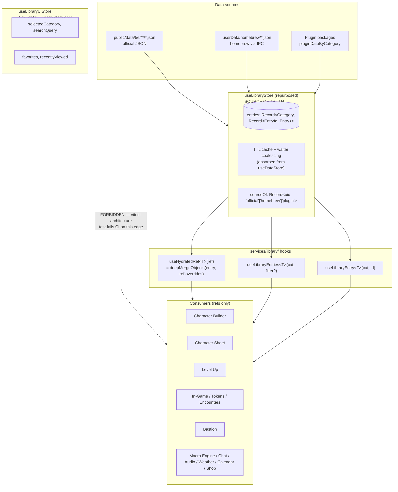

# Phase 15 — Library as Single Source of Truth

Phase 15 is a **data-layer consistency sweep** plus a **store-architecture rewrite**. The library becomes the only canonical store for D&D content data. Every consumer — Character Builder, Character Sheet, Level Up flow, in-game token / NPC / spell / condition UIs, Bastion management, encounter builder, dice macro autocomplete, chat tab-complete, anywhere D&D content appears — is a **consumer**, not a copy-holder. Consumer records carry **references** (`{ entryId, entryType, overrides? }`), never full embedded JSON.

The motivation, restated precisely:

1. **One developer fix reaches every consumer.** When a developer corrects a spell description, fixes monster CR, or rebalances a magic item, the change propagates to every character record, encounter slot, token detail panel, and chat tab-complete result — instantly, no reload, no migration.
2. **The guarantee survives customization.** When a player renames a magic item to "Pew Pew", overrides the description, or tweaks a homebrew's nested component, the developer's later fix to *unrelated* fields still reaches that player. This is achieved via shallow + recursive-object merge at the override boundary (arrays replace atomically).
3. **No parallel data, no drift.** Inline copies of library data on character / campaign / encounter records become impossible — both by convention (everywhere uses `EntryRef`) and by enforcement (a vitest architecture test fails the build on raw `public/data` imports outside the library service layer).

Three concrete drift scenarios Phase 15 eliminates:

- **Errata propagation.** WotC publishes errata for *Wand of Magic Missiles* changing damage to `1d4+1 force` (typed). Every player carrying the wand sees the corrected typed damage on next render, including players who renamed their wand or customized its description.
- **Homebrew rebalance.** DM tightens a homebrew spell's damage from `4d6` to `3d6`. Every character with the spell prepared, every encounter using a monster that casts it, every macro that resolves `$self.spells[<id>].damage` reflects the new value on the next read — no character file rewrite needed.
- **Condition wording.** A description fix to the *Frightened* condition reaches every active token's condition tooltip, every character sheet's conditions panel, every chat-rendered status, every encounter preview — within one render frame.

---

## 🏗️ Architecture & Environment Split

### Windows 11 Machine (`C:\Users\evilp\dnd\`) — ALL WORK IS HERE

Phase 15 is entirely client-side. No Raspberry Pi involvement.

### Raspberry Pi (`patrick@bmo`) — NO WORK THIS PHASE

---

## 🗺️ Data flow



**Reading the diagram:**

- Three data sources feed exactly one store. Loaders absorb into `useLibraryStore.entries[category][entryId]` and tag the entry's uid in `sourceOf` so consumers can audit provenance without branching on it (lint forbids `if (source === 'homebrew')` branches in consumer code).
- Three hooks are the only reads consumers make. `useLibraryEntry` and `useLibraryEntries` return raw entries (used when the consumer holds an id, not a ref — e.g., the library page itself, the "Add Monster from Library" drawer, tab-complete). `useHydratedRef` takes an `EntryRef` and returns the merged entry; this is what 95% of consumers use.
- The dotted forbidden edge (`Sources -.-> Consumers`) is the regression class Phase 15 closes. The vitest architecture test enforces it; without that test, future PRs silently reopen the drift door.

**Override + state contract.** Two distinct things on a consumer record:

| Concept | Lives where | Example | Sync behavior |
|---|---|---|---|
| **Reference + overrides** | `EntryRef { entryId, entryType, overrides?: DeepPartial<Entry> }` | `{ entryType: 'magic-items', entryId: 'wand-of-magic-missiles', overrides: { name: 'Pew Pew' } }` | Persists with the consumer record (character/campaign file); broadcast on player-intent changes |
| **Instance state** | Sibling field on the consumer record | `state: { currentCharges: 5, attuned: true }` | Persists with the consumer record; high-frequency sync hot path during play |

Overrides express *player intent* that should persist and propagate. Instance state expresses *runtime per-entity values* that mutate every round of play. Never mix them. A current-HP value never goes in `overrides`; a renamed magic item never goes in `state`.

**The merge semantics.** `useHydratedRef` walks `ref.overrides` recursively:

- Plain object values **merge** with the corresponding library value, key by key.
- Arrays **replace atomically**: if `overrides.effects = ['burn']`, the library's `effects` array is replaced wholesale.
- Primitives (strings, numbers, booleans) **replace** the library value.
- `undefined` in an override **skips** the field (uses the library value).

This delivers the "one fix everywhere" property at full depth for object-typed fields, while keeping array-typed fields as "if the player customized this list, they own it" — the desirable semantics for `effects`, `actions`, `traits` and similar.

---

## 🧭 Sub-phase dependency map

```
                       ┌──── B Builder ─────┐
A Foundation ─────────►├──── C Sheet ───────┤
(blocks everything)    ├──── D Level Up ────┤
                       ├──── E In-Game ─────┼───► H Cleanup ──► v3.0.0 release
                       ├──── F Bastion ─────┤      (delete legacy)
                       └──── G Misc/Macro ──┘
                       SERIAL ORDER:
                       A → B → C → D → E → F → G → H
                       per-sub-phase: 4-gate green → commit → lightweight tag → next
```

**Cadence rule.** Every sub-phase ends with the full 4-gate suite green:

```bash
npm run lint \
  && npx tsc --noEmit -p tsconfig.web.json \
  && npx tsc --noEmit -p tsconfig.node.json \
  && npx vitest run
```

Only when all four gates pass does the sub-phase end with a commit + a lightweight tag (`phase-15a-done`, `phase-15b-done`, …). If a gate fails, fix in place — never move to the next sub-phase with a red gate.

**Release rule.** No pre-releases. No `-alpha.N` tags. All eight sub-phases land on `claude/improve-phase-15-plan-XFob3` (or whatever branch is active for the implementation session); when sub-phase H is green, cut a single `v3.0.0` release via `dnd-app/scripts/release/cut.mjs` per the `CLAUDE.md` release flow.

The major version bump is warranted: Phase 15 changes the on-disk save schema in a way that requires the `MIGRATIONS[4]` step to load any pre-Phase-15 character or campaign file. Schema-breaking change = major bump.

---

## 📋 Source-of-truth rule

The library is the only canonical store for every entry in `LibraryCategory` and every entry in `DataCategory` — together that's ~80 distinct content kinds, including:

- **D&D content:** species, subspecies, classes, subclasses, class features (per level), feats, backgrounds, fighting styles, spells, invocations, metamagic, items (weapons / armor / gear / tools / magic items / vehicles / mounts / siege equipment / trinkets / light sources / sentient items / variant items / wearable items), monsters, NPCs, creatures, companions, conditions, weapon mastery, languages, skills, supernatural gifts, deities, planes, settlements, traps, hazards, poisons, diseases, curses, environmental effects, crafting recipes, downtime activities, calendars, encounter presets, treasure tables, random tables, chase tables, adventure seeds, NPC names, NPC appearance, NPC mannerisms, alignment descriptions, personality tables.
- **Bastion content:** facilities, services, hirelings, room types, bastion events.
- **Media:** sounds, ambient tracks, portraits, maps, sound events.
- **UI config:** themes, dice colors, keyboard shortcuts, dm-tabs, notification templates, rarity options. (Per user decision: maximum scope — these run through the same hydration model so the rule holds at every consumer boundary, even tiny ones.)
- **Rules reference:** actions, cover, DCs, damage types, currency config, dice types, lighting/travel, creature types, ability score config, session-zero config, moderation.
- **Anything added later** — new category = new entry-type registration in the library; consumers don't change.

The library is the only place this data is **defined**. Every consumer surface **renders from a reference**. There are no parallel data files, no duplicated tables, no inlined JSON in builder steps, no frozen snapshots in character records.

The only allowed deviations:

- **Overrides** — a character / encounter / instance can hold `overrides?: DeepPartial<LibraryEntry>` that the renderer merges on top of the library entry at display time. Renames, custom HP-on-template, balance tweaks — all expressed as overlay, never as a standalone copy.
- **Instance state** — runtime per-entity mutable values (`currentHP`, `currentCharges`, `attuned`, `position`, `prepared: true/false`) live as **sibling fields** on the consumer record, never inside `overrides`.

---

## 🛠️ Sub-Phase A — Foundation

**Goal:** Stand up the truth store, the hydration hooks, the migration framework, and the build guard. Nothing user-facing changes yet; every later sub-phase depends on this.

### A.1 — Types (`src/renderer/src/types/library.ts`)

Add the canonical reference + override shapes plus per-category typed entry interfaces:

```typescript
// EntryRef — the canonical "I reference a library entry" shape used everywhere.
export interface EntryRef<T extends LibraryCategory = LibraryCategory> {
  entryId: string
  entryType: T
  overrides?: DeepPartial<LibraryEntry<T>>
}

// DeepPartial — recursive Partial that keeps object-keyed merge semantics
// (arrays remain atomic, primitives remain replace-by-value).
export type DeepPartial<T> = T extends (infer U)[]
  ? T // arrays replace atomically; no partial-array shape allowed
  : T extends object
  ? { [K in keyof T]?: DeepPartial<T[K]> }
  : T

// MergedEntry — what useHydratedRef returns. Identical shape to LibraryEntry<T>,
// but conceptually "library + overrides merged."
export type MergedEntry<T extends LibraryCategory> = LibraryEntry<T>

// LibraryEntry<T> — per-category typed lookup. Bridges old LibraryItem.data
// (Record<string, unknown>) to the new typed-per-category world.
export type LibraryEntry<T extends LibraryCategory> = T extends 'spells'
  ? SpellEntry
  : T extends 'monsters' | 'creatures' | 'npcs' | 'companions'
  ? MonsterLikeEntry
  : T extends 'magic-items' | 'weapons' | 'armor' | 'gear' | 'tools' | 'vehicles' | 'mounts'
  ? ItemEntry
  : T extends 'feats'
  ? FeatEntry
  : T extends 'classes'
  ? ClassEntry
  : T extends 'subclasses'
  ? SubclassEntry
  : T extends 'class-features'
  ? ClassFeatureEntry
  : T extends 'species'
  ? SpeciesEntry
  : T extends 'backgrounds'
  ? BackgroundEntry
  : T extends 'conditions'
  ? ConditionEntry
  : T extends 'fighting-styles'
  ? FightingStyleEntry
  : T extends 'invocations'
  ? InvocationEntry
  : T extends 'metamagic'
  ? MetamagicEntry
  : T extends 'languages'
  ? LanguageEntry
  : T extends 'skills'
  ? SkillEntry
  : T extends 'supernatural-gifts'
  ? SupernaturalGiftEntry
  : T extends 'weapon-mastery'
  ? WeaponMasteryEntry
  // ... (full table for all ~80 categories)
  : BaseLibraryEntry

// Type-narrow helper.
export function isEntryRef(x: unknown): x is EntryRef<LibraryCategory> {
  return (
    typeof x === 'object' &&
    x !== null &&
    'entryId' in x &&
    'entryType' in x &&
    typeof (x as EntryRef).entryId === 'string' &&
    typeof (x as EntryRef).entryType === 'string'
  )
}
```

Per-category entry interfaces (`SpellEntry`, `MonsterLikeEntry`, `ItemEntry`, …) live next to the existing types in `character-common.ts` and `library.ts`. Several are renamed/moved from `character-common.ts` (`SpellEntry`, `WeaponEntry`, `ArmorEntry`) because they were structured as "inline data for character record" — they become the library-side shape, with the consumer-side referencing them via `EntryRef`.

### A.2 — Zod schemas (`src/renderer/src/services/library/schemas/` — new directory)

One schema file per `LibraryCategory`:

```
src/renderer/src/services/library/schemas/
├── spell.schema.ts
├── monster.schema.ts
├── item.schema.ts
├── feat.schema.ts
├── class.schema.ts
├── subclass.schema.ts
├── class-feature.schema.ts
├── species.schema.ts
├── background.schema.ts
├── condition.schema.ts
├── fighting-style.schema.ts
├── invocation.schema.ts
├── metamagic.schema.ts
├── language.schema.ts
├── skill.schema.ts
├── supernatural-gift.schema.ts
├── weapon-mastery.schema.ts
├── deity.schema.ts
├── plane.schema.ts
├── settlement.schema.ts
├── trap.schema.ts
├── hazard.schema.ts
├── poison.schema.ts
├── disease.schema.ts
├── curse.schema.ts
├── environmental-effect.schema.ts
├── crafting.schema.ts
├── downtime.schema.ts
├── calendar.schema.ts
├── encounter-preset.schema.ts
├── treasure-table.schema.ts
├── random-table.schema.ts
├── chase-table.schema.ts
├── adventure-seed.schema.ts
├── npc-name.schema.ts
├── personality-table.schema.ts
├── bastion-facility.schema.ts
├── bastion-event.schema.ts
├── sound.schema.ts
├── ambient-track.schema.ts
├── portrait.schema.ts
├── map.schema.ts
├── theme.schema.ts
├── dice-color.schema.ts
├── keyboard-shortcut.schema.ts
├── dm-tab.schema.ts
├── notification-template.schema.ts
├── rarity-option.schema.ts
├── action.schema.ts
├── cover.schema.ts
├── dc.schema.ts
├── damage-type.schema.ts
├── currency.schema.ts
├── shop-template.schema.ts
├── rule.schema.ts
└── registry.ts          # LibraryCategory -> z.ZodSchema
```

Each schema exports `parse` and `safeParse`. `registry.ts` exports:

```typescript
export const SCHEMA_REGISTRY: Record<LibraryCategory, z.ZodSchema> = {
  spells: SpellSchema,
  monsters: MonsterSchema,
  // ...
}

export function validateEntry(category: LibraryCategory, raw: unknown): LibraryEntry<LibraryCategory> {
  return SCHEMA_REGISTRY[category].parse(raw)
}

export function safeValidateEntry(
  category: LibraryCategory,
  raw: unknown
): { success: true; data: LibraryEntry<LibraryCategory> } | { success: false; error: z.ZodError } {
  return SCHEMA_REGISTRY[category].safeParse(raw) as never
}
```

A snapshot-style test (`schemas/registry.test.ts`) walks every file under `src/renderer/public/data/5e/**/*.json`, dispatches to the right schema via filename → category mapping, and asserts every entry parses. This catches malformed data on commit.

Validation runs at exactly two boundaries:

1. **Load time** — `loadCategory(category)` validates every raw entry coming from JSON / homebrew / plugin. Invalid entries log a warning and are excluded from the store.
2. **Homebrew save time** — `upsertHomebrew(entry, category)` validates before writing.

Runtime reads (`getEntry`, `getEntries`, `useLibraryEntry`) trust the cache. No per-read validation cost.

### A.2.5 — Homebrew audit fields on `BaseLibraryEntry` (added 2026-05-18)

**Origin:** absorbs Phase 25 H2 (Zod schemas for homebrew). Instead of separate `HomebrewSpellSchema`/`HomebrewMonsterSchema`/etc. wrapping per-category schemas, extend `BaseLibraryEntry` (and the Zod `BaseLibraryEntrySchema` that every per-category schema in A.2 extends) with the audit fields homebrew + plugin entries carry. Official entries leave these fields blank — the schema makes them optional.

**Fields:**

```typescript
interface BaseLibraryEntry {
  id: string
  name: string
  source: 'official' | 'homebrew' | 'plugin'
  createdAt?: string                          // ISO timestamp — homebrew / plugin only
  updatedAt?: string                          // ISO timestamp — homebrew / plugin only
  pluginId?: string                           // when source === 'plugin', the plugin that owns this entry
}
```

**Zod base schema (used by every per-category schema in A.2):**

```typescript
const BaseLibraryEntrySchema = z.object({
  id: z.string().min(1),
  name: z.string().min(1),
  source: z.enum(['official', 'homebrew', 'plugin']),
  createdAt: z.string().datetime().optional(),
  updatedAt: z.string().datetime().optional(),
  pluginId: z.string().min(1).optional()
})

// Per-category schemas extend the base:
export const SpellSchema = BaseLibraryEntrySchema.extend({ /* spell-specific fields */ }).passthrough()
```

**Save / load behavior:**

- `loadCategory(category)` validates raw entries through the per-category schema. Official entries pass with `source: 'official'`, no audit timestamps. Homebrew + plugin loads stamp `source` accordingly.
- `upsertHomebrew(category, entry)` stamps `source: 'homebrew'`, sets `createdAt` (if missing) and `updatedAt` to `new Date().toISOString()`, then validates. Invalid homebrew rejects with a user-facing error.
- Plugin loaders stamp `source: 'plugin'` + `pluginId` + `createdAt = installedAt`.

**Phase 25 H2 fully absorbed.** No homebrew-specific schemas needed. Consumers can't distinguish homebrew/plugin from official except via the `source` field, which the boundary test forbids them from branching on. The Library page itself reads `sourceOf[uid]` to render the "homebrew" / "plugin" badge.

### A.3 — Repurposed `useLibraryStore` (`src/renderer/src/stores/use-library-store.ts`)

Spin the current UI-only state into a new file, then rewrite `useLibraryStore` as the truth store.

**Step A.3.i — Split UI state into `useLibraryUiStore`.**

New file `src/renderer/src/stores/use-library-ui-store.ts`:

```typescript
import { create } from 'zustand'
import { SETTINGS_KEYS } from '../constants'
import type { LibraryCategory, LibraryItem } from '../types/library'

interface LibraryUiState {
  selectedCategory: LibraryCategory | null
  searchQuery: string
  recentlyViewed: LibraryItem[]
  favorites: Set<string>

  setCategory: (category: LibraryCategory | null) => void
  setSearchQuery: (query: string) => void
  addToRecentlyViewed: (item: LibraryItem) => void
  clearRecentlyViewed: () => void
  toggleFavorite: (itemId: string) => void
  isFavorite: (itemId: string) => boolean
}

export const useLibraryUiStore = create<LibraryUiState>(/* ...moved from use-library-store.ts... */)
```

The Library page (`pages/LibraryPage.tsx`) and its components (`components/library/*`) update their imports.

**Step A.3.ii — Rewrite `useLibraryStore` as the truth store.**

```typescript
import { create } from 'zustand'
import type { LibraryCategory, LibraryEntry } from '../types/library'
import { validateEntry } from '../services/library/schemas/registry'

interface CacheMeta { loadedAt: number; loading: boolean }
const CACHE_TTL_MS = 30 * 60 * 1000

type EntrySource = 'official' | 'homebrew' | 'plugin'

interface LibraryStoreState {
  entries: { [K in LibraryCategory]?: Record<string, LibraryEntry<K>> }
  sourceOf: Record<string, EntrySource>                 // keyed by uid = `${category}:${id}`
  cacheMeta: { [K in LibraryCategory]?: CacheMeta }
  loaded: Set<LibraryCategory>

  // Read APIs — every consumer hook goes through these.
  getEntry<T extends LibraryCategory>(category: T, id: string): LibraryEntry<T> | null
  getEntries<T extends LibraryCategory>(
    category: T,
    filter?: (e: LibraryEntry<T>) => boolean
  ): LibraryEntry<T>[]

  // Load APIs — absorbed from useDataStore.
  loadCategory<T extends LibraryCategory>(category: T): Promise<void>
  refresh(category: LibraryCategory): void
  clearAll(): void

  // Homebrew / plugin mutation APIs — absorbed from old useLibraryStore.
  upsertHomebrew<T extends LibraryCategory>(category: T, entry: LibraryEntry<T>): Promise<boolean>
  deleteHomebrew(category: LibraryCategory, id: string): Promise<boolean>
  loadHomebrew(): Promise<void>
  loadPluginContent(): Promise<void>
}

export const useLibraryStore = create<LibraryStoreState>((set, get) => ({
  entries: {},
  sourceOf: {},
  cacheMeta: {},
  loaded: new Set(),

  getEntry: (category, id) => {
    const bucket = get().entries[category]
    return (bucket?.[id] ?? null) as never
  },

  getEntries: (category, filter) => {
    const bucket = get().entries[category]
    if (!bucket) return [] as never
    const all = Object.values(bucket) as LibraryEntry<typeof category>[]
    return (filter ? all.filter(filter) : all) as never
  },

  loadCategory: async (category) => {
    // 1. Check cache + TTL.
    // 2. Coalesce concurrent callers via module-level waiter map (carried over from useDataStore).
    // 3. Fetch raw JSON via library-service.ts (existing loader stays — just plugs into the new store).
    // 4. Validate each entry via SCHEMA_REGISTRY[category].
    // 5. Merge homebrew + plugin entries for the same category, tagging sourceOf.
    // 6. Set entries[category] and mark loaded.
  },

  // ... refresh, clearAll, homebrew + plugin APIs ...
}))
```

The TTL cache + waiter coalescing logic moves from `use-data-store.ts` verbatim, adapted to the new state shape. The big win: consumers see ONE store, not two with overlapping responsibilities.

**Step A.3.iii — Plug `library-service.ts` into the new store.**

`library-service.ts` (1148 lines) is the loader/normalizer. Its 60+ load functions stay, but their results route to `useLibraryStore.entries[category]` via the new `loadCategory` action rather than into `useDataStore.cache`. This is a mechanical change file-by-file inside the service.

**Step A.3.iv — Update existing consumers of `useDataStore`.**

Every file currently importing `useDataStore` gets the import flipped to `useLibraryStore`. Bash:

```bash
grep -rln "from.*use-data-store" src/renderer/src
```

Each consumer's call sites translate `useDataStore.get(category, loader)` → `useLibraryStore.loadCategory(category)` + `useLibraryStore.getEntries(category)`. Mechanical; no behavior change.

`use-data-store.ts` is left in place at end of sub-phase A but flagged for deletion in sub-phase H. (Doing the deletion now would risk breaking a consumer we missed; better to delete at the very end when every sweep has touched its files.)

### A.4 — Hydration hooks (`src/renderer/src/services/library/use-library-entry.ts` — new)

```typescript
import { useCallback } from 'react'
import { useLibraryStore } from '../../stores/use-library-store'
import type { EntryRef, LibraryCategory, LibraryEntry, MergedEntry } from '../../types/library'
import { deepMergeObjects } from './merge'

export function useLibraryEntry<T extends LibraryCategory>(
  category: T,
  id: string | null | undefined
): LibraryEntry<T> | null {
  return useLibraryStore(useCallback((s) => (id ? s.getEntry(category, id) : null), [category, id]))
}

export function useLibraryEntries<T extends LibraryCategory>(
  category: T,
  filter?: (e: LibraryEntry<T>) => boolean
): LibraryEntry<T>[] {
  return useLibraryStore(useCallback((s) => s.getEntries(category, filter), [category, filter]))
}

export function useHydratedRef<T extends LibraryCategory>(
  ref: EntryRef<T> | null | undefined
): MergedEntry<T> | null {
  const base = useLibraryEntry(ref?.entryType as T, ref?.entryId)
  if (!ref || !base) return null
  if (!ref.overrides) return base
  return deepMergeObjects(base, ref.overrides) as MergedEntry<T>
}
```

**Memoization rule.** All three hooks compose Zustand's structural-equality selector with a `useCallback`-stabilized selector function. A library mutation triggers re-renders only for components subscribed to the changed `(category, id)` pair. Mutations to unrelated entries are no-ops for the consumer.

**The merge function** (`src/renderer/src/services/library/merge.ts` — new):

```typescript
type AnyObject = Record<string, unknown>

function isPlainObject(v: unknown): v is AnyObject {
  return typeof v === 'object' && v !== null && !Array.isArray(v) && Object.getPrototypeOf(v) === Object.prototype
}

export function deepMergeObjects<T extends AnyObject, O extends Partial<T>>(base: T, overrides: O): T {
  const out: AnyObject = { ...base }
  for (const key of Object.keys(overrides)) {
    const ov = (overrides as AnyObject)[key]
    if (ov === undefined) continue          // skip undefined overrides
    const bv = (base as AnyObject)[key]
    if (isPlainObject(bv) && isPlainObject(ov)) {
      out[key] = deepMergeObjects(bv, ov)   // recurse into plain objects
    } else {
      out[key] = ov                          // arrays + primitives replace atomically
    }
  }
  return out as T
}
```

Tests (`merge.test.ts`) cover:

- Flat field replacement (`overrides.name = 'Foo'`).
- Nested object merge (`overrides.charges = { max: 10 }` doesn't blow away `rechargeType`).
- Array atomic replace (`overrides.effects = ['burn']` replaces the whole array).
- Two-level deep merge (`overrides.components.material = 'x'` keeps `components.verbal/somatic` live).
- `undefined` override skips the field.
- Empty override returns the base value structurally unchanged.

### A.5 — Migration `MIGRATIONS[4]` (`src/main/storage/migrations.ts`)

Existing infrastructure (`CURRENT_SCHEMA_VERSION = 3`, forward-walking migrations) is intact — Phase 15 plugs in a new entry:

```typescript
export const CURRENT_SCHEMA_VERSION = 4

const MIGRATIONS: Record<number, Migration> = {
  2: /* existing */,
  3: /* existing */,
  4: (data) => {
    if (data.gameSystem !== 'dnd5e') return data
    return migrateCharacter5eToRefs(data)
  }
}
```

`migrateCharacter5eToRefs` (new file `src/main/storage/migrations/v4-character-refs.ts`) does the inline-data-to-ref conversion. For each inlined array on a `Character5e`:

| Old field | New field | Library category |
|---|---|---|
| `knownSpells: SpellEntry[]` | `knownSpellRefs: EntryRef<'spells'>[]` | `spells` |
| `weapons: WeaponEntry[]` | `weaponRefs: EntryRef<'weapons'>[]` | `weapons` |
| `armor: ArmorEntry[]` | `armorRefs: EntryRef<'armor'>[]` | `armor` |
| `equipment: EquipmentItem[]` | `equipmentRefs: EntryRef<'weapons'|'armor'|'gear'|'tools'>[]` | (resolved by name match — see ambiguous-match fallback below) |
| `feats: Array<{...}>` | `featRefs: EntryRef<'feats'>[]` | `feats` |
| `classFeatures: ClassFeatureEntry[]` | `classFeatureRefs: EntryRef<'class-features'>[]` | `class-features` |
| `magicItems: MagicItemEntry5e[]` + `attunement: Array<{...}>` | `magicItemRefs: Array<{ instanceId: string, ref: EntryRef<'magic-items'> }>` + `state.magicItemAttuned: Record<instanceId, boolean>` + `state.magicItemCharges: Record<instanceId, number>` | `magic-items` |
| `conditions: ActiveCondition[]` | `conditionRefs: EntryRef<'conditions'>[]` | `conditions` |
| `customFeatures: CustomFeature[]` | (stays inline — these are by definition NOT in the library; flag as `source: 'character-local'` for the lint rule) | n/a |
| `classes: CharacterClass5e[]` | `classRefs: Array<{ classRef: EntryRef<'classes'>, level, subclassRef?: EntryRef<'subclasses'> }>` | `classes` / `subclasses` |
| `species: string` (already an id) | `speciesRef: EntryRef<'species'> \| null` (null fallback when id doesn't match library) | `species` |
| `background: string` (already an id) | `backgroundRef: EntryRef<'backgrounds'> \| null` (null fallback when id doesn't match library) | `backgrounds` |
| `equipment[*].magicItemId` | rolled into the `magic-items` ref above | n/a |
| `companions[*]` | each companion's stat block becomes a ref | `companions` |

**Attunement migration detail (Design C, 2026-05-18).** The legacy `Character5e` had two separate stores for the same concept: `magicItems[]` (items owned) and `attunement[]` (subset that's attuned, keyed by name). Migration unifies into a single `magicItemRefs` list (each entry has a stable `instanceId`, reusing `MagicItemEntry5e.id` from the legacy record), and lifts the "is attuned?" boolean into `state.magicItemAttuned[instanceId]`. Per-instance charge counts go to `state.magicItemCharges[instanceId]`. To match an old `attunement[]` entry against `magicItems[]`, walk by name; on no match, surface in migration report as "attuned item not found in inventory."

**Library-side ItemEntry shape (Phase 15 A.2 schema).** The legacy `MagicItemEntry5e` had two boolean fields confusingly named: `attunement: boolean` (= "requires attunement", a capability) and `attuned?: boolean` (= "this character has attuned to it", instance state). Phase 15's library `ItemEntry` keeps **only** `requiresAttunement: boolean`. The `attuned` field is dropped from the library shape entirely; "is attuned right now" lives exclusively in `Character.state.magicItemAttuned[instanceId]`. The `item.schema.ts` in A.2 must enforce this — `attuned` is rejected if present on a library entry.

**Bare-id resolution fallback (`species`, `background`).** Both fields are already ids on legacy records, not embedded JSON. The match-or-orphan strategy doesn't fit — if the id doesn't match any library entry, there's no original data to preserve as `overrides`. Instead: on no-match, set the ref to `null` and surface in the migration report as "Unrecognized species/background id; please pick one." The character renders with a "Pick a species" prompt in the sheet's species section until the player resolves it. Same for background.

**Ambiguous equipment match fallback.** Equipment resolves by name across four categories (`weapons | armor | gear | tools`). For items with ambiguous names — e.g., a homebrew "Sword" with no category — match is undefined. Resolver behavior: ambiguous matches log a warning and become `{ entryId: 'orphan:<uuid>', entryType: <best-guess-category>, overrides: <full original record> }`. Migration report flags these as "Ambiguous equipment migration" so player can re-link.

**Pre-existing homebrew migration.** Existing on-disk homebrew files (`userData/homebrew/*.json`) were written before Phase 15's schemas exist. On first v4 boot, before any character migration runs, walk `userData/homebrew/*.json` and validate each entry against Phase 15 A.2's `SCHEMA_REGISTRY[category]`. Entries that pass: load into `useLibraryStore.entries[category]` with `sourceOf[uid] = 'homebrew'`. Entries that fail: log a warning, write the original to `userData/homebrew/incompatible/<file>.json` for user recovery, exclude from the store. Surface failed entries in the migration report so the user can manually re-import or fix.

For each old entry, match by `(name, category)` against the library index built from a one-shot load of all relevant categories. Override derivation:

```typescript
function deriveOverrides<T extends LibraryCategory>(
  category: T,
  inline: AnyObject,
  libraryEntry: LibraryEntry<T>
): DeepPartial<LibraryEntry<T>> {
  // Field-by-field diff. Identical fields drop out. Mutated fields land in overrides.
  // Nested objects recursively diff (objects); arrays diff whole.
}
```

Orphan path: when `match(name, category)` returns null, `entryId = 'orphan:${uuid}'`, `overrides = <full original record>`. The migration also writes the orphan into `useLibraryStore.entries[category]['orphan:${uuid}']` so consumers see it like any other entry — just marked `sourceOf['orphan:${uuid}'] = 'orphan'` so the UI can render the orphan chip.

**Backup snapshot.** Before the migration writes anything, the v4 step calls into the main process via a new internal helper:

```typescript
// src/main/storage/snapshot.ts — new
export async function snapshotIfFirstMigration(saveFilePath: string, targetVersion: number): Promise<void> {
  const bakPath = `${saveFilePath}.pre-phase-15.bak`
  if (targetVersion !== 4) return
  if (await fileExists(bakPath)) return     // idempotent: never overwrite
  await fs.copyFile(saveFilePath, bakPath)
}
```

Called from `migrateData` at the moment we know we're stepping past v3. Idempotent on every dimension (re-running migration on already-v4 data is a no-op; second migration of a v4 file never overwrites the existing `.bak`).

**Mirror migration in the renderer** (`src/renderer/src/services/io/import-export.ts` — `BACKUP_MIGRATIONS[4]`). Same logic, same orphan handling. Backup files exported from the app carry the new shape after import-time migration.

> **Shared migration core (2026-05-18).** To prevent divergence between the main-process `MIGRATIONS[4]` and the renderer-side `BACKUP_MIGRATIONS[4]`, **extract** `migrateCharacter5eToRefs` to `src/shared/migrations/v4-character-refs.ts`. Both call sites import the same function. The shared module is pure (no Electron / Node imports beyond `crypto.randomUUID`); it only operates on character record JSON. Both wrappers handle their environment-specific snapshot / orphan-report concerns separately.

**Migration report.** As `migrateCharacter5eToRefs` runs, it accumulates a per-character summary:

```typescript
interface PerCharacterReport {
  characterId: string
  characterName: string
  migratedCounts: Record<LibraryCategory, number>     // matched and refified
  orphanCounts: Record<LibraryCategory, number>       // couldn't match
  orphans: Array<{ category: LibraryCategory; orphanId: string; originalName: string }>
}
```

Writes to `app.getPath('userData') + '/migration-report.json'`. The renderer reads this on first post-migration boot and triggers the report modal.

### A.6 — Post-load report modal (`src/renderer/src/components/library/MigrationReportModal.tsx` — new)

Renders once on the first launch after the v4 migration runs. Reads `migration-report.json` via a new IPC channel `getMigrationReport()`. Layout:

- Header: "Library migration complete."
- Summary: "Migrated N characters. Matched X spells, Y items, Z conditions. K orphans need review."
- Orphan list: grouped by character. Each orphan row shows the original name + category + a "Re-link" button.
- Re-link flow: clicking "Re-link" opens a library picker filtered to the orphan's category. Selecting an entry rewrites `EntryRef.entryId` from `orphan:xxx` to the picked id; differences between the orphan's overrides and the picked entry become the new `overrides`.
- Footer: "Don't show this again" checkbox writes a setting (`migrationReportDismissed: true`) so subsequent boots skip the modal.

The modal is dismissible without re-linking; orphan chips remain on character sheets so users can re-link later via the sheet UI.

### A.7 — Build guard (`src/renderer/src/services/library/library-boundary.test.ts` — new)

Single vitest spec, runs as part of the 4-gate suite. ~120 lines:

```typescript
import { describe, it, expect } from 'vitest'
import { readdir, readFile, stat } from 'node:fs/promises'
import { join } from 'node:path'

const ROOT = join(__dirname, '../../../')
const ALLOWLIST = [
  'src/renderer/src/services/library/',
  'src/renderer/src/stores/use-library-store.ts',
  'src/renderer/src/services/library-service.ts',
  'src/renderer/src/services/adventure-loader.ts'   // sub-phase G migrates this; allowlist until then
]

const FORBIDDEN_IMPORT = /from\s+['"]([^'"]*public\/data\/[^'"]+)['"]/
const FORBIDDEN_FETCH = /fetch\(\s*['"`]([^'"`]*data\/5e\/[^'"`]+)['"`]/
const SHAPE_KEYS = new Set([
  'name', 'description', 'damage', 'traits', 'level', 'school',
  'hit_die', 'ability_score_increase', 'casting_time', 'range'
])
const BOUNDARY_ALLOW = /\/\/\s*boundary-allow:?\s*(.+)?$/

async function walk(dir: string): Promise<string[]> { /* recursive .ts/.tsx walker */ }

describe('library boundary', () => {
  it('no consumer imports public/data/** raw JSON', async () => {
    const files = await walk(join(ROOT, 'src'))
    const offenders: Array<{ file: string; line: number; match: string }> = []
    for (const file of files) {
      if (ALLOWLIST.some((p) => file.includes(p))) continue
      const content = await readFile(file, 'utf-8')
      const lines = content.split('\n')
      for (let i = 0; i < lines.length; i++) {
        const line = lines[i]
        if (BOUNDARY_ALLOW.test(line)) continue
        const m = FORBIDDEN_IMPORT.exec(line)
        if (m) offenders.push({ file, line: i + 1, match: m[1] })
      }
    }
    expect(offenders).toEqual([])
  })

  it('no consumer fetches /data/5e/** at runtime', async () => { /* same shape, FORBIDDEN_FETCH */ })

  it('no consumer literal has >=3 library-shape keys', async () => {
    // Walk source files; cheap regex pass to find `{ name: ..., description: ..., damage: ... }`-style literals.
    // Flag any with >=3 of SHAPE_KEYS unless inside ALLOWLIST or with // boundary-allow on the line.
  })
})
```

Adds ~200ms to vitest. Catches the regression class Phase 15 closes. Inline `// boundary-allow: reason` on a specific line opts that line out (the test rejects allowlist entries without a reason after the colon).

### A.8 — Source-of-truth README (`src/renderer/src/services/library/README.md` — new)

```markdown
# Library — Source of Truth

> All D&D content data lives here. Consumers reference entries by `entryId` + `entryType`;
> the library hydrates at read time. No duplicate data anywhere. Player customizations
> live as `overrides` (deep-merged with the library entry). Runtime per-entity values
> (current HP, current charges, attuned, position) live as sibling fields on the
> consumer record, NEVER inside `overrides`.

## The EntryRef contract

```typescript
interface EntryRef<T extends LibraryCategory> {
  entryId: string
  entryType: T
  overrides?: DeepPartial<LibraryEntry<T>>
}
```

## Reading library data

```tsx
// You have an id, want the entry:
const spell = useLibraryEntry('spells', 'fireball')

// You want all entries in a category, optionally filtered:
const evocationSpells = useLibraryEntries('spells', (s) => s.school === 'evocation')

// You have a ref (most common case in consumer components):
const merged = useHydratedRef(character.spellRefs[0])
```

## The merge

`useHydratedRef` walks `ref.overrides` recursively. Plain objects merge key-by-key.
Arrays and primitives replace atomically. `undefined` skips.

## Forbidden patterns

- `import x from '/public/data/...'` outside this directory
- `fetch('/data/5e/...')` outside this directory
- Embedded `{ name, description, damage, ... }` literals in consumer code
- `if (entry.source === 'homebrew') ...` — consumers MUST NOT branch on source

Inline opt-out: `// boundary-allow: <reason>`. Reviewer must accept the reason.
```

### A — Verification

After sub-phase A:

1. `useLibraryEntry`, `useLibraryEntries`, `useHydratedRef` exist and pass unit tests against a mocked store.
2. `useLibraryStore` exposes `getEntry / getEntries / loadCategory / refresh / upsertHomebrew / deleteHomebrew / loadHomebrew / loadPluginContent` with the new shape.
3. `useLibraryUiStore` exists and the Library page renders unchanged.
4. Zod schemas exist for every `LibraryCategory`; the snapshot test passes against all of `public/data/5e/**`.
5. `MIGRATIONS[4]` exists with full coverage of Character5e inlined fields; tests cover round-trip (save → load → re-save), orphan path, idempotency, and `.bak` non-overwrite.
6. `MigrationReportModal.tsx` renders against a mocked report; the IPC channel `getMigrationReport` resolves.
7. The vitest boundary test runs and currently passes (no offending imports yet — sub-phases B-G keep it passing).
8. `services/library/README.md` is committed.
9. Full 4-gate suite green.
10. Commit + tag `phase-15a-done`.

---

## 🛠️ Sub-Phase B — Character Builder Sweep

**Goal:** Every consumer file under `src/renderer/src/components/builder/5e/*` and `src/renderer/src/stores/builder/slices/*` reads from the library via the hydration hooks and stores `EntryRef[]` instead of inline data.

### Builder files to touch

```
src/renderer/src/components/builder/5e/
├── CharacterBuilder5e.tsx
├── DetailsTab5e.tsx
├── ContentTabs5e.tsx
├── MainContentArea5e.tsx
├── CharacterSummaryBar5e.tsx
├── MulticlassLevelBar5e.tsx
├── GearTab5e.tsx
├── EquipmentShop5e.tsx
├── HigherLevelEquipment5e.tsx
├── SpellsTab5e.tsx
├── SpellPicker5e.tsx
├── CantripPicker5e.tsx
├── SpellSummary5e.tsx
├── LanguagesTab5e.tsx
├── SpecialAbilitiesTab5e.tsx
├── BackstoryEditor5e.tsx
├── PersonalityEditor5e.tsx
├── AppearanceEditor5e.tsx
├── gear-tab-types.ts
└── (all .test.tsx siblings)
```

Each component's data reads convert:

```typescript
// BEFORE — direct JSON import + inline shape
import speciesData from '/public/data/5e/origins/species.json'
const selected = speciesData.find((s) => s.id === builderState.speciesId)

// AFTER — hydration hook + ref
const selected = useLibraryEntry('species', builderState.speciesId)
```

Builder local-state shape (in `stores/builder/slices/`):

```typescript
// BEFORE
interface BuilderState {
  species: { name: string; size: string; abilities: Record<string, number>; traits: string[] }
  // ...
}

// AFTER
interface BuilderState {
  speciesRef: EntryRef<'species'> | null
  classRefs: Array<{ classRef: EntryRef<'classes'>, level: number, subclassRef?: EntryRef<'subclasses'> }>
  backgroundRef: EntryRef<'backgrounds'> | null
  featRefs: EntryRef<'feats'>[]
  knownSpellRefs: EntryRef<'spells'>[]
  equipmentRefs: EntryRef<'weapons'|'armor'|'gear'|'tools'|'magic-items'>[]
  // ...
}
```

### Builder store slices

Files in `src/renderer/src/stores/builder/slices/`:

- `builder-spells.ts` — `knownSpells` becomes `knownSpellRefs: EntryRef<'spells'>[]`. Prepared state moves to a sibling `state.preparedSpellIds: string[]` (instance state, not an override).
- `builder-classes.ts` (or `builder-class-selection.ts` if that's the actual name) — multiclass entries become `classRefs[]` per the multiclass shape above.
- `builder-equipment.ts` — equipment selection becomes `equipmentRefs[]` with the resolved EntryRef category.
- `builder-feats.ts` — `featRefs: EntryRef<'feats'>[]`.
- Any slice that imports raw JSON from `public/data/5e/**` flips to a `useLibraryEntries` read.

### Side panels hydrate live

Builder "details" side panel: previously read a frozen JSON entry at pick time. Phase 15 makes it `useLibraryEntry(category, builderState.<X>Ref?.entryId)`. A library edit (homebrew tweak, balance fix) immediately updates what the player sees in the builder without rebuilding the character.

### Personality / trinket / roll tables

Files using `data/personality-tables.ts`:

- The `.ts` data file becomes a deletion target for sub-phase H.
- Consumers convert to `useLibraryEntries('personality-tables', filter?)` (and `'random-tables'` / `'trinkets'` for their corresponding tables).
- The `rollD4` / hard-coded length pattern becomes `rollFrom(entries)` reading `useLibraryEntries(...).length`.

### B — Verification

After sub-phase B:

1. Every file under `components/builder/5e/` reads via hydration hooks; no `import .* public/data` remains in builder code.
2. The vitest boundary test still passes.
3. Per-component spec tests assert (a) no `public/data` import in the file under test, (b) a library mutation propagates to the rendered output (mocked-store test).
4. End-to-end: a fresh character built in the dev server displays correctly; the side panel reacts live when a homebrew entry is edited in another tab.
5. Full 4-gate green.
6. Commit + tag `phase-15b-done`.

---

## 🛠️ Sub-Phase C — Character Sheet Sweep

**Goal:** Every consumer file under `src/renderer/src/components/sheet/5e/*` reads via hydration hooks; the `Character5e` type is rewritten with `*Ref(s)` field naming; saved characters load via `MIGRATIONS[4]`.

### `Character5e` type rewrite (`src/renderer/src/types/character-5e.ts`)

Field renames (also covered by `MIGRATIONS[4]`):

```typescript
// BEFORE
interface Character5e {
  species: string
  background: string
  classes: CharacterClass5e[]
  knownSpells: SpellEntry[]
  weapons: WeaponEntry[]
  armor: ArmorEntry[]
  equipment: EquipmentItem[]
  feats: Array<{ id: string; name: string; description: string; choices?: Record<string, string | string[]> }>
  classFeatures: ClassFeatureEntry[]
  magicItems?: MagicItemEntry5e[]
  conditions: ActiveCondition[]
  attunement: Array<{ name: string; description: string }>
  customFeatures?: CustomFeature[]
  // ...
}

// AFTER (Design C, 2026-05-18 — keyed by stable instanceId, NOT by array index)
interface Character5e {
  speciesRef: EntryRef<'species'> | null            // null fallback if legacy id doesn't match library
  backgroundRef: EntryRef<'backgrounds'> | null     // same
  classRefs: Array<{
    instanceId: string                              // crypto.randomUUID() per class entry
    classRef: EntryRef<'classes'>
    level: number
    subclassRef?: EntryRef<'subclasses'>
    levelTaken: number                              // for replay / undo
  }>
  knownSpellRefs: Array<{ instanceId: string, ref: EntryRef<'spells'> }>
  weaponRefs: Array<{ instanceId: string, ref: EntryRef<'weapons'> }>
  armorRefs: Array<{ instanceId: string, ref: EntryRef<'armor'> }>
  equipmentRefs: Array<{ instanceId: string, ref: EntryRef<'weapons'|'armor'|'gear'|'tools'|'magic-items'> }>
  featRefs: Array<{ instanceId: string, ref: EntryRef<'feats'> }>
  classFeatureRefs: Array<{ instanceId: string, ref: EntryRef<'class-features'> }>
  magicItemRefs?: Array<{ instanceId: string, ref: EntryRef<'magic-items'> }>
  conditionRefs: Array<{ instanceId: string, ref: EntryRef<'conditions'> }>
  customFeatures?: CustomFeature[]                  // STAYS inline — by definition not in library
  // Instance state — keyed by instanceId from the corresponding ref array entry.
  // NEVER keyed by array index (reorder-fragile) or by entryId (collision-prone with duplicates).
  state: {
    preparedSpellIds: Record<string /* instanceId */, boolean>
    weaponEquipped: Record<string /* instanceId */, boolean>
    armorEquipped: Record<string /* instanceId */, boolean>
    magicItemCharges: Record<string /* instanceId */, number>
    magicItemAttuned: Record<string /* instanceId */, boolean>
    // ...
  }
}
```

### Sheet files to touch

Every file under `src/renderer/src/components/sheet/5e/*`:

```
AbilityScoresGrid5e.tsx, ArmorManager5e.tsx, AttackCalculator5e.tsx,
AttunementTracker5e.tsx, BackgroundPanel5e.tsx, CharacterTraitsPanel5e.tsx,
ClassResourcesSection5e.tsx, CoinBadge5e.tsx, CombatStatsBar5e.tsx,
CompanionsSection5e.tsx, ConditionsSection5e.tsx, CraftingProgress5e.tsx,
CraftingRecipeList5e.tsx, CraftingSection5e.tsx, DeathSaves5e.tsx,
EquipmentListPanel5e.tsx, HighElfCantripSwapModal5e.tsx, MagicItemsPanel5e.tsx,
SpellcastingSection5e.tsx, SpellPrepOptimizer.tsx, SpellSlotTracker5e.tsx,
(~40 files total — full list in the actual file system at implementation time)
```

**Phase 23 Sub-Phase F (M2) absorption.** `AttunementTracker5e.tsx` and `MagicItemsPanel5e.tsx` previously showed different attunement counts (one read `character.attunement.length`, the other `character.magicItems.filter(mi => mi.attuned).length`). After Sub-Phase C: both panels read `Object.values(character.state.magicItemAttuned).filter(Boolean).length`. Single source. Phase 23 M2 fully absorbed by this sweep.

Each file:

- Replace inline-data reads with `useHydratedRef(character.<X>Ref)` or `useLibraryEntry(category, id)`.
- Runtime state reads come from `character.state.<X>`.
- Tests assert: (1) no `public/data` import; (2) a library mutation propagates to display; (3) instance-state mutations don't touch `overrides`.

### Specific gotchas

- **Death-save auto-applied conditions** (sub-phase 17ac shipped this earlier). The matcher becomes `conditionRefs.some((r) => r.entryId === 'unconscious')` — ref-id based, not name-based.
- **Spell prep state** — `preparedSpellIds: string[]` in `state`, not `overrides`. Easy to confuse during the rewrite.
- **Magic item attunement (Design C, 2026-05-18)** — `state.magicItemAttuned: Record<instanceId, boolean>` keyed by the **stable `instanceId`** on each `magicItemRefs[]` entry. **Not** keyed by array index (reordering inventory shifts every key) or by `entryId` (a character with two of the same magic item — twin daggers, two healing potions — can't distinguish them; both have the same `entryId`).
  - The legacy `attuned?: boolean` field on `MagicItemEntry5e` was confused — it mixed library-level "this item *can* be attuned" with character-level "this character *has* attuned it". Phase 15 A.2's `item.schema.ts` drops `attuned` from the library shape entirely. Library entry keeps `requiresAttunement: boolean`; character carries `state.magicItemAttuned[instanceId]`.
  - `MagicItemEntry5e.id` already exists per-instance on legacy records — migration reuses it as the new `instanceId` (no new UUID generation needed for already-saved characters).
  - 3-attuned-max check: `Object.values(character.state.magicItemAttuned).filter(Boolean).length`.
- **Charges** — `state.magicItemCharges[instanceId]: number`. Max charges live on the library entry. Same instanceId keying discipline as attunement.
- **Equipped state** — `state.weaponEquipped` and `state.armorEquipped` keyed by instanceId. A character with two longswords sees each one's equipped state independently.
- **Prepared spells** — `state.preparedSpellIds: Record<instanceId, boolean>`. Player can prepare two instances of the same spell ref if the homebrew design allows it.
- **Equipped state** — `state.weaponEquipped` and `state.armorEquipped` maps. The library entry doesn't carry "equipped"; it's purely a per-character runtime flag.
- **Inventory display ordering** — character record can hold a `state.equipmentOrder: string[]` if player drag-reordering matters; otherwise display in ref-array order.

### C — Verification

After sub-phase C:

1. `Character5e` type has the new shape; `MIGRATIONS[4]` produces it from v3 saves.
2. Every sheet file uses hydration hooks; no `public/data` imports in `components/sheet/`.
3. Round-trip test: save → load → re-save produces byte-identical output on a v4-shape character.
4. Migration test: a fixture v3 character with full inline data migrates to v4; `.bak` is written; orphan chips render for unmatched entries; report JSON contains the expected counts.
5. Library propagation test (manual): edit a spell description in the library; confirm the sheet's spell card re-renders without reload.
6. Full 4-gate green.
7. Commit + tag `phase-15c-done`.

---

## 🛠️ Sub-Phase D — Level Up Sweep

**Goal:** Level-up choices source from library `classes` / `subclasses` entries' per-level data; player choices persist as refs; multiclass is fully ref-shaped.

### Files to touch

```
src/renderer/src/components/levelup/5e/*
src/renderer/src/stores/level-up/apply-level-up.ts
src/renderer/src/stores/level-up/level-up-spells.ts
src/renderer/src/stores/level-up/level-up-feats.ts            (if present)
src/renderer/src/stores/level-up/level-up-store.ts            (if present; verify name)
src/renderer/src/stores/level-up/* — every slice
```

### Conversions

- Class progression: `useLibraryEntry('classes', classId).features.filter((f) => f.level <= currentLevel)`. No `levelup-tables.ts`; class entries hold per-level features directly. (Sub-phase H deletes any stale `*-tables.ts` discovered.)
- Subclass unlock: same pattern; subclass entries hold their own per-level features.
- ASI / feat choice: `useLibraryEntries('feats')` populates the picker; the choice persists as an `EntryRef<'feats'>` on the character.
- Spell slot table: from the class entry's `spellSlotProgression` field.
- Expertise / fighting style / cantrip swap: choices persist as refs to the corresponding categories.

### Multiclass

```typescript
// On Character5e (final shape from C):
classRefs: Array<{
  classRef: EntryRef<'classes'>
  level: number
  subclassRef?: EntryRef<'subclasses'>
  levelTaken: number      // for replay / undo
}>
```

Level-up calculator reads from this single list; the sheet's class summary reads from the same list. One source.

### D — Verification

After sub-phase D:

1. Level Up offers reflect the live library entry for each class; a library edit to a class feature shows up next time the level-up wizard opens.
2. Multiclass: a 5/3/2 character renders correctly; switching one of the classes via Level Up rewrites only the relevant `classRefs[]` entry.
3. Per-component spec tests assert no `public/data` imports and library-mutation propagation.
4. Full 4-gate green.
5. Commit + tag `phase-15d-done`.

---

## 🛠️ Sub-Phase E — In-Game Sweep

**Goal:** Every in-game UI surface — tokens, NPC stat blocks, spell-cast modals, condition tooltips, initiative, encounter builder — reads via hydration hooks. Encounter records and token records hold refs + state.

### Files to touch

```
src/renderer/src/components/game/UnifiedStatBlock.tsx
src/renderer/src/components/game/GameLayout.tsx
src/renderer/src/components/game/GameModalDispatcher.tsx
src/renderer/src/components/game/modals/utility/CompendiumModal.tsx
src/renderer/src/components/game/dm/* — every DM-side modal/panel
src/renderer/src/components/game/player/* — every player-side modal/panel
src/renderer/src/components/game/sidebar/* — initiative tracker, conditions panel, EquipmentTab.tsx, SpellsTab.tsx (the last two currently bypass useDataStore via direct window.api.game.load* calls — absorbs Phase 22 H4)
src/renderer/src/components/game/modals/* — every modal that reads D&D data
src/renderer/src/components/game/overlays/* — token detail, NPC popup, spell tooltip
src/renderer/src/components/game/bottom/* — chat, dice, command bar
src/renderer/src/components/game/map/* — token rendering with library data
src/renderer/src/components/game/modal-groups/*
```

### Conversions

- **Token detail panel** — `useHydratedRef(token.monsterRef ?? token.npcRef ?? token.playerCharacterRef)`.
- **NPC stat block popup** — same.
- **Spell-cast modal** — `useLibraryEntry('spells', castSpellId)` for the spell descriptor; per-cast damage roll resolves variables via the macro engine (which itself reads via the library in sub-phase G).
- **Condition tooltips** — `useLibraryEntry('conditions', conditionId)`.
- **Initiative tracker** — every row holds an `EntryRef` for the rendered name/portrait; max HP read live from the library; current HP from `token.state.currentHP`.
- **"Add Monster from Library" drawer** — `useLibraryEntries('monsters' | 'creatures' | 'npcs', filter)`.

### Encounter builder + DM-created tokens

Encounter records store:

```typescript
interface Encounter5e {
  monsterRefs: Array<{
    instanceId: string                              // crypto.randomUUID() per slot
    ref: EntryRef<'monsters' | 'creatures' | 'npcs'>
    count: number                                   // only used when N identical stamp-outs needed without per-instance state
    startX?: number
    startY?: number
    instanceOverrides?: DeepPartial<MonsterLikeEntry>  // for "Goblin (Lieutenant)" with custom HP
  }>
  // ...
}
```

**Two patterns for "multiple of the same monster":**

- **`count: N`** — stamp out N identical creatures with no per-instance distinguishing state. Fine for "5 goblins, all identical." The DM places tokens for each; per-token state lives on the token records, not the encounter.
- **N separate entries with distinct `instanceId`s and `instanceOverrides`** — when each monster has its own customization (Goblin Lieutenant with custom HP, Goblin Shaman with extra spells, etc.). Each is a distinct encounter slot.

Use whichever fits. Phase 26 Step 10 + Step 11 (encounter pre-position + smart placement) use the same shape.

**Array-override edge case for monster `actions`.** `instanceOverrides.actions = [...]` replaces the entire `actions` array atomically per Phase 15's array-replace rule. A DM who tweaks one action on an encounter monster permanently forks that monster's action list — library updates to other actions never reach that encounter. Intentional per the design; document explicitly so encounter authors aren't surprised.

DM-dragged tokens:

```typescript
interface Token {
  id: string
  monsterRef: EntryRef<'monsters' | 'creatures' | 'npcs'>
  state: {
    position: { x: number; y: number }
    currentHP: number
    currentInitiative: number
    appliedConditionIds: string[]
    temporaryHP?: number
    // ...
  }
}
```

Max HP read live from the library. CR calculation walks library entries — a library rebalance updates encounter difficulty without rebuilding the encounter.

### E — Verification

After sub-phase E:

1. Token detail panels render via refs; a library edit to a monster's stat block reflects in the open token panel within one frame.
2. Encounter CR recomputes when a referenced monster's CR changes in the library.
3. Renaming a monster via `instanceOverrides.name` in an encounter doesn't fork the library — the renamed copy still picks up library edits to other fields.
4. Per-component spec tests pass; boundary test still green.
5. Full 4-gate green.
6. Commit + tag `phase-15e-done`.

---

## 🛠️ Sub-Phase F — Bastion

**Goal:** Refactor the existing `stores/bastion-store/` to refs, **build** the `components/bastion/` UI ref-shaped from day one, and document the rule for future contributors.

### Store refactor (`src/renderer/src/stores/bastion-store/`)

Files: `facility-slice.ts`, `event-slice.ts`, `types.ts`, `index.ts`.

Conversions:

```typescript
// types.ts — BEFORE
interface BastionFacility {
  id: string
  name: string
  type: string
  description: string
  services: Array<{ name: string; description: string; cost: number }>
  hirelings: Array<{ name: string; role: string; wage: number }>
  // ...
}

// types.ts — AFTER
interface BastionFacility {
  id: string                                      // instance id (this specific facility owned by this character)
  facilityRef: EntryRef<'bastion-facilities'>    // library reference
  serviceRefs: EntryRef<'bastion-services'>[]    // library references
  hirelingRefs: Array<{
    ref: EntryRef<'bastion-hirelings'>
    state: { wage: number; hiredOn: string; status: 'active' | 'on-leave' | 'fired' }
  }>
  state: {
    level: number
    constructionProgress: number
    currentOrders: string[]                       // order ref ids
    // ...
  }
}
```

### New UI (`src/renderer/src/components/bastion/` — new directory)

- `BastionDashboard.tsx` — root view, lists owned facilities, summary stats.
- `FacilityList.tsx` — renders facility refs via `useHydratedRef`; supports filter + sort.
- `FacilityDetail.tsx` — single facility view; tabs for Services / Hirelings / Orders / Events.
- `BastionEventsPanel.tsx` — random events from `bastion-events` library; hydrated via `useLibraryEntries`.
- `BastionHirelingList.tsx` — hireling roster with state (wage, status, etc.) alongside the library ref.
- `BastionOrdersPanel.tsx` — active orders + completion timeline.
- `BastionRoomEditor.tsx` — room-type picker (`useLibraryEntries('bastion-facilities', ...)` filtered to rooms) + placement / configuration.

Routing entry registered in `src/renderer/src/App.tsx` (or wherever the page registry lives). New nav-bar entry for Bastion alongside Library, Builder, Game.

Tests per component: ~3 specs each — (1) no `public/data` import, (2) renders correctly from refs against a mocked library store, (3) reflects library mutations.

### Bastion rule doc (`dnd-app/docs/phases/bastion-data-rule.md` — new)

Short doc (~40 lines) stating that all future Bastion contributions must:

- Use `EntryRef` for all references to facilities / services / hirelings / room types / events.
- Use `useHydratedRef` for rendering.
- Keep runtime state (level, construction progress, wages-as-customized, current orders) in `state` siblings, never in `overrides`.
- Pass the boundary test before merge.

### F — Verification

After sub-phase F:

1. `stores/bastion-store/` slices hold only refs + state; no inline library data.
2. `components/bastion/` exists with the listed components; the dashboard renders against a mocked library store with seed facilities.
3. Per-component tests pass; boundary test stays green.
4. `docs/phases/bastion-data-rule.md` exists and is linked from `AGENTS.md`.
5. Full 4-gate green.
6. Commit + tag `phase-15f-done`.

---

## 🛠️ Sub-Phase G — Misc / Macro / Chat / Audio / Weather / Calendar / Shop

**Goal:** Every remaining consumer surface — macro variable resolution, chat tab-complete, audio entries, weather presets, calendar templates, shop inventory, UI-config readers — uses hydration hooks. The "everything" scope from the planning Q&A is closed off here.

### Macro engine (`src/renderer/src/services/macro-engine.ts`)

`$self.spells[0].damage` and similar walk the live library through the character's refs:

```typescript
// BEFORE — read from frozen sheet snapshot
function resolveSelf(character: Character5e, path: string[]): unknown {
  // path = ['spells', '0', 'damage']
  return character.knownSpells[0].damage
}

// AFTER — walk live library via refs
function resolveSelf(character: Character5e, path: string[], libraryStore: LibraryStore): unknown {
  // path = ['spells', '0', 'damage']
  if (path[0] === 'spells') {
    const ref = character.knownSpellRefs[Number(path[1])]
    if (!ref) return undefined
    const lib = libraryStore.getEntry('spells', ref.entryId)
    if (!lib) return undefined
    const merged = deepMergeObjects(lib, ref.overrides ?? {})
    return path.slice(2).reduce((v, k) => (v as Record<string, unknown>)?.[k], merged as unknown)
  }
  // ... other categories
}
```

A macro rolled today reflects the current library state. Frozen snapshot reads are explicitly forbidden.

### Chat tab-complete (`src/renderer/src/services/chat-commands/*`)

Tab-complete for `/spell`, `/item`, `/monster`, `/feat`, `/condition` searches the library directly via `useLibraryEntries(category, filter)` — no parallel index, no duplicated name list. The existing `services/library/content-index.ts` (25 lines) gets absorbed into the truth store's `getEntries` path (the name-keyed lookup becomes a derived selector).

### Audio / weather / calendar / shop / UI config

- Audio entries — verify the access path is `useLibraryEntry` / `useLibraryEntries`-shaped. Convert `sound-events.json` and `ambient-tracks.json` consumers.
- Weather presets — same. The weather panel reads via the library.
- Calendar templates — same. Calendar UI reads via the library.
- Shop templates — `items: EntryRef<'magic-items' | 'weapons' | 'armor' | 'gear'>[]`. The shop UI hydrates each item via `useHydratedRef`.
- UI config (themes, dice-colors, keyboard-shortcuts, dm-tabs, notification-templates, rarity-options) — every reader swaps direct JSON imports for `useLibraryEntry`. Boundary test enforces.

### Adventure loader (`src/renderer/src/services/adventure-loader.ts`)

Currently allowlisted in the boundary test (line 1046 of `library-service.ts` and line 59 of `adventure-loader.ts` use `fetch('/data/5e/...')` directly). Sub-phase G migrates these to `useLibraryStore.loadCategory(...)` so the allowlist shrinks to just `services/library/**`.

**Explicit step:** After the loader migration above lands, edit `src/renderer/src/services/library/library-boundary.test.ts` and remove `'src/renderer/src/services/adventure-loader.ts'` from the `ALLOWLIST` constant. The boundary test now enforces the rule against the loader too.

### Library mutation broadcast wiring

`useLibraryStore` mutations (`upsertHomebrew`, plugin loads, official errata patches) need to reach peers in a multiplayer session. Phase 15 ships the store but not the broadcast — the broadcast is **Phase 31's responsibility**:

- Phase 31 registers a `library` shard (per its reverse-map entry, added 2026-05-18).
- The shard subscribes to `useLibraryStore.entries` mutations, diffs against the last broadcast snapshot, ships `state:delta` to peers.
- Permission filtering (via Phase 29 keys) hides DM-only library entries (e.g., hidden monster lore) from non-DM peers.

Until Phase 31 lands, library mutations stay local. Local-only homebrew is the today-state anyway; multi-DM homebrew authoring is a Phase 31 feature. **No Phase 15 step needed** — just documented for the contract.

### G — Verification

After sub-phase G:

1. `services/macro-engine.ts` resolves variables via the library; macro spec tests pass with mutated library state showing in resolved values.
2. Chat tab-complete shows live library entries; a homebrew spell added at runtime appears in tab-complete on the next keystroke.
3. UI config (themes, dice-colors, etc.) reads via hydration hooks.
4. The boundary test allowlist shrinks to `src/renderer/src/services/library/**` plus `src/renderer/src/stores/use-library-store.ts`.
5. Full 4-gate green.
6. Commit + tag `phase-15g-done`.

---

## 🛠️ Sub-Phase H — Cleanup

**Goal:** Delete legacy parallel-data files. Verify no stragglers. Cut the release.

### Deletions

```
src/renderer/src/data/personality-tables.ts
src/renderer/src/data/personality-tables.test.ts
src/renderer/src/stores/use-data-store.ts
src/renderer/src/stores/use-data-store.test.ts
src/renderer/src/services/library/content-index.ts      (if absorbed)
src/renderer/src/services/library/content-index.test.ts
```

Plus any `*-tables.ts` files discovered during the sweeps that hold inline D&D data. Plus inline-shape interfaces in `character-common.ts` that are now unreferenced (the `SpellEntry`, `WeaponEntry`, `ArmorEntry`, `MagicItemEntry5e` definitions that lived as "inline data for the character record"; these are replaced by per-category typed entries in `types/library.ts` from sub-phase A).

**NOT deleted:**

- `src/renderer/src/services/data-provider.ts` — **stays** as the official imperative API for non-React access paths (loaders, migration framework, main-process IPC handlers that can't use hooks). The 83 `load5eX()` exports become thin wrappers around `useLibraryStore.loadCategory(category) + getEntries(category)`. Per Phase 15 Option 3 (2026-05-18): React components use hydration hooks (`useLibraryEntry` etc.); services + main-process consumers use `data-provider`. The two paths read the same store; the distinction is about who can call hooks. Document the rule in `src/renderer/src/services/library/README.md`.
- `src/renderer/src/stores/use-plugin-store.ts` — **stays**, but **split in scope**: plugin **library entries** flow through `useLibraryStore.entries` (with `sourceOf[uid] = 'plugin'` + `pluginId` tagging per A.2.5). Plugin **metadata** (enabled/disabled state, manifest, install dir, install/uninstall hooks) stays in `use-plugin-store`. The split is enforced by convention — the store no longer caches plugin data content directly. Document the split in `use-plugin-store.ts`'s top-of-file JSDoc.

### Rename verification

`grep -rn "knownSpells\b\|weapons:\|armor:\|magicItems\|classFeatures" src/renderer/src` — should return zero hits outside (a) migration code, (b) tests asserting migration behavior, (c) the new typed `LibraryEntry<>` definitions.

### Doc updates (final)

- `AGENTS.md` — add "Data layer rules" section. Reference `services/library/README.md`.
- `CLAUDE.md` — "When adding new dnd-app files" section gets a sub-bullet:
  > **All D&D content data lives in the library.** Consumers reference entries by `EntryRef`; no inline duplication. See `src/renderer/src/services/library/README.md` for the contract. Boundary test (`library-boundary.test.ts`) fails CI on raw `public/data` imports.
- `docs/SUGGESTIONS-LOG-DNDAPP.md` — append an `info` entry summarizing Phase 15's invariants so future grep-the-logs workflows pick it up.

### H — Verification

After sub-phase H:

1. `git diff --stat` shows a large net deletion (the legacy data files plus the absorbed `use-data-store.ts`).
2. `grep -rn "from.*use-data-store" src/renderer/src` returns zero hits.
3. `grep -rn "import .*'/?public/data" src/renderer/src` returns hits only inside `services/library/` (and the boundary test sees them as allowlisted).
4. Full 4-gate green.
5. Commit `chore(library): delete legacy parallel-data files` + tag `phase-15h-done`.

### Release

Per `CLAUDE.md` release flow:

```bash
# Write release notes
cat > /tmp/v3.0.0-notes.md <<'EOF'
**Phase 15 — Library as Single Source of Truth.**

Schema-breaking change: character + campaign saves now reference library entries instead of
inlining their data. Loading any pre-Phase-15 save auto-migrates via the v4 migration step and
writes a one-time `*.pre-phase-15.bak` snapshot per file for rollback. A migration report modal
on first launch lists what was migrated and surfaces orphans (entries that couldn't be matched
against the library) for re-linking.

What changed:
- One developer fix to the library now propagates to every consumer.
- Inline data fields on Character5e renamed to *Ref / *Refs.
- New `useLibraryStore` is the canonical truth store; `useDataStore` retired.
- New hydration hooks: useLibraryEntry, useLibraryEntries, useHydratedRef.
- New build guard (vitest architecture spec) fails CI on raw public/data imports outside the library service layer.
- New Bastion UI shipped ref-shaped from day one.

Rollback: if a migration looks wrong, quit the app, locate `<savefile>.pre-phase-15.bak`,
rename it back over the original, and downgrade to a pre-3.0.0 release.
EOF

git stash push -u -m "wip-during-release"
node dnd-app/scripts/release/cut.mjs 3.0.0 --notes-file /tmp/v3.0.0-notes.md
git stash pop
```

The Release workflow runs preflight (lint + tsc-web + tsc-node + vitest) and asset-verify (6 expected files). Both must be green for the release to publish.

---

## ⚠️ Constraints & Edge Cases

### Migration safety

- **One-pass migration.** The `MIGRATIONS[4]` step runs at load. After the first save in v4 shape, no further migration runs.
- **`.bak` lifecycle.** Written exactly once per save file (at the moment of v3→v4 step). Never overwritten by a subsequent migration. User-deletable from disk after they've confirmed migration looks correct.
- **Idempotency.** Re-running migration on already-v4 data is a no-op. The migration step checks `schemaVersion === 4` before doing any work and exits immediately.
- **Orphans are preserved.** Unmatched inline entries become `entryId: 'orphan:<uuid>'` with full original data in `overrides`. They render with an "orphan" chip. Players can re-link via the migration report modal or the sheet UI.
- **Rollback recipe.** Quit the app. Locate the `*.pre-phase-15.bak` file next to each migrated save. Rename `<save>.pre-phase-15.bak` back to `<save>` (overwrite). Downgrade to a pre-3.0.0 release.

### Performance

- **Hydration is O(1) per read.** `useLibraryStore.getEntry(category, id)` is two object-property lookups. `getEntries(category, filter)` is `Object.values + filter` — O(n) in entries-in-that-category, which is bounded (largest category is `spells` at ~500 entries).
- **Memoization at the hook level.** All three hydration hooks compose a `useCallback`-stabilized selector. A library mutation triggers re-renders only for components subscribed to the changed `(category, id)` pair.
- **No render storms.** Profile after each sweep step. If a sheet section's render time grows, fix the hook (e.g., split into more granular subscriptions), not by reverting to inline data.

### Override discipline

- **Overrides express player intent.** Renames, custom descriptions, balance tweaks. They persist with the character/campaign.
- **State expresses runtime mutation.** Current HP, current charges, attuned, equipped, prepared, position. They persist with the character/campaign but live as siblings, never inside `overrides`.
- **No deep override of arrays.** Arrays in `overrides` replace the whole library array atomically. If the player customized an action list on a homebrew monster, they own that list — they don't auto-pick up new actions added to the library entry. This is intentional.
- **Instance state is keyed by `instanceId`, not array index.** `state.magicItemAttuned`, `state.magicItemCharges`, `state.weaponEquipped`, `state.armorEquipped`, `state.preparedSpellIds` — all `Record<instanceId, T>`. Reordering inventory must not silently re-key state. `instanceId` is a stable `crypto.randomUUID()` set at acquire time (or migrated from `MagicItemEntry5e.id` for legacy magic items).

### Network sync

- **Library mutations broadcast via the existing sync path.** No new transport work this phase.
- **All clients hydrate from their local mirror.** No per-render network fetch.
- **Late-joiner sync.** A client joining mid-session receives the full library snapshot in the initial state-bootstrap.
- **State mutations are a separate hot path.** A current-HP update is a small `state` patch; a library entry mutation is a larger `entry` patch. Sync layer can prioritize state patches without changing the data model.

### Homebrew + plugin parity

- **One store, three sources.** `useLibraryStore.entries` holds official + homebrew + plugin entries in the same map. `sourceOf` tags by uid for audit.
- **No source branching in consumers.** Boundary test forbids `if (sourceOf[uid] === 'homebrew')` and `if (entry.source === 'plugin')` in consumer code. Provenance is read-only metadata for the library page itself.
- **Same shape for all three.** The Zod schema for each category validates official + homebrew + plugin entries identically. A plugin can't ship a "lite" entry missing required fields — the loader rejects it with a warning.

### Build guard

- **The boundary test is non-negotiable.** Without it, future PRs silently re-introduce duplicate-data patterns and the regression bug class returns.
- **Allowlist policy.** The test allowlists `src/renderer/src/services/library/**` and `src/renderer/src/stores/use-library-store.ts`. Anything else flagging the rule requires a `// boundary-allow: <reason>` comment with a documented reason. Reviewer accepts or rejects the reason on PR.
- **What it catches.** Raw `import .* from .*public/data/.*` outside allowlist; `fetch('/data/5e/...')` outside allowlist; object literals with ≥3 library-shape keys (`name + description + damage + traits + level + school + hit_die + ability_score_increase + casting_time + range`) outside allowlist.
- **What it doesn't catch.** Highly-renamed re-implementations (e.g., a developer creates `{ title, text, hitPoints, abilities }` as a clear copy of a monster entry). The heuristic only catches the obvious shape; reviewers still own architectural review.

### Zod validation timing

- **Load time.** `loadCategory(category)` validates every raw entry from JSON / homebrew / plugin. Invalid entries log a warning and are excluded from the store. The snapshot test guarantees every entry currently in `public/data/5e/**` passes.
- **Homebrew save time.** `upsertHomebrew(category, entry)` validates before writing to disk. Invalid homebrew is rejected with a user-facing error.
- **Runtime reads.** No validation. The cache is trusted; reads are O(1) lookups.

### Backward compatibility window

There isn't one. Phase 15 ships as `v3.0.0`. Pre-3.0.0 saves migrate on first load via the `MIGRATIONS[4]` step and the `.pre-phase-15.bak` snapshot. Post-3.0.0 saves cannot be opened by pre-3.0.0 builds (the schema version mismatch is detected and the load fails with a clear "this save is from a newer version" error). This matches how v2 → v3 shipped.

### Plugin content load order

Bootstrap order on app start (matters because `useHydratedRef` returns `null` for entries not yet in the store):

1. **Official content** — `useLibraryStore.loadCategory(...)` for every `LibraryCategory`. Files from `public/data/5e/**`. Schema-validated; tagged `source: 'official'`.
2. **Homebrew** — `loadHomebrew()` walks `userData/homebrew/*.json`. Schema-validated; tagged `source: 'homebrew'`. Failed entries surface in the migration report.
3. **Plugin content** — `loadPluginContent()` walks installed plugin manifests, pulls their library entries, validates, tags `source: 'plugin'` + `pluginId`.
4. **First render** — `<App />` mounts. Hydration hooks now have data.

If a consumer renders before this completes, `useHydratedRef(ref)` returns `null` and the consumer must handle null gracefully (Component cleanup contract below).

### Component cleanup contract

`useLibraryEntry`, `useLibraryEntries`, and `useHydratedRef` ALL return `null` (or empty array, for `useLibraryEntries`) when their referenced entry doesn't exist. Reasons this can happen at runtime:

- Bootstrap not complete yet (covered above).
- DM deleted the library entry mid-session (the consumer's character still holds the ref; entry is gone).
- Library entry moved between categories (e.g., a homebrew "Dragon" reclassified from `bestiary` to `npcs`). The ref's `entryType` no longer matches — see "Library entry category changes" below.
- Orphan path active (entry was an `orphan:<uuid>` from migration; user hasn't re-linked).

**Consumers MUST handle null.** Every place that calls `useHydratedRef(ref)` is a place that can return `null`. Render an explicit "missing item" / "missing spell" / "orphan — pick a replacement" UI. Don't crash, don't render placeholder data that pretends nothing is wrong.

### Library entry category changes

A homebrew entry can be re-classified between categories during its lifetime (rare, but possible — the DM realizes a "creature" should be an "NPC"). The ref's `entryType` is now stale.

**Behavior:** treated as an orphan. `useHydratedRef` returns `null`. The library editor's "Move category" action MUST detect inbound references and surface a warning: "This entry is referenced by N characters / M encounters. Moving it will orphan those references." Same flow as deletion (per Step 23 reference counts).

### Plugin override collisions

Plugin entries can have IDs that collide with official entries. Behavior:

- **Official entries are never overridden by plugin loads.** A plugin shipping `{ id: 'fireball', source: 'plugin' }` does NOT shadow the official Fireball — the plugin entry is rejected at load with a clear warning.
- **Plugin entries with colliding ids across plugins** are namespaced. Plugin A's entry `{ id: 'fireball' }` loads as `entries.spells['plugin:plugin-a:fireball']`. References in plugin manifests use the full namespaced id.
- **Homebrew entries cannot collide with official entries either** — `upsertHomebrew` checks the official set and rejects on collision with a "use a different id" error.

This preserves the trust model: the player controls homebrew; the user-installed plugins can extend but never silently rewrite official content.

### Migration-report dismissal persistence

The "Don't show this again" checkbox in `MigrationReportModal` writes `migrationReportDismissed: true` to **app-level settings** (`app.getPath('userData') + '/settings.json'`), not campaign-store. Rationale: the migration is a one-time event per machine, not per-campaign. Subsequent campaigns / launches don't re-show the modal once dismissed on a given install. New installs on a different machine show the modal again (probably desired — different machine = different state to migrate).

### Boundary test performance budget

The vitest boundary test (A.7) must complete in under **500ms**. If it grows past that — e.g., the codebase expands and the file walk takes longer — split into a separate `vitest run --filter library-boundary` job that runs in parallel with the main suite. Today's 200ms estimate is the working budget; flag if it drifts.

### Release tag handling

Per `CLAUDE.md` release flow, `dnd-app/scripts/release/cut.mjs 3.0.0` is the only thing that pushes a `v*` tag. The intermediate sub-phase tags (`phase-15a-done`, `phase-15b-done`, …) are **lightweight, local-only by convention** — push them individually if you want them on the remote (`git push origin phase-15a-done`), NOT via `git push --tags` (which would push all tags and could accidentally trigger the release workflow if any matches its tag-filter). Verify `release.yml`'s `on.push.tags` filter is restricted to `'v*.*.*'` before starting Phase 15; if it's just `'*'`, narrow it first.

### Customizing customizations

A player who renamed *Wand of Magic Missiles* to *Pew Pew* can later rename it again — the override merges with itself in place. Removing the override (player deletes the rename) restores the library name on next render, with no data lost.

A player who tweaked a homebrew spell can revert one field while keeping others — `overrides.<field>` is set to `undefined` to remove just that field (the merge skips undefined values).

---

## 🎯 Verification — end-to-end test plan

After **Sub-Phase A**: `useLibraryEntry`, `useLibraryEntries`, `useHydratedRef` work against a mock library. Round-trip test confirms hydration. Deep-merge test covers all four cases (flat replace, nested object merge, array replace, undefined skip). New types compile. Zod schemas pass against every JSON entry. `MIGRATIONS[4]` test fixtures cover the full Character5e inline-field set. Boundary test passes against a fresh tree (no offenders yet).

After **Sub-Phase B**: Builder picks resolve via library. Side panel shows library-sourced data live. A library edit propagates to the builder side panel without rebuild. Personality / trinket / roll tables draw from library, no hard-coded length. Boundary test still green.

After **Sub-Phase C**: Sheet renders every section from refs. Renaming a magic item produces an `overrides` overlay; library entry stays canonical. Death-save auto-conditions match by ref id, not name. Multiclass character with 3 classes renders correctly from `classRefs`. Migration on a v3 fixture writes `.bak` once and produces correct v4 shape with orphan chips for unmatched entries.

After **Sub-Phase D**: Level Up offers come from library by class+level. Player choice persists as a ref. Multiclass level-up correctly adds to `classRefs`.

After **Sub-Phase E**: In-game token detail panels, NPC stat blocks, spell modals, condition tooltips all library-sourced. Encounter CR recomputes when a referenced monster's CR changes in the library. Token max HP updates when library entry mutates; current HP stays on `token.state`.

After **Sub-Phase F**: Bastion store holds refs; Bastion UI renders the dashboard against a mocked library. New nav entry routes to Bastion. Bastion data rule doc committed.

After **Sub-Phase G**: Macro variable resolution walks live library. Chat tab-complete pulls names from library. UI config (themes, dice colors, keyboard shortcuts, etc.) reads via hydration hooks. Boundary test allowlist shrunk to just `services/library/**`.

After **Sub-Phase H**: Legacy files deleted. `git diff --stat` shows large net deletion. Full 4-gate green. `v3.0.0` cut and shipped via the release flow.

**Cross-surface coherence test (manual smoke, sub-phase E or later):**

1. Start dev server.
2. Open Library page; edit a spell description (homebrew tweak).
3. Switch to Character Sheet; the spell card shows the new description.
4. Open the Builder; the spell picker side panel shows the new description.
5. Switch to In-Game; cast the spell; the spell-cast modal shows the new description.
6. Open chat; tab-complete `/spell <name>`; the tooltip shows the new description.

All five surfaces reflect the edit within one render frame, no reload.

---

## 🧭 Execution order — reminder

1. **A Foundation** first — blocks everything.
2. **B → C → D → E → F → G** in strict serial order. Each sub-phase: 4-gate green → commit → lightweight tag → next.
3. **H Cleanup** at the end. Big subtractive commit.
4. **v3.0.0 release** after H is green.

No sub-phase advances on a red gate. No PRs opened mid-phase. No GitHub releases until H is green.

Begin implementation with Sub-Phase A.

---

## 🔗 Plans superseded or modified by Phase 15

| Plan | Item | Disposition |
|------|------|-------------|
| Phase 16 | Sub-Phase E (Step 14) — Merge CompendiumModal into Library | **Absorbed.** Phase 15 Sub-Phase E (`game/modals/utility/CompendiumModal.tsx` in the file list) covers the broader rule. |
| Phase 19 | `srd-provider.ts` / `getPackagedDataPath` packaged-path util | **Coordinate.** Phase 15 A.7 build-guard restricts raw-JSON imports to library boundaries. Phase 19 utils need an allowlist exception or refactor to load via the library store. |
| Phase 22 | H4 (Step 6) — Fix Service Layer Bypasses | **Absorbed by Sub-Phase E** (`components/game/sidebar/EquipmentTab.tsx` + `SpellsTab.tsx` explicit in E's file list — they bypass `useDataStore` via direct `window.api.game.load*` calls). Not absorbed by A.3.iv (which only covers `useDataStore` consumers). |
| Phase 23 | Sub-Phase C (S3) — Remote Character Store | **NOT absorbed.** Phase 15 reshapes `Character5e` field names but doesn't touch the network character-update flow or `lobbyStore.remoteCharacters`. Phase 23 S3's single-canonical-write fix stays live work; Phase 31 eventually absorbs the network flow via the character shard. |
| Phase 23 | Sub-Phase F (M2) — Attunement count mismatch | **Absorbed by Sub-Phase C.** Both `AttunementTracker5e.tsx` and `MagicItemsPanel5e.tsx` read `state.magicItemAttuned` after C — single source. |
| Phase 24 | B1 — subclass not persisted | **NOT absorbed.** Phase 15 renames `classes[].subclass` → `classRefs[].subclassRef`, but the builder bug (no write-back) is unchanged. Stays Phase 24 live work, targeting whichever field name is current. |
| Phase 24 | B2 — multiclass hit dice | **Partially absorbed.** Per-class `hitDie` lives on library `ClassEntry` after Phase 15. The `apply-level-up.ts:402-414` iteration fix stays Phase 24 live work. |
| Phase 24 | `spell-data.ts` (spell-slot / cantrip tables) | **Ported.** B3 fix lands first, then Sub-Phase G deletes the parallel file and moves the corrected tables into a library `class-progression-table` entry type. |
| Phase 25 | H2 — Zod schemas for 13 homebrew types | **Fully absorbed by Phase 15 A.2 + A.2.5.** Unified `SCHEMA_REGISTRY` + homebrew audit fields on `BaseLibraryEntry`. No homebrew-specific schemas needed. Phase 25 H2 struck. |
| Phase 25 | H4 (Sub-Phase D) — Unify Storage Systems | **Absorbed.** Sub-Phase G (Homebrew Parity) places homebrew + custom-creatures in the same library store under unified shape. |
| Phase 25 | M2 (Sub-Phase F) — Builder/Sheet Integration | **Absorbed.** Sub-Phases B/C/D make every consumer hit the library, where homebrew lives. |
| Phase 25 | H3 — Custom Mechanics | **Reframed.** Display layer fixed by Phase 15; mechanical-effects work (`feat-mechanics-5e.ts` extension, EffectBuilder, dice formulas) stays Phase 25. |
| Phase 26 | Step 10 — encounter monster pre-position shape | **Coordinated.** Encounter stores `{ instanceId, ref, count, startX, startY, instanceOverrides? }` per Phase 15 Sub-Phase E. Field name `instanceOverrides` (NOT `overrides`) per Phase 15 distinction. |
| Phase 28 | Step 28a.1 — Math.random sweep on data tables | **Skipped.** Sub-Phase H deletes the parallel files (`personality-tables.ts`, etc.). Math.random sweep skips them; library-stored equivalents pick up `cryptoRandom` during the port. |
| Phase 28 | Step 28d.3 — `as unknown as` pass on `library-service.ts` | **Still live post-Phase-15.** The 5 casts sit at JSON-parse boundaries that Phase 15 A.3.iii doesn't move. Sweep them as Phase 28 work after A.3.iii stabilizes the file. |
| Phase 29 | Permission keys for library entries | **Coordinate.** Phase 15 A.2 `BaseLibraryEntry` includes provenance (`source`). Phase 29 keys gate DM-only entry fields (hidden monster lore) via Phase 31's shard `permissionFilter`. |
| Phase 31 | `library` shard | **Phase 31 owns the broadcast.** Phase 15 ships `useLibraryStore` but no per-shard sync — Phase 31 registers the library shard. |
| Phase 31 | Character shard | **Phase 31 owns the character-update flow.** `dm:character-update` ceases to exist post-Phase-31; `lobbyStore.remoteCharacters` becomes dead code. |
| Phase 33h | `scripts/schemas/*` content-shape fix | **No conflict.** Phase 15 runs runtime schemas at `services/library/schemas/`. Phase 33h fixes dev-time schemas at `scripts/schemas/`. Different boundaries; both coexist. |
| Phase 35 | IPC schema reuse | **Coordinate.** Phase 35's `withSchema` wrapper imports per-category schemas from `services/library/schemas/registry.ts` for channels carrying `LibraryEntry<T>` payloads (storage, BMO sync, etc.). Single source of truth for entry shape across renderer + IPC + storage. |

Every affected plan carries a "See also: Phase 15" note near its top so the relationship is visible from either direction.
