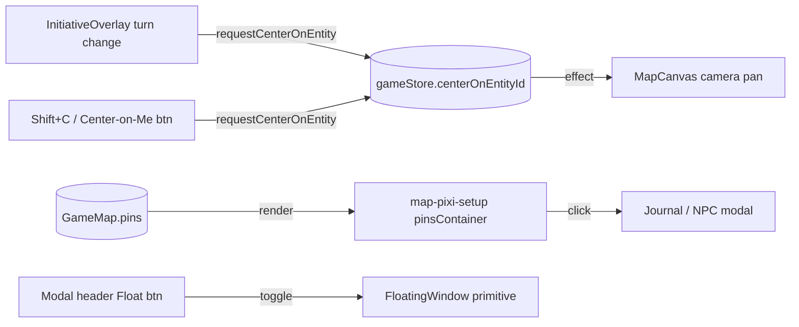

# Phase 16 — VTT Platform Comparison: Net-New Polish

## Context
Phase 16 collects the net-new gaps identified by comparing the dnd-app VTT against D&D Beyond, Foundry VTT, and Roll20. Most platform-comparison findings (active effects, dynamic lighting, trigger zones, audio emitters, multi-floor filtering, advanced walls, multi-token operations, rollable tables, party inventory, encounter builder, foreground/occlusion, guided character builder, library unification) are already owned by other phases — see the Depends on / blocks section.

What remains here are the workflow polish features that don't fit elsewhere: auto-pan during initiative, map pins with journal links, non-blocking floating windows for DM reference tools, macro engine improvements (conditionals + repeat + visibility while bottom bar is collapsed), scene preloading, animated map transitions, and hover-based grid coordinate readout. The intended outcome is parity with the QoL features players expect from mainstream VTTs without bloating any existing subsystem.

## Depends on / blocks
- Depends on: Phase 1 (lighting, regions, audio emitters, floor filtering, walls, multi-token, rollable tables, party inventory, encounter builder, foreground/occlusion), Phase 2 (guided builder), Phase 13 (token context menu wiring), Phase 15 (library unification — absorbs old Sub-Phase E)
- Blocks: none. Phase 31 (live-state sync) will later move pin CRUD into a `map-pins` shard; until then, pin broadcasts go through `dm:map-update`.

## Files touched
| Path | Role |
|------|------|
| `src/renderer/src/components/game/map/MapCanvas.tsx` | Auto-pan camera, hover grid coordinate readout, scene transition overlay |
| `src/renderer/src/components/game/overlays/InitiativeOverlay.tsx` | Trigger auto-pan on turn change (DONE) |
| `src/renderer/src/hooks/use-game-shortcuts.ts` | `center-on-me` keyboard handler (DONE) |
| `src/renderer/src/components/game/GameLayout.tsx` | Wire `onCenterOnMe`, host `Add Pin` flow (DONE); add `autoPanOnTurnChange` setting + toggle |
| `src/renderer/src/components/game/bottom/PlayerBottomBar.tsx` | "Center on Me" button; MacroBar in collapsed branch (DONE) |
| `src/renderer/src/types/map.ts` | `MapPin`, `MapPinIcon`, `pins` field on `GameMap` (DONE) |
| `src/renderer/src/components/game/map/map-pixi-setup.ts` | New `pinsContainer` layer between tokens and fog |
| `src/renderer/src/components/game/overlays/EmptyCellContextMenu.tsx` | "Add Pin" menu entry (DONE — label-only) |
| `src/renderer/src/components/ui/FloatingWindow.tsx` | Draggable/resizable window primitive (DONE) |
| `src/renderer/src/components/game/modals/combat/InitiativeModal.tsx` | Add Float/Dock toggle |
| `src/renderer/src/components/game/modals/dm-tools/CreatureModal.tsx` | Add Float/Dock toggle |
| `src/renderer/src/components/game/modals/dm-tools/DMNotesModal.tsx` | Add Float/Dock toggle |
| `src/renderer/src/services/macro-engine.ts` | `expandRepeatBlocks` (DONE); add `{if}` conditional parser |
| `src/renderer/src/components/game/map/grid-layer.ts` | `drawGridLabels` row/column overlay (DONE — different shape than hover-readout) |

## Sub-phase summary
| # | Sub-phase | Theme |
|---|-----------|-------|
| 16a | Auto-pan to active token | Camera follows initiative + Center-on-Me UX |
| 16b | Map pins with journal linkage | Spatial bookmarks with linked content |
| 16c | Non-blocking floating tools | DM reference panels that don't block the map |
| 16d | Macro engine improvements | Conditionals, repeat blocks, visible-when-collapsed |
| 16e | (Removed) | Absorbed into Phase 15 (library unification) |
| 16f | Scene preloading + transitions | Asset preload on portal links + fade between maps |
| 16g | Grid coordinate readout | Hover HUD showing cell label under cursor |

## Architecture / data flow

## Sub-phase details

### 16a — Auto-Pan to Active Token
**Files:** `src/renderer/src/components/game/GameLayout.tsx`, `src/renderer/src/components/game/bottom/PlayerBottomBar.tsx`, `src/renderer/src/components/game/map/MapCanvas.tsx`
**Steps:**
1. Add `autoPanOnTurnChange: boolean` (default `true`) to the game settings store and surface a toggle in the game toolbar or settings dropdown. Gate the existing `requestCenterOnEntity` call at `InitiativeOverlay.tsx:70-73` on that setting (each viewer can override DM default).
2. Add a "Center on Me" button in `PlayerBottomBar.tsx` that calls `useGameStore.getState().requestCenterOnEntity(character.id)`, mirroring the existing `onCenterOnMe` handler at `GameLayout.tsx:563-567`.
3. In `MapCanvas.tsx:694-712` (current snap-pan), add a debounce that suppresses auto-pan for 5 seconds after the user manually pans/zooms. Track the last user-pan timestamp via the existing `panRef`/wheel handlers and skip the centering effect if `Date.now() - lastManualPanAt < 5000`.

**Acceptance:** Toggling the setting off stops `MapCanvas.tsx:697` from re-centering on initiative changes. Pressing the "Center on Me" button moves the camera to the local character. Manually panning then waiting for a turn change does NOT auto-pan within 5s; after 5s it does.

### 16b — Map Pins with Journal Linkage
**Files:** `src/renderer/src/components/game/map/map-pixi-setup.ts`, `src/renderer/src/components/game/map/MapCanvas.tsx`, `src/renderer/src/components/game/overlays/EmptyCellContextMenu.tsx`, `src/renderer/src/components/game/GameLayout.tsx`
**Steps:**
1. Add a `pinsContainer` PixiJS Container in `map-pixi-setup.ts` between the token layer and the fog layer (mirror the existing `gridLabelContainer` pattern at `:97-99`). Wire it into the returned layers tuple at `:184`.
2. In `MapCanvas.tsx`, add a `useEffect` that reads `activeMap.pins`, filters by `visibleToPlayers` for non-DM viewers and by `floor === currentFloor`, then renders each pin as an icon + colored chrome at `(gridX * cellSize + cellSize/2, gridY * cellSize + cellSize/2)`. Hide labels at zoom thresholds below ~0.5 to avoid clutter on dense maps.
3. Add pointer handlers on each pin sprite: hover shows the `label` as a tooltip; click dispatches based on link fields — `linkedJournalId` opens journal panel, `linkedNpcId` opens NPC detail, `linkedLocationId` opens location detail.
4. Upgrade the existing label-only prompt at `GameLayout.tsx:947-963` into a richer form (icon picker, color, visibility toggle, optional journal/NPC/location picker). Keep the same `updateMap(activeMap.id, { pins: [...] })` write path so 31's shard migration is trivial.

**Acceptance:** A DM adding a pin via the EmptyCellContextMenu sees it render on the map. A pin with `visibleToPlayers: false` is invisible to non-DM viewers. Hovering a pin shows its label; clicking opens the linked content. Pins persist in `GameMap.pins`.

### 16c — Non-Blocking Floating Tools
**Files:** `src/renderer/src/components/game/modals/combat/InitiativeModal.tsx`, `src/renderer/src/components/game/modals/dm-tools/CreatureModal.tsx`, `src/renderer/src/components/game/modals/dm-tools/DMNotesModal.tsx`, `src/renderer/src/components/game/GameLayout.tsx`
**Steps:**
1. In each of the three modal headers, add a "Float / Dock" button beside Close. Clicking Float closes the modal (via existing `onClose`) and opens the same content inside `<FloatingWindow storageKey="initiative" ... />` mounted at the `GameLayout` level.
2. Persist the user's last choice per tool in a `floatingWindowState` slice (sessionStorage-backed) so subsequent opens default to whichever surface (modal vs floating) was last used.
3. Manage z-order at the `GameLayout` mount points — the `FloatingWindow` primitive already increments `zCounter` on focus (`FloatingWindow.tsx:38`); confirm the wrapper exposes the focus handler upstream.
4. Do NOT float `AttackModal`, `SpellModal`, or any confirmation modal — these stay focused/blocking by design.

**Acceptance:** Pressing Float on `InitiativeModal` shows the same tracker inside a draggable window with the map still interactive behind it. Reload — the same tool reopens as floating because the preference persisted. Clicking another floating window brings it forward.

### 16d — Macro Engine Conditionals
**Files:** `src/renderer/src/services/macro-engine.ts`
**Steps:**
1. Add a `{if condition}A{else}B{/if}` parser to `macro-engine.ts` that runs BEFORE `resolveMacroVariables`. Support comparison operators (`<`, `>`, `<=`, `>=`, `==`, `!=`) and arithmetic (`+`, `-`, `*`, `/`) on the already-supported `$self.hp`, `$self.maxhp`, `$mod.*`, `$prof`, `$level` variables. No `eval()` — hand-rolled tokenizer.
2. Extend `resolveMacroVariables` at `macro-engine.ts:17-62` to also resolve `$self.hp` and `$self.maxhp` (currently only `mod.*`, `self`, `target`, `prof`, `level` are handled).
3. Wire `expandConditionalBlocks` into `executeMacro` at `macro-engine.ts:100-101` so the order is: repeat -> conditional -> variables.
4. Malformed conditionals should produce a clear chat error (`[Macro: name] syntax error in {if ...}`) and not throw.

**Acceptance:** A macro `{if $self.hp < $self.maxhp/2}2d6+$mod.con{else}1d6+$mod.con{/if}` rolls the high die when bloodied and the low die when healthy. A malformed `{if foo bar}...{/if}` shows a clear error in chat, never crashes the chat dispatcher. Existing macros without conditionals continue to work identically.

### 16f — Scene Preloading + Transitions
**Files:** `src/renderer/src/components/game/map/MapCanvas.tsx`, `src/renderer/src/stores/game/map-token-slice.ts`
**Steps:**
1. Add `preloadAdjacentMaps(currentMap, allMaps)` near `MapCanvas.tsx:321` (the existing `Assets.load` call). For each `terrain` cell with `type === 'portal'` and a defined `portalTarget`, call `Assets.load(targetMap.imagePath).catch(() => {})`. Cap at 3 preloads to keep GPU memory bounded. Host only — clients preload when they receive the map-data on switch.
2. Call `preloadAdjacentMaps` on map load and when the campaign map list changes.
3. Add a fade-to-black transition when switching active maps: pre-switch fade overlay 0->1 (300ms), call `setActiveMap`, wait one `requestAnimationFrame`, fade 1->0 (300ms). Use a PixiJS overlay or CSS overlay on the canvas container. Respect `prefers-reduced-motion` — skip animation if set.

**Acceptance:** With a campaign of 3+ maps linked via portals, switching to the linked map happens with no asset-load stutter (verified via DevTools network panel — no PNG/JPG load during the switch). The transition is a smooth 600ms fade. Setting `prefers-reduced-motion: reduce` removes the fade.

### 16g — Grid Coordinate Hover Readout
**Files:** `src/renderer/src/components/game/map/MapCanvas.tsx`
**Steps:**
1. On the map's pointermove handler, compute grid coordinates under the cursor using the existing `pixelToGrid`-equivalent math used at `MapCanvas.tsx:704-708`. Square grids -> column letter + row number ("A1", "AA12"); hex grids -> axial coordinates ("3,7").
2. Render a small absolute-positioned HUD element inside the MapCanvas wrapper (`bottom-2 right-2 bg-black/60 text-white text-xs px-2 py-1 rounded`) showing the current coordinate.
3. Add a settings toggle to hide if unwanted. Note: row/column edge labels already exist via `drawGridLabels` (`grid-layer.ts:218`) — this is a separate hover-only readout.

**Acceptance:** Moving the cursor across cells updates the HUD readout in real time. The HUD respects the toggle. For both DM and players. No measurable FPS drop during sustained mouse movement.

## Constraints & edge cases
- **Auto-pan info leak**: The hidden-token guard at `InitiativeOverlay.tsx:60-69` MUST stay. Pre-existing Phase 15c fix — don't undo by triggering camera moves on hidden enemies' turns.
- **Auto-pan vs manual pan**: Debounce manual interactions so the camera doesn't fight the user.
- **Pin density**: Many pins on one map gets noisy; hide labels (not icons) below zoom 0.5.
- **Pin sync**: Until Phase 31 lands, pin CRUD must be broadcast via the existing `dm:map-update` channel. After Phase 31 (live-state sync), pins live in the `map-pins` shard and propagate via delta automatically.
- **Floating windows**: Never float confirmation modals or combat input modals (AttackModal, SpellModal) — focus is intentional there. Clamp window position to viewport bounds.
- **Macro conditional safety**: No `eval()`. Hand-rolled tokenizer over a fixed variable allowlist. Backward-compatible — every existing macro must continue to work unchanged.
- **Scene preload memory budget**: Hard cap of 3 preloaded maps. Only the host preloads (P2P clients receive map data lazily on switch).
- **Grid hover-readout vs row/column labels**: Two different features. `drawGridLabels` already paints edge labels; the new HUD is per-cursor. Both can coexist.

## Verification
- `cd dnd-app && npm test -- macro-engine` — confirms `{if}` parser cases, malformed input handling, repeat-then-conditional ordering.
- `cd dnd-app && npm test -- map-pixi-setup` — confirms `pinsContainer` is in the layer stack at the expected position.
- Manual smoke: start a campaign, open initiative, advance turns -> camera pans to the active token, no pan when hidden enemy is up. Toggle the setting off -> no camera move. Press Shift+C / Center-on-Me -> camera centers on local character.
- Manual smoke: DM places a pin via empty-cell menu, fills label/icon/journal link -> pin renders, hover shows label, click opens linked content. Player without `visibleToPlayers` doesn't see the pin.
- Manual smoke: open InitiativeModal, click Float -> floating window appears, map is interactive behind it, reload -> initiative reopens floating.
- Manual smoke: portal-link two maps, set active to one, DevTools Network tab clear -> switch maps; no image fetch happens during the switch; the fade transition plays for 600ms.
- Manual smoke: hover cursor across the map -> HUD updates with cell label; toggle off -> HUD disappears.

## Completed
- 16a Step 1 (auto-pan trigger) — DONE (`src/renderer/src/components/game/overlays/InitiativeOverlay.tsx:54-73`) — `requestCenterOnEntity` flag fires on turn change; MapCanvas consumes at `MapCanvas.tsx:694-712`; hidden-token info-leak guard preserved.
- 16a Step 3 (Center-on-Me shortcut) — DONE (`src/renderer/public/data/ui/keyboard-shortcuts.json:32`, `src/renderer/src/hooks/use-game-shortcuts.ts:94`, `src/renderer/src/components/game/GameLayout.tsx:562-567`) — Shift+C centers on local player's character.
- 16b Step 1 (MapPin type) — DONE (`src/renderer/src/types/map.ts:31-55`) — `MapPin` interface, `MapPinIcon` union, `pins?: MapPin[]` on `GameMap`.
- 16b Step 4 (Add Pin menu entry, minimal) — DONE (`src/renderer/src/components/game/overlays/EmptyCellContextMenu.tsx:143-153`, `src/renderer/src/components/game/GameLayout.tsx:943-964`) — label-only prompt writes to `activeMap.pins`; icon/color/link picker is the live remainder under 16b Step 4.
- 16c Step 0 (FloatingWindow primitive) — DONE (`src/renderer/src/components/ui/FloatingWindow.tsx:1-80`, `src/renderer/src/components/ui/index.ts:8`) — draggable, resizable, sessionStorage-persisted, z-order managed; no consumers yet.
- 16d Step 0 (repeat blocks + multi-line dispatch) — DONE (`src/renderer/src/services/macro-engine.ts:80-88`, `:100-118`) — `{repeat N}...{/repeat}` expands to N newline-joined copies, cap N=20; each line dispatched independently.
- 16d Step 0b (macro bar visible when bottom bar collapsed) — DONE (`src/renderer/src/components/game/bottom/PlayerBottomBar.tsx:192-204`) — collapsed branch renders `<MacroBar />` inline alongside collapsed `<ChatPanel />`.
- 16g Step 0 (row/column edge labels) — DONE (`src/renderer/src/components/game/map/grid-layer.ts:218`, `src/renderer/src/components/game/map/map-overlay-effects.ts:112-114`) — `drawGridLabels` paints column letters along top and row numbers along left when zoom > 0.5. Distinct from the live hover-readout step.
- Phase 1 / prior follow-up (drawTokenStatusRing wired) — DONE (`src/renderer/src/components/game/map/token-sprite.ts:265`) — formerly unused; now invoked on each token sprite.
- **16a Steps 1-3 (auto-pan + Center-on-Me + debounce) — DONE 2026-05-29.** Step 1: `services/game/auto-pan-pref.ts` (per-viewer localStorage flag, default ON) gates `InitiativeOverlay`'s `requestCenterOnEntity` call; an "Auto-pan" checkbox in the expanded tracker header toggles it. Step 2: "Center on Me" button in `PlayerBottomBar` action column → `requestCenterOnEntity(character.id)`. Step 3: `requestCenterOnEntity(entityId, viaAutoPan?)` gained a flag (store `centerViaAutoPan`); `MapCanvas` stamps `lastManualPanAtRef` on wheel + pan-drag pointerdown (space/middle, not token clicks) and suppresses **auto-pan** (not explicit Center-on-Me) for 5s after a manual move. Hidden-token info-leak guard preserved. 4-gate green; map-token-slice specs (55) pass.
- **16g Steps 1-3 (grid coordinate hover readout) — DONE 2026-05-29.** `MapCanvas` pointermove computes the cell under the cursor (mirrors the click-to-place math); `formatGridLabel` → "A1" (square, spreadsheet column letters) / axial "x,y" (hex/gridless). HUD div (`bottom-2 right-2 bg-black/60`) + a toggle button (`bottom-2 left-2`, localStorage `dnd-vtt-grid-coord-hud`, default on); the pointermove listener is skipped entirely when off (no per-move cost). Distinct from the existing `drawGridLabels` edge labels (16g Step 0). 4-gate green.
- **16b Steps 1-2 (map pins: layer + render) — DONE 2026-05-29; Steps 3-4 remaining.** Step 1: `pinsContainer` Container added to `map-pixi-setup.ts` between tokens and fog (+ test assertions for the layer key + label; 10 specs). Step 2: `components/game/map/pin-layer.ts` `renderPins` draws each pin (colored teardrop + icon glyph + label, labels hidden below 0.5 zoom) into `pinsContainer`; a `MapCanvas` effect (`pinsContainerRef`) renders `map.pins` filtered by `visibleToPlayers` (non-DM) + `currentFloor`. Satisfies "DM-added pin renders; `visibleToPlayers:false` invisible to players." **Remaining (app-verification-heavy):** Step 3 (hover tooltip + click-to-open linked journal/NPC/location — needs interactive sprites + callback plumbing to GameLayout) and Step 4 (upgrade the label-only `EmptyCellContextMenu` prompt into a rich icon/color/visibility/link-picker form). Logged for app-capable follow-up.
- **16f Step 1 (scene preload) — DONE 2026-05-29; Step 3 (fade) remaining.** `services/map/preload-adjacent.ts` `collectPreloadImagePaths` (pure, 4 specs: dedupe, cap at 3, skip self/missing/unknown) + a host-only `MapCanvas` effect that `Assets.load`s portal-linked maps' textures so switching has no load stutter. **Remaining:** Step 3 (fade-to-black map-switch transition respecting `prefers-reduced-motion`) — canvas animation, app-verification-heavy.
- **Fixed a tsc-node regression** in `electron.vite.config.ts` from the earlier 14g commit (`minify: 'esbuild'` widened to `string` in the un-contextually-typed config return → overload failure; `as const` pins the literal). The 14d/14g commit only ran tsc-web, so this slipped through — now green on all gates.
- **16c (non-blocking floating tools) — DONE for Initiative + DM Notes; CreatureModal deferred.** New `stores/use-floating-tools-store.ts` (per-tool floating flags, sessionStorage-persisted). `InitiativeModal` + `DMNotesModal` refactored to dual-mode: a **⇱ Float** button in the docked header switches the tool into a `<FloatingWindow>` (draggable/resizable, z-order managed, position persisted) mounted via `DmModals`; the floating instance persists across modal open/close and reloads (sessionStorage), with the map interactive behind it. `AttackModal`/`SpellModal`/confirmations intentionally NOT floatable (§16c Step 4). **`CreatureModal` float deferred** — it's a dual-purpose modal (creature lookup + summon) with heavy props; a blind float-refactor is riskier than its value, logged for a follow-up. Needs app smoke (drag/dock/persist/z-order). 4-gate green.
- **16d Steps 1-4 (macro `{if}` conditionals) — DONE 2026-05-29** (`src/renderer/src/services/macro-engine.ts`). Added `$self.hp`/`$self.maxhp` resolution; `expandConditionalBlocks(command, character)` parses `{if COND}A{else}B{/if}` (else optional) via a hand-rolled, NO-eval recursive-descent evaluator over `+ - * /` (precedence + unary minus) and comparators (`<= >= == != < >`) on the numeric variable allowlist (`$self.hp`, `$self.maxhp`, `$mod.*`, `$prof`, `$level`). Wired into `executeMacro` in order repeat→conditional→variables; malformed conditions throw `MacroSyntaxError`, caught to emit `[Macro: name] syntax error in {if ...}` (never crashes the dispatcher). 8 new specs (37 total in `macro-engine.test.ts`); existing macros unaffected. **16d COMPLETE** (Step 0/0b repeat+collapsed-bar already done).
