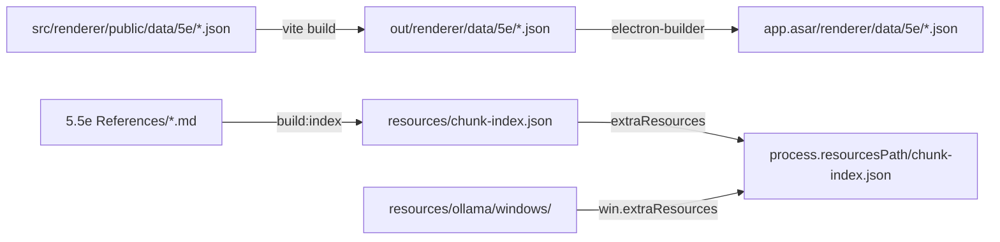

# Phase 19 — Packaging, Build Configuration, and Distribution

## Context

Phase 19 covers the Electron build toolchain: electron-vite + electron-builder, the NSIS installer, the auto-updater, code signing, platform targets, and how data assets are resolved in packaged vs dev builds. The original audit (2026-03-09) flagged a critical packaged path bug in `srd-provider.ts` that makes AI SRD lookups return nothing in production, plus several reliability/quality gaps (no code signing, Windows-only targets, `release` script not cleaning stale artifacts).

The 2026-05-19 re-verification shows significant progress: Linux builds now ship (`linux.target: ["AppImage"]`, `build:linux`, `release:linux`), CI release workflow exists with preflight + verify-assets jobs, chunk-index handles missing reference files, and auto-check-on-startup is wired. The critical `srd-provider.ts` `public/` path bug is still live, the shared `paths.ts` utility was never created, `prerelease` is still not invoked by `release`, and code signing is still not configured.

## Depends on / blocks

- Depends on: none
- Blocks: Phase 15 (library build-guard lint allowlist needs to know which files load 5e raw JSON), Phase 30 (host-side snapshot path under `userData/snapshots/` should reuse the same path-resolution layer if one lands)

## Files touched

| Path | Role |
|------|------|
| `src/main/ai/srd-provider.ts` | Critical packaged-path bug — `'public'` still in join |
| `src/main/ai/context-builder.ts` | Dev branch still references `renderer/public/data/5e`; covered by try/catch |
| `src/main/ai/chunk-builder.ts` | Already uses `process.resourcesPath` + `rulebooks` / `chunk-index.json` correctly |
| `src/main/ipc/game-data-handlers.ts` | Already uses `is.dev` branching with no `public/` in packaged path |
| `src/main/paths.ts` | Does not exist — proposed shared util |
| `package.json` | `build` config; `release` script still skips `prerelease`; no CSC config; no `mac` target |
| `scripts/build/prerelease-clean.mjs` | Present but not invoked by `release` |
| `scripts/build/build-chunk-index.mjs` | Already handles missing `5.5e References/` by falling back to tracked `resources/chunk-index.json` |
| `scripts/build/verify-build.mjs` | Does not exist — local pre-package verification gap |
| `scripts/sign.mjs` | Does not exist — conditional signing wrapper |
| `src/main/updater.ts` | `maybeAutoCheckOnLaunch` already implemented (v2.1.16) |
| `src/main/index.ts` | Already calls `maybeAutoCheckOnLaunch()` at line 265 |
| `.github/workflows/release.yml` | Has `preflight` + matrix build + `verify-assets`; no signing wiring |

## Sub-phase summary

| # | Sub-phase | Theme |
|---|-----------|-------|
| 19a | Fix critical packaged path | srd-provider `'public'` bug + audit related callers |
| 19b | Shared paths utility | Centralize dev/packaged path resolution |
| 19c | Release script reliability | Invoke `prerelease` + add local build verification |
| 19d | Code signing | Conditional signing wrapper + CSC env var docs |
| 19e | macOS target | Add `mac`/`dmg` build config |
| 19f | Cross-platform path audit | Verify `userData`, separators on all OSes |

## Architecture / data flow

Key invariant: Vite copies the *contents* of `src/renderer/public/` to the root of `out/renderer/`. The `public/` directory name is stripped. Any main-process code joining `'public'` into a packaged path will miss the file.

## Sub-phase details

### 19a — Fix critical packaged path in srd-provider

**Files:** `src/main/ai/srd-provider.ts`, `src/main/ai/context-builder.ts`
**Steps:**
1. In `src/main/ai/srd-provider.ts:7`, remove the literal `'public'` from the join so the packaged branch reads `join(process.resourcesPath, 'app.asar', 'renderer', 'data', '5e')`. The dev branch at line 9 (`join(app.getAppPath(), 'src', 'renderer', 'public', 'data', '5e')`) is correct and stays.
2. In `src/main/ai/context-builder.ts:24-30`, replace the `NODE_ENV` check with `app.isPackaged` (matches the rest of the codebase) and align the packaged path with `getSrdDir()` in srd-provider. Today the prod branch already targets `out/renderer/data/5e` via `app.getAppPath()` which is the loader-time path, not the packaged path; switching to `process.resourcesPath + app.asar + renderer + data + 5e` makes both files consistent.
3. Verify `src/main/ipc/game-data-handlers.ts:10` continues to work — it uses `__dirname, '..', 'renderer'` in packaged mode which resolves to `app.asar/renderer/` (correct). No change needed.
4. Verify `src/main/ai/chunk-builder.ts:24` (`process.resourcesPath, 'rulebooks'`) and `chunk-builder.ts:292` (`process.resourcesPath, 'chunk-index.json'`) are unchanged — both are extraResources entries outside the asar.

**Acceptance:** `grep -rn "public" src/main/ai/srd-provider.ts src/main/ai/context-builder.ts` shows no `public` literal in either packaged branch. Manually run a packaged build, open the DM, ask "what does fireball do?" — SRD lookup returns spell data instead of empty.

### 19b — Shared paths utility

**Files:** `src/main/paths.ts` (new), `src/main/ai/srd-provider.ts`, `src/main/ai/context-builder.ts`, `src/main/ai/chunk-builder.ts`, `src/main/ipc/game-data-handlers.ts`
**Steps:**
1. Create `src/main/paths.ts` exporting `getDataDir()` and `getResourcePath(relative: string)` that branch on `app.isPackaged` and return the canonical paths used by Step 1.
2. Replace direct path joins in `srd-provider.ts:5-10`, `context-builder.ts:24-30`, `chunk-builder.ts:22-32`, and `game-data-handlers.ts:7-12` with calls into the new utility.
3. Decide Phase 15 coordination: if Phase 15 lands a build-guard lint rule restricting raw 5e JSON imports, either add `paths.ts` to the allowlist OR route reads through the renderer library store. Note here when Phase 15 ships.

**Acceptance:** Single source of truth for the asar-relative data dir. `grep -rn "renderer.*public.*data\|app.asar.*renderer" src/main` returns only `paths.ts`. Existing `srd-provider.test.ts`, `context-builder.test.ts`, `chunk-builder.test.ts`, `game-data-handlers.test.ts` still pass.

### 19c — Release script reliability

**Files:** `package.json` (scripts block, lines 11-27), `scripts/build/verify-build.mjs` (new)
**Steps:**
1. Edit `package.json:21` (`release` script) so it invokes `prerelease` first: `"release": "npm run prerelease && npm run build:index && electron-vite build && electron-builder --win --publish always"`. Apply the same to `release:linux` (line 22) and `release:all` (line 23). `prerelease-clean.mjs` only wipes `dist/` — safe to run on every release.
2. Create `scripts/build/verify-build.mjs` that asserts `out/main/index.js`, `out/preload/index.mjs`, `out/renderer/index.html`, `out/renderer/data/5e/spells/spells.json`, and `resources/chunk-index.json` exist before electron-builder runs. Insert between `electron-vite build` and `electron-builder` in each release script.
3. Confirm `.github/workflows/release.yml` `verify-assets` job (lines 192-229) continues to catch the post-publish surface (it lists 6 expected assets — keep in sync if installer artifact names change).

**Acceptance:** `npm run release` cleans `dist/` then rebuilds. `verify-build.mjs` exits non-zero if any required output is missing. Local pre-tag run of `npm run check:release` still green.

### 19d — Code signing (Windows)

**Files:** `package.json` (lines 101-120), `scripts/sign.mjs` (new), `.env.signing.template` (new)
**Steps:**
1. Replace `"signAndEditExecutable": true` (line 106) with `"signAndEditExecutable": false` plus `"sign": "./scripts/sign.mjs"` so unsigned builds don't fail when no cert is present.
2. Create `scripts/sign.mjs`: if `process.env.CSC_LINK` is unset, log "skipping code signing" and return. Otherwise delegate to electron-builder's default signtool wrapper. Keep it ESM (`export default async function sign(configuration) {…}`).
3. Add `.env.signing.template` documenting `CSC_LINK` (path to PFX) and `CSC_KEY_PASSWORD`. Add `.env.signing` to `.gitignore` (verify not already excluded).
4. Document in `README.md` that production builds require a cert; CI can use base64-encoded secrets (`CSC_LINK` as base64 → electron-builder writes a temp file).

**Acceptance:** Local `npm run build:win` succeeds without `CSC_LINK` set (no signing). With a valid cert, the installer is signed (verify in Windows file properties → Digital Signatures).

### 19e — macOS target

**Files:** `package.json` (build block, after line 144)
**Steps:**
1. Add `mac` section with `category: "public.app-category.games"`, `target: ["dmg", "zip"]`, `icon: "resources/icon.png"`, `hardenedRuntime: true`, `gatekeeperAssess: false`.
2. Add `dmg` section with two-icon layout (app + Applications symlink).
3. Add `build:mac` and `release:mac` scripts that mirror the Linux pair.
4. Note in README that DMG builds require running on a Mac runner (electron-builder cannot produce notarized DMGs on Windows/Linux). Add `macos-latest` to the release.yml matrix when a Mac runner becomes available — out of scope for this phase, but document the requirement.

**Acceptance:** `npm run build:mac` (on a Mac) produces a DMG and ZIP. Configuration is valid (run `npx electron-builder --help` to confirm no schema errors).

### 19f — Cross-platform path audit

**Files:** `src/main/`, `src/renderer/`
**Steps:**
1. Confirm `app.getPath('userData')` is used everywhere user-writable state lives (campaigns, settings, snapshots). Grep for hard-coded `%APPDATA%`, `~/Library`, `~/.config`.
2. Grep for hardcoded backslashes in path strings: `grep -rn "\\\\\\\\" src/`. None expected — `path.join` handles separators.
3. Grep for Windows drive-letter assumptions: `grep -rn "C:\\\\\|D:\\\\" src/`. None expected.
4. Verify `path.join`/`path.sep` usage in all main-process file IO.

**Acceptance:** Clean greps for the patterns above. Existing tests still pass on Linux CI runner.

## Constraints & edge cases

- **ASAR boundary:** `app.asar` contents are read-only and shimmed as a virtual filesystem. `extraResources` entries live *outside* the asar at `process.resourcesPath`. Never prepend `app.asar` to an extraResources path. The Ollama bundle (`resources/ollama/windows/` → `ollama/`) and `chunk-index.json` are both extraResources.
- **Vite public dir stripping:** `src/renderer/public/<x>` becomes `out/renderer/<x>` (no `public/` segment). The Phase 19 critical bug is exactly this off-by-one path.
- **Code signing cost:** Standard CAs charge $200-400/year for code signing certs. Azure Trusted Signing is cheaper for indie devs. Free self-signed certs do not bypass SmartScreen.
- **macOS cross-compilation:** electron-builder cannot produce signed/notarized DMGs from Windows or Linux. A macOS CI runner is required.
- **GitHub release API rate limits:** Unauthenticated check-for-updates calls hit 60/hour. The updater silently downgrades errors to "not-available" to avoid alarming users when the limit is hit.
- **Delta updates:** Differential downloads are intentionally disabled in `updater.ts` (line 236) due to corruption observed across structural changes (e.g. v2.0 → v2.1 when `signAndEditExecutable` flipped). Full re-downloads are slower but reliable.
- **`window.isDestroyed()` guard:** Broadcasting update status events to closed windows throws. `broadcastStatus` in `updater.ts:57-63` already guards correctly.
- **CI parity:** `5.5e References/` is gitignored so CI does not have it. `build-chunk-index.mjs` already falls back to the tracked `resources/chunk-index.json` (lines 240-247). Do not break that fallback.

## Verification

After each sub-phase:
1. `npm run lint && npm run test`
2. `npm run check:release` (lint + both typechecks + tests — same gates as CI preflight)
3. For 19a/19b: build the app (`npm run build:win` on Win, `npm run build:linux` on Linux), install it, open the DM, prompt with a known SRD spell name. SRD context block should appear in the AI prompt logs.
4. For 19c: `npm run release` end-to-end on a throwaway tag — confirm `dist/` was cleaned and all expected artifacts are present.
5. For 19d: Win build with no `CSC_LINK` succeeds and is unsigned (expected SmartScreen warning); with a real cert, installer shows a valid digital signature.
6. For 19e: build on a Mac runner — DMG mounts and the app launches.
7. For 19f: full test suite green on the Linux CI runner.

## Completed

> **PHASE 19 COMPLETE (19a–19f) — 2026-05-29.** Full 4-gate green (lint 0, tsc web+node 0, vitest 6477/6477).
> - **19a/19b** — Fixed the critical packaged SRD path. The old `srd-provider` packaged branch (`process.resourcesPath/app.asar/renderer/public/data/5e`) kept a stale `public/` AND dropped `out/`, so production SRD lookups returned nothing. New `src/main/paths.ts` (`getRendererPublicDir` / `getDataDir` / `getResourcePath`) centralizes dev-vs-packaged resolution; the verified-correct packaged data dir is `<app.asar>/out/renderer/data/5e`. Routed srd-provider, context-builder (removed its bespoke NODE_ENV branch), chunk-builder (rulebooks + chunk-index extraResources), and game-data-handlers through it. **NOTE: the plan's suggested fix path also dropped `out/` — corrected against the actual asar layout (`files` packs `out/` preserving project structure).** All 26 path-related tests pass.
> - **19c** — `release` / `release:linux` / `release:all` now run `prerelease` (dist/ clean) then `build:index` then `electron-vite build` then a new `verify:build` gate then electron-builder. New `scripts/build/verify-build.mjs` asserts out/main/index.js, out/preload/index.mjs, out/renderer/index.html, out/renderer/data/5e/spells/spells.json, resources/chunk-index.json.
> - **19d** — `win.signAndEditExecutable: false` + `win.sign: ./scripts/sign.mjs`; the hook skips when `CSC_LINK` unset (unsigned build succeeds) else signs via Windows SDK signtool. Added `.env.signing.template` (+ root .gitignore exception `!**/.env.signing.template`) and a README signing section. NOTE: chose signtool over importing electron-builder internals (unstable across versions); the cert path is untestable in this env but the no-cert skip path is verified.
> - **19e** — `mac` (games category, hardenedRuntime, gatekeeperAssess false, dmg+zip) + `dmg` (two-icon /Applications layout) config; `build:mac` / `release:mac` scripts; README notes DMGs need a Mac runner (macos-latest matrix entry deferred).
> - **19f** — Path audit clean: no `%APPDATA%` / `~/Library` / `~/.config` hardcoding; the only drive-letter literal (`C:\Program Files` in ollama-manager) is inside a `process.platform === 'win32'` guard; 43 `getPath('userData')` sites for state, 2 `getPath('temp')`. No code changes.
> - **Deferred:** macos-latest CI runner (19e, needs a Mac host); Phase 15 build-guard allowlist coordination for `paths.ts` (15 already shipped; `paths.ts` reads main-process data dirs, not renderer library — no boundary-test conflict).

### Pre-existing (earlier-session) stamps

- 19g Step 1 — DONE (`src/main/updater.ts:290-298`, `src/main/index.ts:265`) — auto-check-on-startup wired via `maybeAutoCheckOnLaunch`, gated by `settings.autoCheckUpdates`, with a 5s deferral so the renderer is alive for status events. Also covers optional auto-download and auto-restart prefs.
- 19h Step 1 — DONE (`scripts/build/build-chunk-index.mjs:240-247`) — missing `5.5e References/` directory now falls back to the tracked `resources/chunk-index.json` instead of failing the build. Empty-index fallback is unnecessary because the prebuilt index is checked in.
- 19i Step 1 — DONE (`package.json:133-147`, `package.json:18`, `package.json:22`, `.github/workflows/release.yml:77-190`) — Linux `AppImage` target shipped, `build:linux` and `release:linux` scripts in place, release workflow builds Windows + Linux in matrix.
- 19j Step 1 — DONE (`.github/workflows/release.yml:35-75`) — CI preflight job validates version match + lint + both typechecks + tests before any artifact is built.
- 19k Step 1 — DONE (`.github/workflows/release.yml:192-229`) — post-publish `verify-assets` job fails the release if any of the 6 expected assets are missing (catches the v2.0.1 / v2.0.2 silent-partial-upload class of bug).
- 19l Step 1 — DONE (`src/main/ipc/game-data-handlers.ts:10`) — packaged path correctly uses `join(__dirname, '..', 'renderer')` with no stale `public/` segment; path-traversal guard via `resolve` is also in place (line 24).
- 19m Step 1 — DONE (`src/main/ai/chunk-builder.ts:24`, `chunk-builder.ts:292`) — rulebooks and chunk-index resolution correctly use `process.resourcesPath` without joining `app.asar`.
- 19n Step 1 — DONE (`package.json:21`) — `release` script invokes `build:index` (chunk index rebuild) before electron-vite build. Still missing the `prerelease` clean (tracked in 19c Step 1).
