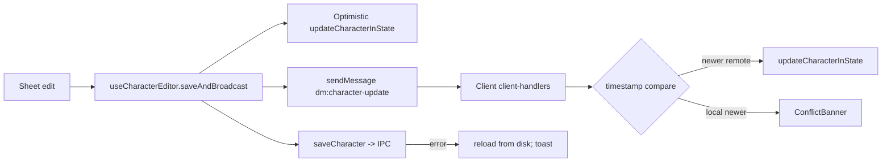

# Phase 23 — In-Game Character Sheet

## Context
The 5e character sheet is comprehensive and functional, organized into a two-column Tailwind grid with collapsible sections (`CharacterSheet5ePage.tsx`). Data binds via Zustand (`use-character-store.ts`) with broadcast through `useCharacterEditor`. The architecture is solid but exhibits several gaps: no list virtualization (spells/equipment lag with 50+ entries), no in-sheet spell search/filter, remote character updates land in `lobbyStore.remoteCharacters` instead of the canonical character store, no conflict detection on simultaneous DM+player edits, sparse `useMemo` coverage, attunement is split across two fields (`character.attunement` array vs `character.magicItems[].attuned` boolean), and saves block on IPC round-trip.

Quality-of-life gaps surfaced during audit: no rollable tool proficiencies (the UI lists tools, but no roll buttons), no quick-actions panel (Attack/Dash/Disengage), no temp-HP or damage-application helper, no consumable tracking (ammo/potions/scrolls), no initiative roll button on the sheet, no individual hit-die rolling, container weights are not aggregated, currency conversion on sell may drop denominations, and there is no condition sync message type. A real bug exists in `MagicItemsPanel5e.tsx`: line 57 checks `mi.attunement` while line 59 filters `mi.attuned`, so the "Attuned: X/3" label appears off the wrong predicate.

Phase 23 closes performance, sync-correctness, and QoL gaps without trespassing on phase-owned work (conditions-to-rolls automation lives in Phase 1/4; death save automation in Phase 4; ARIA in Phase 18; player inventory panel in Phase 15A; shard-based sync supersedes the conflict layer post-Phase 31).

## Depends on / blocks
- Depends on: none (interim work; coordinate field shapes with Phase 15)
- Blocks: none directly; the Sub-Phase D conflict layer becomes shard-level work after Phase 31

## Files touched
| Path | Role |
|------|------|
| `src/renderer/src/components/sheet/5e/SpellList5e.tsx` | Virtualize spell rows; add search/filter input |
| `src/renderer/src/components/sheet/5e/SpellcastingSection5e.tsx` | Hoist filter state; pass to SpellList |
| `src/renderer/src/components/sheet/5e/EquipmentListPanel5e.tsx` | Virtualize equipment rows; categories/sort |
| `src/renderer/src/stores/network-store/client-handlers.ts` | Route `dm:character-update` to character store; conflict detection |
| `src/renderer/src/stores/use-character-store.ts` | Add `updateCharacterInState` (if missing); optimistic write |
| `src/renderer/src/stores/use-lobby-store.ts` | Remove `remoteCharacters` (interim) |
| `src/renderer/src/hooks/use-character-editor.ts` | Optimistic save + rollback pattern |
| `src/renderer/src/components/sheet/5e/AttunementTracker5e.tsx` | Derive from `magicItems[].attuned` |
| `src/renderer/src/components/sheet/5e/MagicItemsPanel5e.tsx` | Fix `mi.attunement` vs `mi.attuned` mismatch |
| `src/renderer/src/components/sheet/5e/ToolProficiencies5e.tsx` | Add roll buttons per tool |
| `src/renderer/src/components/sheet/5e/HitPointsBar5e.tsx` | Damage/heal/temp-HP helper |
| `src/renderer/src/components/sheet/5e/SkillsSection5e.tsx`, `SavingThrowsSection5e.tsx`, `OffenseSection5e.tsx`, `DefenseSection5e.tsx`, `EquipmentSection5e.tsx` | `useMemo` for derived stats |
| `src/renderer/src/components/sheet/5e/SheetHeader5e.tsx` | Initiative roll button |
| `src/renderer/src/services/weight-calculator.ts` | Container weight aggregation |

## Sub-phase summary
| # | Sub-phase | Theme |
|---|-----------|-------|
| 23a | List virtualization | Performance |
| 23b | Spell search & filters | UX |
| 23c | Unify character update flow | Sync correctness |
| 23d | Conflict detection & resolution | Sync correctness |
| 23e | `useMemo` and `React.memo` coverage | Performance |
| 23f | Attunement unification | Data consistency |
| 23g | Optimistic save pattern | UX latency |
| 23h | Tool proficiency rolls | QoL |
| 23i | Standardize editor hook usage | Maintenance |
| 23j | Quick actions & damage helper | QoL |
| 23k | Consumable & spell scroll tracking | QoL |
| 23l | Initiative & hit-die rolls on sheet | QoL |
| 23m | Inventory categories & container weight | UX/correctness |
| 23n | Condition sync message type | Sync correctness |

## Architecture / data flow

## Sub-phase details

### 23a — List virtualization
**Files:** `src/renderer/src/components/sheet/5e/SpellList5e.tsx`, `src/renderer/src/components/sheet/5e/EquipmentListPanel5e.tsx`
**Steps:**
1. In `SpellList5e.tsx:274-303`, replace the nested `.map` with `useVirtualizer` from `@tanstack/react-virtual` (already in repo, used in `ChatPanel`, `LibraryItemList`). Flatten level groups into a single virtual list with header rows interleaved. Use `measureElement` so expanded spell rows resize correctly.
2. In `EquipmentListPanel5e.tsx`, wrap the equipment item list in the same virtualizer pattern (`estimateSize: 48`, `overscan: 5`).
3. Preserve scroll position when navigating back into the sheet (store last scrollTop in a ref keyed by character id).
**Acceptance:** A character with 80 spells across all levels scrolls without dropped frames in DevTools Performance; only ~20 spell DOM nodes are present at any one time.

### 23b — Spell search & filter
**Files:** `src/renderer/src/components/sheet/5e/SpellcastingSection5e.tsx`, `src/renderer/src/components/sheet/5e/SpellList5e.tsx`
**Steps:**
1. Add `spellSearch` and filter state (`school[]`, `castingTime[]`, `components{V,S,M}`, `concentration`, `ritual`, `preparedOnly`) to `SpellcastingSection5e.tsx`.
2. Render search input + filter chip row above the spell list. Default `preparedOnly` to true for prepared casters and false otherwise.
3. Pass filtered `spellsByLevel` (post-filter) into `SpellList5e`.
4. Filter resets when the sheet unmounts.
**Acceptance:** Typing "fire" hides non-matching spells in <50ms with 60+ spells; toggling "Ritual" reduces the visible set to ritual spells only.

### 23c — Unify character update flow
**Files:** `src/renderer/src/stores/network-store/client-handlers.ts`, `src/renderer/src/stores/use-character-store.ts`, `src/renderer/src/stores/use-lobby-store.ts`, `src/renderer/src/hooks/use-character-editor.ts`
**Steps:**
1. Verify/add `updateCharacterInState(id, data)` to `use-character-store.ts` (saveCharacter at line 55).
2. In `client-handlers.ts:924-935`, replace `useLobbyStore.getState().setRemoteCharacter(...)` with `useCharacterStore.getState().updateCharacterInState(payload.characterId, payload.characterData)`.
3. Remove the redundant `useLobbyStore.getState().setRemoteCharacter` call in `use-character-editor.ts:22`.
4. Audit all `setRemoteCharacter` call sites: `DeathSaves5e.tsx:41,93`, `ClassResourcesSection5e.tsx:31`, `CombatStatsBar5e.tsx:321`, `HitPointsBar5e.tsx:48`, `host-handlers.ts:368-369,488`. Each must call the character store instead. Then delete `remoteCharacters` field + setter from `use-lobby-store.ts` (lines 155, 172, 196, 464-466, 527) and update tests.
**Acceptance:** `grep -rn "remoteCharacters\|setRemoteCharacter" src/renderer/src/` returns only deletions.

### 23d — Conflict detection & resolution
**Files:** `src/renderer/src/stores/network-store/client-handlers.ts`, `src/renderer/src/components/common/ConflictBanner.tsx` (new)
**Steps:**
1. In the `dm:character-update` case of `client-handlers.ts`, compare local `updatedAt` against `payload.characterData.updatedAt`. If `localTs > remoteTs + 2000ms` tolerance, push a conflict entry into a new `useConflictStore`.
2. Create `ConflictBanner.tsx` consuming the conflict store. Buttons: "Keep Mine" (re-broadcasts local) and "Accept DM" (force-applies the remote payload). Mount the banner in the sheet root.
3. Default behaviour when remote is newer: apply silently.
**Acceptance:** Two-tab test — both sides set HP simultaneously; the older side sees the banner; clicking "Accept DM" replaces local state; clicking "Keep Mine" rebroadcasts.

### 23e — `useMemo` and `React.memo` coverage
**Files:** `SkillsSection5e.tsx`, `SavingThrowsSection5e.tsx`, `OffenseSection5e.tsx`, `DefenseSection5e.tsx`, `SpellcastingSection5e.tsx`, `EquipmentSection5e.tsx`, `SpellList5e.tsx`
**Steps:**
1. Wrap per-section derived arrays in `useMemo` keyed on `[character.skills, abilityScores, proficiencies]` etc.
2. Wrap `SpellRow` (in `SpellList5e.tsx:30`) and equipment row in `React.memo`.
**Acceptance:** React Profiler shows the unedited rows skip render when one HP value changes; cold render of the sheet is under 60ms with a level-17 caster.

### 23f — Attunement unification
**Files:** `src/renderer/src/components/sheet/5e/AttunementTracker5e.tsx`, `src/renderer/src/components/sheet/5e/MagicItemsPanel5e.tsx`, `src/renderer/src/types/character-5e.ts`

> **Phase 15 alignment (2026-05-19):** Phase 15 v3 Design C lifts instance state (attuned, charges, equipped) into a sibling `character.state` map keyed by `instanceId`, NOT a boolean on each magic-item entry. 23f below aligns to that shape — both panels read `character.state.magicItemAttuned[instanceId]`. The library-side `ItemEntry` carries only `requiresAttunement: boolean` (capability), never per-character "is attuned" state. If 23f ships BEFORE Phase 15, use `mi.attuned` as the interim shape and re-route through `state.magicItemAttuned` during Phase 15 Sub-Phase C. The library-vs-character split (requiresAttunement on library, attuned in state) is the load-bearing fix regardless of order.

**Steps:**
1. Fix mismatch at `MagicItemsPanel5e.tsx:57` (`mi.attunement`) vs `:59` (`mi.attuned`) — both panels MUST read from a single source. Post-Phase-15 source: `character.state.magicItemAttuned[instanceId]`. Pre-Phase-15 interim: pick `mi.attuned` and deprecate `mi.attunement` at `character-5e.ts:247` — but flag the line "instance state stays on the entry until Phase 15 Sub-Phase C lifts it to `state.magicItemAttuned[instanceId]`".
2. In `AttunementTracker5e.tsx:40`, derive displayed slots from the single source: `Object.values(character.state?.magicItemAttuned ?? {}).filter(Boolean).length` post-Phase-15, or `(character.magicItems ?? []).filter(mi => mi.attuned).length` pre-Phase-15.
3. In `MagicItemsPanel5e.tsx:59`, change the count expression to match (1) above.
4. Migrate the legacy `character.attunement: Array<{name, description}>` array into the chosen single source. Post-Phase-15 this is the `MIGRATIONS[4]` work; pre-Phase-15 fold attunement entries into matching `magicItems[]` rows by name and stamp `attuned: true`.

**Acceptance:** With three attuned magic items, both `AttunementTracker5e` slot grid and `MagicItemsPanel5e` "Attuned: 3/3" label show the same count, sourced from the SAME field (either both `mi.attuned` pre-15 or both `state.magicItemAttuned[instanceId]` post-15).

### 23g — Optimistic save pattern
**Files:** `src/renderer/src/hooks/use-character-editor.ts`, `src/renderer/src/stores/use-character-store.ts`
**Steps:**
1. Update `saveAndBroadcast` (`use-character-editor.ts:26`) to first call `updateCharacterInState(updated)` synchronously, then `saveCharacter(updated).catch(...)` to rollback via `window.api.loadCharacter` + toast.
2. Broadcast continues to fire immediately so peers see the change before disk persists.
**Acceptance:** With `saveCharacter` artificially delayed 500ms, editing HP shows the new value instantly; throwing a save error reverts with a "Save failed" toast.

### 23h — Tool proficiency rolls
**Files:** `src/renderer/src/components/sheet/5e/ToolProficiencies5e.tsx`
**Steps:**
1. In the tool-row render block (`ToolProficiencies5e.tsx:128-205`), add a roll button next to each tool name. Use `toolDescriptions[].ability` (line 167) to pick the ability modifier.
2. Wire the click to the shared dice service so the result broadcasts via `game:dice-result`.
**Acceptance:** Clicking "Thieves' Tools" rolls `1d20 + PROF + DEX`; result appears in chat with label "Thieves' Tools check".

### 23i — Standardize editor hook usage
**Files:** sheet components
**Steps:**
1. Replace direct `useCharacterStore.getState().characters.find(...)` + `saveCharacter` pairs with `useCharacterEditor` in: `DeathSaves5e.tsx:26,78`, `SpellcastingSection5e.tsx:54,125,180,189,194,214,239,247`, `ShortRestModal5e.tsx:49,53`, `FeaturesSection5e.tsx:69,75,125,131,147,153`, `CombatStatsBar5e.tsx:305,334`, `NotesSection5e.tsx:24,26`, `SheetHeader5e.tsx:40,47,77,91,104,224,243`, `HitPointsBar5e.tsx:32-49`.
**Acceptance:** `grep -rn "useCharacterStore.getState()" src/renderer/src/components/sheet/5e/` returns zero matches outside `useCharacterEditor`.

### 23j — Quick actions & damage helper
**Files:** `src/renderer/src/components/sheet/5e/HitPointsBar5e.tsx`, new `QuickActions5e.tsx`
**Steps:**
1. Add a damage/heal input row inside `HitPointsBar5e.tsx` (number input + "Damage", "Heal", "Temp HP" buttons). Damage applies temp HP first; heal caps at max HP; temp HP uses 5e "take higher" rule.
2. Create `QuickActions5e.tsx` with buttons for Dash, Disengage, Dodge, Hide, Help, Ready, Search. Each emits a chat-system message.
**Acceptance:** Entering "5" + Damage subtracts 5 from current HP (temp HP first); clicking Dodge posts a chat message.

### 23k — Consumable & spell scroll tracking
**Files:** `src/renderer/src/components/sheet/5e/EquipmentListPanel5e.tsx`, `src/renderer/src/types/character-5e.ts`
**Steps:**
1. Add optional `charges?: number`, `maxCharges?: number`, `consumable?: boolean` to the equipment item type.
2. For consumable items, render a "Use" button that decrements `charges`. At 0 charges, prompt to remove or keep.
3. Spell scrolls: when used, post a chat dice roll if attack/save and remove from inventory.
**Acceptance:** A Potion of Healing item with `charges: 1` shows a Use button; clicking heals and removes the item.

### 23l — Initiative & hit-die rolls on sheet
**Files:** `src/renderer/src/components/sheet/5e/SheetHeader5e.tsx`, `src/renderer/src/components/sheet/5e/ShortRestModal5e.tsx`
**Steps:**
1. Add an "Initiative" button to `SheetHeader5e.tsx` toolbar. Rolls `1d20 + DEX + (alert? +5)` and broadcasts via dice service.
2. In `ShortRestModal5e.tsx`, alongside the bulk "Spend N hit dice" flow, add per-hit-die buttons that roll individually and apply healing.
**Acceptance:** Initiative button posts an init roll to chat; hit-die buttons apply the rolled value as healing.

### 23m — Inventory categories & container weight
**Files:** `src/renderer/src/components/sheet/5e/EquipmentListPanel5e.tsx`, `src/renderer/src/services/weight-calculator.ts`
**Steps:**
1. Add category tabs/chips (Weapons | Armor | Adventuring Gear | Tools | Consumables | All) in `EquipmentListPanel5e.tsx`; filter by inferred category from item type.
2. In `weight-calculator.ts:46`, recurse into container `contents[]` (if present) so a Bag of Holding correctly reports either 0 or its contents weight.
3. Verify currency conversion on `sellItem` rounds and promotes coin denominations.
**Acceptance:** Equipment list filters by category; weight of items inside a backpack is included; selling a 25gp item adds 12gp 5sp.

### 23n — Condition sync message type
**Files:** `src/renderer/src/stores/network-store/messages.ts`, `src/renderer/src/components/sheet/5e/ConditionsSection5e.tsx`, `src/renderer/src/stores/network-store/client-handlers.ts`, `src/renderer/src/stores/network-store/host-handlers.ts`
**Steps:**
1. Add `game:condition-update` payload (`characterId`, `conditions: ConditionState[]`).
2. `ConditionsSection5e.tsx` emits the message on add/remove/value-change via `useCharacterEditor.broadcastIfDM`.
3. Handlers apply the update to the character store.
**Acceptance:** DM adds Exhaustion(2) to a player; the player sees the condition appear without a full character-update roundtrip.

## Constraints & edge cases
- Virtualization with variable row heights requires `measureElement`; spell rows expand to ~200px+ from ~48px collapsed.
- Conflict tolerance window: 2 seconds — avoids false positives from network latency.
- Optimistic rollback UX: brief flash animation to signal the revert; broadcast still fires.
- Spell filter state is session-local and does not persist.
- After Phase 15, `character.magicItems[]` becomes `Array<{ instanceId, ref: EntryRef<'magic-items'> }>` and instance state (`attuned`, `charges`, `equipped`) moves to `character.state.magicItemAttuned[instanceId]` / `state.magicItemCharges[instanceId]` siblings. 23f's count-derivation logic stays valid; the source field changes from `mi.attuned` to `state.magicItemAttuned[instanceId]`. Phase 15 Sub-Phase C owns the field rename; 23f owns the both-panels-read-same-source UX fix regardless of timing.
- After Phase 31, `dm:character-update` disappears; 23c writes become the shard apply path, 23d conflict logic moves into the shard-applier.
- DM-version-wins is the default conflict resolution; the banner is informational.

## Verification
- Run `cd dnd-app && npm run lint && npm run typecheck && npm test` after each sub-phase.
- Manual two-tab DM+player session: edit HP, conditions, spells from each side; verify divergence is reconciled correctly.
- React DevTools Profiler: confirm sub-section memoization reduces wasted renders on isolated edits.
- DevTools Performance recording with 80+ spells: confirm virtualized DOM count stays bounded.
- `grep -rn "remoteCharacters" src/renderer/src/` returns zero after 23c.

## Completed
(none — verification on 2026-05-19 against current code shows every sub-phase still NOT DONE or PARTIAL; details below for the PARTIAL case)
- 23e — PARTIAL — `useMemo`/`memo` present in 8 files (`CombatStatsBar5e`, `FeatureCard5e`, `HitPointsBar5e`, `MagicItemCard5e`, `MulticlassAdvisor`, `SpellPrepOptimizer`, `SpellSlotGrid5e`, `WeaponList5e`); most other section components recompute on every render. Still NEEDED for `SkillsSection5e`, `SavingThrowsSection5e`, `OffenseSection5e`, `DefenseSection5e`, `EquipmentSection5e`, `SpellList5e` rows.
