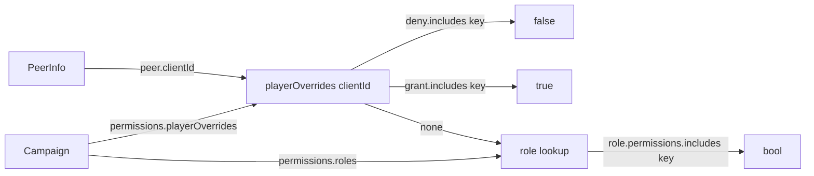

# Phase 29 — Roles + Permissions

## Context

Today nearly every gameplay gate in dnd-app is one of two literal checks: `networkRole === 'host'` or `localPlayer?.isCoDM`. Examples: `pages/InGamePage.tsx:59` derives `isDM` from those literals; `stores/network-store/index.ts:558 filterGameStateForRole` strips DM-only fields based on a host/non-host string role; `components/lobby/PlayerList.tsx:21` gates Promote/Demote/Kick via `isHostView`. Phase 17b (`v2.1.38`) made CoDM equivalent to host for game-view purposes but left the literal checks in place.

Consequences: no granular elevation between Player and CoDM; spectators have a single allowlist (`SPECTATOR_ALLOWED_TYPES`); every campaign uses the same role shapes; debugging "what does Player X see?" requires re-creating their lobby seat.

Goal: data-driven permissions. The DM defines what each role can do, optionally per-player, optionally per-campaign. Every gate becomes `hasPermission(peer, key, campaign)`. Ships on the existing P2P transport — no transport changes. Foundation for Phase 30 (Player-as-Host rewrite) and Phase 31 (Live-state sync overhaul), but standalone-useful immediately.

## Depends on / blocks
- Depends on: Phase 17b (CoDM equivalence — built-in CoDM role must reproduce its perm set)
- Blocks: Phase 30 (Player-as-Host rewrite), Phase 31 (Live-state sync overhaul), Phase 18 (UI visibility gates should target `hasPermission` shape from day one)

## Files touched
| Path | Role |
|------|------|
| `src/renderer/src/types/permissions.ts` | NEW — `Permission` union, `PermissionCategory` enum, `PERMISSION_GROUPS`, `getPermissionLabel` |
| `src/renderer/src/services/permissions/has-permission.ts` | NEW — `hasPermission(peer, key, campaign)` lookup |
| `src/renderer/src/data/builtin-roles.ts` | NEW — `BUILTIN_ROLES: Role[]` (DM / CoDM / Player / Spectator) |
| `src/renderer/src/types/campaign.ts` | Add `Role`, `PlayerOverride`, `CampaignPermissions`; `Campaign.permissions?` |
| `src/renderer/src/stores/use-campaign-store.ts` | Role CRUD + override actions |
| `src/renderer/src/stores/network-store/index.ts` | `filterGameStateForRole`, `transformUpdatePayloadForPeer` → permission lookups |
| `src/renderer/src/stores/network-store/host-handlers.ts` | `SPECTATOR_ALLOWED_TYPES` becomes derived; per-message permission check |
| `src/renderer/src/network/host-manager.ts` / `client-manager.ts` | Kick / ban / promote permission checks |
| `src/renderer/src/pages/InGamePage.tsx` | `isDM` derivation → `hasPermission` |
| `src/renderer/src/pages/LobbyPage.tsx` | `isHost` references → permission lookups |
| `src/renderer/src/components/lobby/PlayerList.tsx` | `isHostView` → permission lookups |
| `src/renderer/src/components/game/GameLayout.tsx` | Extend `viewMode` state for view-as-role |
| `src/renderer/src/components/game/dm/*` | DM-only UI gates |
| `src/renderer/src/components/game/overlays/*` | DM toolbar, FloatingDMPanel, EmptyCellContextMenu |
| `src/renderer/src/services/chat-commands.ts` | DM-only chat commands |
| `src/renderer/src/components/campaign/PermissionsEditor.tsx` | NEW — matrix editor |
| `src/renderer/src/components/campaign/PlayerOverridesPanel.tsx` | NEW — per-player overrides |
| `src/renderer/src/pages/CampaignDetailPage.tsx` | New "Permissions" tab |
| `src/main/storage/campaign-storage.ts` | Migration on load (inject `BUILTIN_ROLES` if missing) |

## Sub-phase summary
| # | Sub-phase | Theme |
|---|-----------|-------|
| 29a | Permission key universe + `hasPermission` helper | ~60-80 keys; deny > grant > role lookup |
| 29b | Built-in role defaults | DM / CoDM / Player / Spectator as data |
| 29c | Custom roles per campaign | Add / edit / duplicate / delete role CRUD |
| 29d | Per-player overrides | `playerOverrides[clientId] = { grant, deny }` |
| 29e | Codebase sweep — replace literal gates | Every `role === 'host'` / `isCoDM` → `hasPermission` |
| 29f | View-as-role debug mode | DM toggle masks self with target peer's perms |
| 29g | Permissions editor UI | Campaign Settings → Permissions tab |
| 29h | Migration for existing campaigns | Inject defaults; preserve `isCoDM` → `role-codm` |

Each sub-phase ends with `lint + tsc-web + tsc-node + vitest` (4-gate). One release at the end: **v3.0.0** (major bump — large architectural change even though invisible at default settings).

## Sub-phase details

### 29a — Permission key universe + `hasPermission` helper
**Files:** `src/renderer/src/types/permissions.ts` (NEW), `src/renderer/src/services/permissions/has-permission.ts` (NEW)
**Steps:**
1. Create `src/renderer/src/types/permissions.ts` exporting `Permission` string union of all keys, `PermissionCategory` enum (`view`, `token`, `chat`, `map`, `combat`, `npc`, `tools`, `moderation`), `PERMISSION_GROUPS: Record<PermissionCategory, Permission[]>`, and `getPermissionLabel(key) → string`.
2. Define the key universe (initial draft, ~60-80 keys):
   - **view:** `view_hidden_tokens`, `view_dm_only_stats`, `view_full_fog`, `view_hidden_npcs`, `view_dm_journal_entries`, `view_secret_handouts`
   - **token:** `move_own_token`, `move_any_token`, `add_token`, `remove_token`, `change_token_visibility`, `edit_token_hp`, `edit_token_conditions`, `edit_own_sheet`, `edit_any_sheet`, `view_any_sheet`
   - **chat:** `roll_dice`, `roll_hidden_dice`, `see_hidden_dice`, `chat_send`, `chat_whisper`, `chat_clear`, `chat_file_upload`
   - **map:** `draw_visible`, `draw_dm_only`, `clear_drawings`, `place_pin`, `edit_fog`, `change_active_map`, `edit_map`, `edit_grid`, `edit_walls`
   - **combat:** `manage_initiative`, `end_turn_any`, `end_turn_own`, `start_combat`, `end_combat`, `add_condition_any`, `remove_condition_any`
   - **npc:** `add_npc`, `edit_npc`, `reveal_npc_field`, `manage_sidebar_entries`, `edit_party_inventory`, `edit_handouts`, `manage_journal`
   - **tools:** `use_dm_tools`, `use_ai_dm`, `edit_campaign_settings`, `manage_homebrew`, `manage_audio`, `manage_calendar`, `manage_weather`
   - **moderation:** `kick_player`, `ban_player`, `timeout_player`, `mute_player_chat`, `promote_codm`, `demote_codm`, `change_player_role`, `transfer_host`, `end_session`
3. Create `src/renderer/src/services/permissions/has-permission.ts` exporting `hasPermission(peer: PeerInfo, key: Permission, campaign: Campaign | null): boolean` implementing:
   - If `!peer` or `!campaign?.permissions`, return false.
   - Read `campaign.permissions.playerOverrides[peer.clientId]`; if `deny.includes(key)` → false; if `grant.includes(key)` → true.
   - Find peer's role in `campaign.permissions.roles`; if missing → false.
   - Return `role.permissions.includes(key)`.
4. Add `src/renderer/src/services/permissions/has-permission.test.ts` covering deny > grant > role precedence, missing campaign, missing role, unknown permission key (returns false, no throw).

**Acceptance:** Helper compiles. Unit tests cover all four precedence paths. No existing call sites yet — sweep happens in 29e.

### 29b — Built-in role defaults
**Files:** `src/renderer/src/data/builtin-roles.ts` (NEW), `src/renderer/src/types/campaign.ts`
**Steps:**
1. In `src/renderer/src/types/campaign.ts`, add `Role` interface: `{ id: string, name: string, description?: string, color?: string, isBuiltIn: boolean, permissions: Permission[] }`. Add `PlayerOverride` and `CampaignPermissions = { roles: Role[], playerOverrides: Record<string, PlayerOverride> }`. Add `permissions?: CampaignPermissions` to `Campaign`.
2. Create `src/renderer/src/data/builtin-roles.ts` exporting `BUILTIN_ROLES: Role[]` with stable ids `role-dm`, `role-codm`, `role-player`, `role-spectator`:
   - **DM** — every permission in the universe.
   - **CoDM** — every permission except `promote_codm`, `demote_codm`, `transfer_host`, `ban_player`, `end_session`, `edit_campaign_settings`.
   - **Player** — `move_own_token`, `edit_own_sheet`, `roll_dice`, `chat_send`, `chat_whisper`, `draw_visible`, `view_any_sheet`, `end_turn_own`. No DM-only views.
   - **Spectator** — `chat_send`, `chat_whisper`, `roll_dice`, plus view-only perms (no `view_hidden_*`). No write actions.
3. Wherever a new campaign is created (campaign wizard / `use-campaign-store.ts createCampaign`), populate `campaign.permissions = { roles: structuredClone(BUILTIN_ROLES), playerOverrides: {} }`.
**Acceptance:** `BUILTIN_ROLES` import resolves anywhere. New campaign gets per-campaign copy of `BUILTIN_ROLES`.

### 29c — Custom roles per campaign
**Files:** `src/renderer/src/stores/use-campaign-store.ts`, `src/renderer/src/types/campaign.ts`
**Steps:**
1. In `use-campaign-store.ts`, add actions: `addRole(campaignId, role)`, `updateRole(campaignId, roleId, updates)`, `deleteRole(campaignId, roleId)`, `duplicateRole(campaignId, roleId)`. `deleteRole` throws if the target `isBuiltIn`; reassigns any peer holding the deleted role to `role-player` and emits a system chat message.
2. Built-in role ids stay stable (`role-dm`, `role-codm`, `role-player`, `role-spectator`). UI must prevent delete on built-ins; store enforces.
3. Tests in `use-campaign-store.test.ts` cover add / update / delete / duplicate, built-in deletion guard, and reassignment on deletion of an in-use custom role.
**Acceptance:** DM can create "Apprentice DM" with any subset; duplicate "Player" → "Senior Player" and tweak; deleting an assigned custom role falls peers back to Player with a system message.

### 29d — Per-player overrides
**Files:** `src/renderer/src/types/campaign.ts`, `src/renderer/src/stores/use-campaign-store.ts`, `src/renderer/src/services/permissions/has-permission.ts`
**Steps:**
1. Confirm `PlayerOverride = { grant: Permission[], deny: Permission[] }` and `CampaignPermissions.playerOverrides: Record<string /* clientId */, PlayerOverride>` exist from 29b.
2. Add `setPlayerOverride(campaignId, clientId, override)` and `clearPlayerOverride(campaignId, clientId)` to `use-campaign-store.ts`.
3. Verify `hasPermission` precedence (from 29a): explicit deny > explicit grant > role permission. Add tests asserting both-grant-and-deny-on-same-key resolves to deny.
**Acceptance:** DM can grant `view_hidden_tokens` to one player; deny `chat_whisper` to a specific player even though role has it; conflicting grant+deny → deny wins (UI warning in 29g).

### 29e — Codebase sweep: replace literal gates
**Files:** see "Files touched" table above; sweep will find more.
**Steps:**
1. Replace `pages/InGamePage.tsx:59` (`isDM = networkRole === 'host' || localIsCoDM || (networkRole === 'none' && campaign?.dmId === 'local')`) with a `hasPermission(localPeer, 'use_dm_tools', campaign)` (or finer-grained per consumer). Standalone path (no network) maps the local user to `role-dm`.
2. Refactor `stores/network-store/index.ts:558 filterGameStateForRole(state, role)` so the second arg is the recipient peer (or peer+campaign); per-field filtering keyed on `hasPermission(peer, 'view_*', campaign)`. Update call site `index.ts:57`.
3. Refactor `stores/network-store/host-handlers.ts` `SPECTATOR_ALLOWED_TYPES` into a derived predicate: each inbound message type maps to a required permission key; handler entry checks `hasPermission(senderPeer, requiredKey, campaign)`.
4. Replace `components/lobby/PlayerList.tsx:21` (`isHostView = role === 'host'`) and the kick/promote gates on `:179` with `hasPermission(localPeer, 'kick_player' | 'promote_codm' | ..., campaign)`.
5. Replace remaining `isCoDM` usages (29 hits across `src/renderer/src/`) with appropriate permission lookups. Keep the `isCoDM` field on `PeerInfo` for backwards compat during migration; remove in a follow-up cleanup phase.
6. Sweep `components/game/dm/*`, `components/game/overlays/*` (DM toolbar, FloatingDMPanel, EmptyCellContextMenu), chat commands in `services/chat-commands.ts`, and map event handlers. Each touched site documents in commit body which key replaced the literal.
7. Sweep kick/ban/promote in `network/host-manager.ts` and `network/client-manager.ts` (Note: plan originally cited `network/host-connection.ts`; that file does not exist — actual paths are `host-manager.ts` + `client-manager.ts`).
**Acceptance:** `git grep "role === 'host'"` returns zero hits in gameplay surface. `git grep "isCoDM"` returns zero hits in gameplay (field still exists on `PeerInfo` for migration). Phase 17b CoDM acceptance tests still pass.

### 29f — View-as-role debug mode
**Files:** `src/renderer/src/components/game/GameLayout.tsx`, `src/renderer/src/services/permissions/has-permission.ts`
**Steps:**
1. In `GameLayout.tsx:144`, extend `viewMode` from `'dm' | 'player'` to `{ mode: 'self' | 'as-role'; targetRoleId?: string; targetPlayerId?: string }`. Preserve sessionStorage key shape with a migration.
2. Extend `hasPermission(peer, key, campaign, opts?: { viewAs?: { roleId?: string, playerId?: string } })` so the caller can mask their real peer with a synthetic peer carrying the target role + overrides.
3. Add a "View as" dropdown in DMToolbar: Self / each campaign player / Spectator / each custom role.
4. Banner at the top: "Viewing as Player X — click to exit" so the DM doesn't get stuck wondering why their tools vanished.
**Acceptance:** Toggle to "View as Player X" → hidden tokens disappear, DM-only stats hide, fog reveals as Player X, DM toolbar dims. Toggle back to Self → full DM view restored.

### 29g — Permissions editor UI
**Files:** `src/renderer/src/components/campaign/PermissionsEditor.tsx` (NEW), `src/renderer/src/components/campaign/PlayerOverridesPanel.tsx` (NEW), `src/renderer/src/pages/CampaignDetailPage.tsx`
**Steps:**
1. Build `PermissionsEditor.tsx`: lists campaign roles with description + permission count; clicking a role expands a matrix grouped by `PERMISSION_GROUPS` from 29a, with checkboxes. Includes reset-to-defaults per role, bulk "grant all in category" / "deny all in category", and a search box.
2. Build `PlayerOverridesPanel.tsx`: lists each campaign player; expand to per-permission tri-state switches (grant / role-default / deny). Surface a non-blocking warning chip when a key is both granted and denied.
3. Add a "Permissions" tab to `CampaignDetailPage.tsx` hosting both components.
4. Wire saves to `use-campaign-store.ts` actions (29c, 29d). Changes propagate to peers via existing campaign update broadcast.
**Acceptance:** DM can create/edit/delete custom roles and see the live matrix; set per-player overrides; changes save to disk and reach all peers.

### 29h — Migration for existing campaigns
**Files:** `src/main/storage/campaign-storage.ts` (Note: plan originally cited `src/main/io/campaign-io.ts`; actual path is `src/main/storage/campaign-storage.ts`)
**Steps:**
1. On campaign load in `campaign-storage.ts`, if `campaign.permissions` is missing, inject `{ roles: structuredClone(BUILTIN_ROLES), playerOverrides: {} }`.
2. Preserve in-flight `isCoDM` flag: any lobby player with `isCoDM === true` gets their role set to `role-codm` on first migration. The `isCoDM` field on `PeerInfo` remains during the migration window.
3. Subsequent saves write the new `permissions` field so future loads skip migration.
**Acceptance:** Loading a pre-permissions save works identically — DM has all perms, CoDM-flagged players have CoDM perms. Saved file now contains `permissions`; reload is a no-op for migration.

## Architecture / data flow

## Constraints & edge cases
- **Custom roles are per-campaign only.** No global role library — simpler data model, no cross-campaign coupling.
- **Contradictory overrides warn-but-allow.** DM can grant `edit_any_sheet` while denying `view_any_sheet`; UI surfaces a warning chip; deny still wins.
- **Built-in roles editable but not deletable.** Reset-to-defaults restores original perms.
- **Migration is one-way.** Once `permissions` is populated, `isCoDM` boolean stops being consulted; removed entirely in follow-up cleanup phase.
- **`isCoDM` field remains on `PeerInfo` during the migration window** so 29e doesn't have to ship a `PeerInfo` schema change in the same pass as the sweep.
- **Standalone (non-network) path:** local user is treated as `role-dm` for permission checks; no peer plumbing needed for solo play.

## Verification
- **After 29a-d:** unit tests on `hasPermission` cover deny > grant > role precedence, missing data, custom roles, overrides.
- **After 29e:** existing Phase 17b CoDM acceptance tests pass. Existing kick/ban/promote tests pass. `git grep "role === 'host'"` and `git grep "isCoDM"` clean across gameplay surface.
- **After 29f:** DM toggles "View as Player X" — map fog reveals as Player X, DM toolbar hides, hidden tokens vanish.
- **After 29g:** DM creates custom "Senior Player" role with `manage_initiative` granted, assigns Bob; Bob can advance initiative but cannot kick.
- **After 29h:** loading a Phase 17 save with a CoDM-flagged player → that player loads with `role-codm`. No regression.
- **All sub-phases:** `npm run lint`, `npx tsc --noEmit -p tsconfig.web.json`, `npx tsc --noEmit -p tsconfig.node.json`, `npx vitest run` all green.

## Completed

> **PHASE 29 PARTIAL — 2026-05-29 (overnight autonomous pass; foundation done, sweep/UI/migration deferred).** 4-gate green (lint 0, tsc web+node 0, vitest 6520/6520).
> - **29a DONE** — `types/permissions.ts` (Permission union, PermissionCategory, `PERMISSION_GROUPS` ~70 keys, `ALL_PERMISSIONS`, `getPermissionLabel`); `services/permissions/has-permission.ts` (`hasPermission` with deny>grant>role precedence + `resolvePeerRoleId` deriving built-ins from isHost/isCoDM/role). 6 unit tests (all four precedence paths + missing-role + CoDM).
> - **29b DONE** — `Role`/`PlayerOverride`/`CampaignPermissions` + `Campaign.permissions?` in types/campaign.ts; `PeerInfo.roleId?`; `data/builtin-roles.ts` (`BUILTIN_ROLES`: DM=all, CoDM=all−host-mgmt, Player, Spectator). NOT YET wired into createCampaign (see deferred).
> - **DEFERRED:** 29b-step3 inject on create + 29h migration on load (harmless but unused until the sweep consumes `campaign.permissions` — land together), 29c custom-role CRUD, 29d per-player override actions, 29e the literal-gate sweep (HIGH risk — replaces every `role==='host'`/`isCoDM` gameplay gate; needs app verification of DM gating), 29f view-as-role, 29g permissions editor UI. The foundation (29a/29b) is consumable by all of these.

(prior: Phase 29 fully PROPOSED as of 2026-05-19. No permission files, no `hasPermission` helper, no `BUILTIN_ROLES`, no `Campaign.permissions` field, `GameLayout.viewMode` still `'dm' | 'player'`, 29 `isCoDM` hits and the `networkRole === 'host'` literal in `InGamePage.tsx:59` still present.)

> **PHASE 29 — 2026-05-29 (resumed "do them all"; 4-gate green).** 29c/29d/29h landed earlier in the resume.
> - **29g DONE** — `components/campaign/PermissionsEditor.tsx` (role list → category-grouped permission matrix with per-category bulk grant/deny, reset-to-defaults, search; built-ins editable but not deletable) + `PlayerOverridesPanel.tsx` (per-player tri-state grant/default/deny + conflict chip), surfaced in a new Permissions card on CampaignDetailPage, wired to the 29c/29d store actions. Overrides keyed by player `userId` (peer `clientId` reconciliation noted inline).
> - **STILL DEFERRED:** 29e literal-gate sweep (HIGH risk — replaces every `role==='host'`/`isCoDM` gameplay gate; needs app verification) and 29f view-as-role (limited value without 29e's hasPermission gating; land together).
