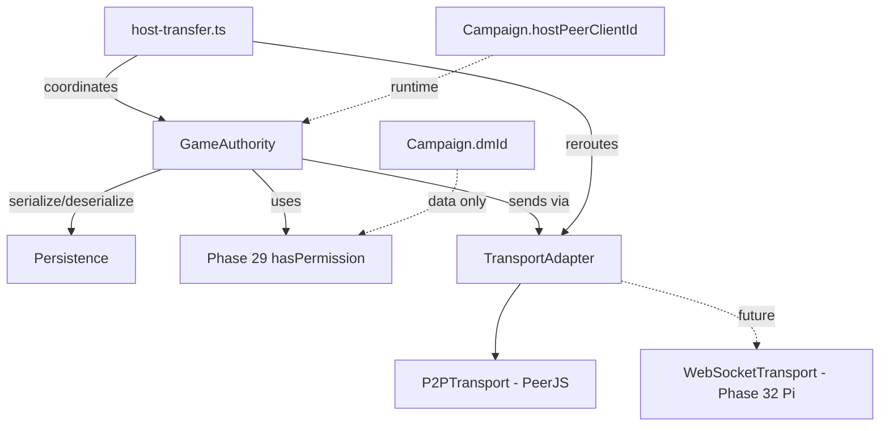

# Phase 30 — Player-as-Host architecture rewrite

## Context

Today, the "network host" and the "DM" are the same peer by accident. Whoever calls `startHosting()` becomes both the network host (holds authoritative `useGameStore`, runs `host-handlers.ts`, validates inbound messages, broadcasts to peers) and the DM (every gameplay permission, holds `campaign.dmId`). This conflation means the DM cannot transfer mid-session (closing the DM's app shuts down the network) and a player cannot host on behalf of someone else (better connection / always-on machine, different friend DMs).

Goal: separate the two concepts cleanly. Consolidate host-side logic into a `GameAuthority` module behind a `TransportAdapter` interface. Any peer can hold the host role; any peer (or zero peers) can hold the DM role; both can transfer mid-session.

Phase 29's permission system makes the gameplay side role-driven. This phase makes the network side authority-driven, with the authority abstracted so it can run anywhere (player's machine here, Pi in Phase 32).

## Depends on / blocks
- Depends on: Phase 29 (permissions matrix — `hasPermission`, `transfer_host`, `change_player_role` perms must exist)
- Blocks: Phase 31 (live-state sync overhaul mounts its shard registry inside `GameAuthority`), Phase 32 (cloud host — Pi-side implementation of `GameAuthority` over same transport-adapter contract)

## Files touched

| Path | Role |
|------|------|
| `src/renderer/src/network/authority/game-authority.ts` | NEW — consolidated authority module |
| `src/renderer/src/network/authority/persistence.ts` | NEW — debounced host-side snapshot persistence |
| `src/renderer/src/network/authority/game-authority.test.ts` | NEW — authority tests |
| `src/renderer/src/network/transport/transport-adapter.ts` | NEW — interface |
| `src/renderer/src/network/transport/p2p-transport.ts` | NEW — PeerJS implementation |
| `src/renderer/src/network/transport/host-transfer.ts` | NEW — atomic handover protocol |
| `src/renderer/src/network/transport/p2p-transport.test.ts` | NEW — transport tests |
| `src/renderer/src/network/transport/host-transfer.test.ts` | NEW — transfer atomicity tests |
| `src/renderer/src/network/host-connection.ts` | MODIFY then delete — logic moves into `GameAuthority` |
| `src/renderer/src/network/host-manager.ts` | MODIFY then delete — logic moves into `GameAuthority` |
| `src/renderer/src/network/host-message-handlers.ts` | MODIFY then delete — logic moves into `GameAuthority` |
| `src/renderer/src/stores/network-store/host-handlers.ts` | MODIFY then delete — logic moves into `GameAuthority` |
| `src/renderer/src/stores/network-store/index.ts` | MODIFY — `filterGameStateForRole`, `transformUpdatePayloadForPeer`, sendMessage host branch route through authority |
| `src/renderer/src/types/campaign.ts` | MODIFY — add `Campaign.hostPeerClientId: string \| null` |
| `src/renderer/src/stores/use-campaign-store.ts` | MODIFY — `transferDmRole` action |
| `src/renderer/src/components/lobby/PlayerCard.tsx` | MODIFY — "Transfer Host" + "Transfer DM" menu items |
| `src/main/storage/campaign-snapshots.ts` | NEW — IPC handler reading/writing `<userData>/snapshots/<campaignId>.json` |
| `src/main/storage/campaign-storage.ts` | MODIFY — migration mapping `dmId` → `hostPeerClientId` for legacy saves (same file Phase 29h migrates for permissions; coordinate edits) |

## Sub-phase summary

| # | Sub-phase | Theme |
|---|-----------|-------|
| 30a | Extract `GameAuthority` module | Consolidate scattered host logic into one module |
| 30b | Transport adapter abstraction | `TransportAdapter` interface; PeerJS becomes `P2PTransport` |
| 30c | Decouple host-peer from DM-role | `Campaign.hostPeerClientId` separate from `dmId` |
| 30d | Host-role transfer protocol | `host:transfer-request/accept/broadcast` atomic switchover |
| 30e | DM-role transfer | Role reassignment via Phase 29 |
| 30f | Transfer UI in PlayerCard menu | Permission-gated menu items |
| 30g | Persistence on host-side | Debounced snapshot serialization |
| 30h | Tests + verify-don't-assume sweep | Authority + transfer + DM separation specs |
| 30i | Migration for legacy campaigns | Map old `dmId` → `hostPeerClientId` |

One release: **v4.0.0** after 30i (major bump — `GameAuthority` is a new public-ish surface, old host-handler shims removed in follow-up).

## Architecture / data flow

## Sub-phase details

### 30a — Extract `GameAuthority` module
**Files:** `src/renderer/src/network/authority/game-authority.ts` (new); modify `src/renderer/src/network/host-connection.ts`, `src/renderer/src/network/host-manager.ts`, `src/renderer/src/network/host-message-handlers.ts`, `src/renderer/src/stores/network-store/host-handlers.ts`, `src/renderer/src/stores/network-store/index.ts` (`filterGameStateForRole` at line 558, `transformUpdatePayloadForPeer` at line 656)
**Steps:**
1. Create `game-authority.ts` exporting a class with `init(campaign, hostPeerInfo, transport)`, `applyAction(actor, action) → { accepted, broadcast[] }`, `getSnapshot(forPeer) → NetworkGameState`, `onSnapshotChange(cb)`, `addPeer/removePeer`, `validate(actor, action)`, `serialize/deserialize`.
2. Move handleJoin, message router, ban check, peer dedup from `host-connection.ts` into authority.
3. Move connections map, peerInfoMap, lastHeartbeat from `host-manager.ts` into authority.
4. Move `applyChatModeration`, `validateMessage` from `host-message-handlers.ts` into authority.
5. Move case-by-case host message handling from `stores/network-store/host-handlers.ts` into authority.
6. Move `filterGameStateForRole` (network-store/index.ts:558) and `transformUpdatePayloadForPeer` (network-store/index.ts:656) into authority's `getSnapshot`.
7. Old files become thin shims calling into the new module; delete in follow-up cleanup.
**Acceptance:** Existing tests pass with `GameAuthority` producing identical outputs. Adding a new message type requires editing exactly one file.

### 30b — Transport adapter abstraction
**Files:** `src/renderer/src/network/transport/transport-adapter.ts` (new), `src/renderer/src/network/transport/p2p-transport.ts` (new)
**Steps:**
1. Define `TransportAdapter` interface: `send`, `broadcast`, `broadcastExcluding`, `onMessage`, `onPeerJoin`, `onPeerLeave`, `disconnect`, `close`.
2. Wrap current PeerJS code into `P2PTransport` implementing the interface; preserve behavior.
3. Modify `GameAuthority` constructor to accept `TransportAdapter` — remove direct PeerJS imports.
4. Add `MemoryTransport` stub for in-process peer simulation in tests.
**Acceptance:** Game still runs on PeerJS unchanged. `grep "from 'peerjs'" src/renderer/src/network/authority/` returns zero results. `MemoryTransport` enables unit tests.

### 30c — Decouple host-peer from DM-role
**Files:** `src/renderer/src/types/campaign.ts` (currently `dmId: string` at line 79), `src/renderer/src/network/authority/game-authority.ts`
**Steps:**
1. Add `Campaign.hostPeerClientId: string | null` to campaign type. Existing `dmId` semantically becomes "who has DM role" only.
2. `GameAuthority`: `hostPeerInfo` is a runtime concept (passed in init); DM-role is campaign data; never coupled.
3. Sweep "isHost" checks in renderer code. Convert to either `peer.clientId === campaign.hostPeerClientId` (transport-routing display only) or `hasPermission(peer, '<dm_perm>', campaign)` (everywhere else).
**Acceptance:** Campaign with `hostPeerClientId === 'client-alice'` and DM role on `client-bob` works — Alice routes traffic, Bob has DM perms. Default create-game flow still assigns both to the creator.

### 30d — Host-role transfer protocol
**Files:** `src/renderer/src/network/transport/host-transfer.ts` (new), modify `src/renderer/src/network/transport/p2p-transport.ts`, `src/renderer/src/network/authority/game-authority.ts`
**Steps:**
1. Define new message types: `host:transfer-request` (current host → target, payload `{ targetClientId, snapshotPayload, sequenceCursor }`), `host:transfer-accept` (target → current host, payload `{ targetClientId, acceptedAt }`), `host:transfer-broadcast` (current host → all, payload `{ newHostClientId }`).
2. In `p2p-transport.ts`, implement re-routing: close peer connections to old host, initiate new ones to new host. Switchover window ~1-2s; existing Phase 17g auto-reconnect covers it.
3. In `game-authority.ts`, add `transferTo(targetClientId)`: validates `accept_host_transfer` perm on target, pauses inbound message processing, serializes snapshot, sends, waits for accept, broadcasts switch.
4. Handle failure: if target dies mid-transfer, original host stays authoritative; abort with system chat message.
**Acceptance:** Alice transfers host to Bob; game pauses ~1-2s; state ships; Bob's app is authority; peers reconnect via Bob; game resumes.

### 30e — DM-role transfer
**Files:** `src/renderer/src/stores/use-campaign-store.ts`
**Steps:**
1. Add `transferDmRole(campaignId, fromClientId, toClientId)` action. Reassigns DM role; no transport implications.
2. Broadcast a campaign-update so all peers see new DM assignment.
3. Implementation is essentially `setPlayerRole(targetPeer, 'role-dm')` since Phase 29 already supports per-player role assignment.
**Acceptance:** Alice (DM) transfers DM to Bob; Bob now has DM role; Alice demoted to chosen fallback role.

### 30f — Transfer UI in PlayerCard menu
**Files:** `src/renderer/src/components/lobby/PlayerCard.tsx`
**Steps:**
1. Add "Transfer Host →" menu item: visible if local peer has `transfer_host` AND target is not currently the host.
2. Add "Transfer DM →" menu item: visible if local peer has `change_player_role` AND target is not currently the DM.
3. Confirmation modal for both (disruptive actions).
**Acceptance:** DM/host sees both items on other players' cards. Non-DM peer granted `transfer_host` via Phase 29 overrides sees Transfer Host only.

### 30g — Persistence on host-side
**Files:** `src/renderer/src/network/authority/persistence.ts` (new), `src/main/storage/campaign-snapshots.ts` (new IPC handler — aligned with existing `src/main/storage/` directory for campaign IO)
**Steps:**
1. In `persistence.ts`, debounce ~5s snapshot serialization via `window.api.saveCampaignSnapshot(campaignId, snapshot)`. On host startup, attempt `window.api.loadCampaignSnapshot(campaignId)` and seed authority if found.
2. In `src/main/storage/campaign-snapshots.ts`, add IPC read/write to `<userData>/snapshots/<campaignId>.json`. Uses Phase 19 path utility if landed. Co-locates with the other campaign-data IO modules already in `src/main/storage/` (no new `src/main/io/` directory introduced).
**Acceptance:** Host crashes mid-game; reopens app; loads from snapshot; peers reconnect; play resumes. Host transfer ships snapshot via same `serialize()` API.

### 30h — Tests + verify-don't-assume sweep
**Files:** `src/renderer/src/network/authority/game-authority.test.ts` (new), `src/renderer/src/network/transport/p2p-transport.test.ts` (new), `src/renderer/src/network/transport/host-transfer.test.ts` (new)
**Steps:**
1. Comprehensive `game-authority.test.ts` covering all migrated host-logic paths; assert byte-identical output vs pre-30a code path for the same inputs.
2. `p2p-transport.test.ts` wraps existing host-manager tests under the adapter.
3. `host-transfer.test.ts` covers atomic transfer success, target rejection, target crash mid-transfer, network blip during transfer.
**Acceptance:** 4-gate suite green. New tests cover transfer + DM-role separation + Phase 29 permission integration.

### 30i — Migration for legacy campaigns
**Files:** `src/main/storage/campaign-storage.ts` (existing main-process campaign loader; same file Phase 29h amends for permissions migration — coordinate so the two migration steps don't trample each other)
**Steps:**
1. On campaign load, if `campaign.hostPeerClientId` is missing but `campaign.dmId` is set, set `hostPeerClientId = dmId`. Preserves host=DM coupling for legacy saves.
2. Auto-rejoin flow handles cross-session host changes.
3. If Phase 29h's `BUILTIN_ROLES` injection runs in the same load path, order the two migrations explicitly: permissions inject first, then hostPeerClientId default. Both write back on first save in the new shape.
**Acceptance:** Pre-30 save loads exactly as today (host = DM). After explicit transfer, new value persists across sessions.

## Constraints & edge cases

- Host-peer and DM-role default to the same peer at campaign creation (backwards compatible; diverges only on explicit transfer).
- Phase 29 permissions are the single source of truth for gameplay actions; host-peer concept is purely about transport routing.
- Transfer protocol pauses gameplay briefly (~1-2s) — acceptable; live-migrate without pausing is much more complex and not worth it for the "DM stepping away" use case.
- Persistence is local-host disk for this phase; Phase 32 moves it to Pi.
- `TransportAdapter` is the seam Phase 32 plugs into — WebSocket transport implements the same interface, no `GameAuthority` changes needed.
- Open question: if host-peer disconnects without transferring, default = elect remaining peer (DM first, longest-connected fallback) with `transfer_host` perm and prompt "Accept host responsibility" toast; ~30s no-accept → pause and wait for original host. Confirm with user before 30d.
- Open question: should host transfer require both old and new host online? Default = yes (atomic handshake). Confirm before 30d.
- Plans-superseded notes: Phase 17 Step 19 (NET-5 broadcast hardening) must land first — its `host-manager.ts` try-catch travels into `GameAuthority` during 30a. Phase 19 Step 3 path utility must cover 30g's persistence target. Phase 20 Sub-Phase C / S3 TURN credentials inject into `P2PTransport` constructor — the seam 30b creates. Phase 22 production console statements at `host-handlers.ts:132,161` apply the console→logger swap during 30a consolidation. Phase 27 Sub-Phase J A9 custom audio sync routes through `TransportAdapter`. Phase 28 items 28c.3/28c.5/28d.4/28i.1 all move into or are reframed by `TransportAdapter`.

## Verification

- 4-gate suite (`npm run lint`, `tsc --noEmit` web+node, `npm test`, `npm run build`) green after every sub-phase.
- `grep -rn "hostPeerClientId" src/` shows usage only in code that needs transport routing.
- `grep -rn "peerjs" src/renderer/src/network/authority/` returns zero matches after 30b.
- Manual: create campaign → transfer host to second peer → both peers report new host → original host leaves → game continues.
- Manual: create campaign → transfer DM to second peer (without transferring host) → DM perms move; host stays.
- Manual: kill host mid-game → reopen → snapshot restores state.
- Manual: load pre-30 save → host = DM by default; transfer once → persists across reload.

## Completed

No prior verification stamps in this plan; codebase scan on 2026-05-19 confirms no Phase 30 work started. No `authority/` or `transport/` directories under `src/renderer/src/network/`; no `game-authority.ts`, `transport-adapter.ts`, `p2p-transport.ts`, `host-transfer.ts`, or `persistence.ts` files exist; no `hostPeerClientId` field in `src/renderer/src/types/campaign.ts` (still only `dmId: string` at line 79); no `src/main/io/` directory; no `hasPermission` symbol anywhere (Phase 29 not yet landed — confirms dependency still blocking).

> **PHASE 30 DEFERRED — 2026-05-29 (overnight autonomous pass).** Player-as-Host: consolidate host logic into GameAuthority behind TransportAdapter, atomic host/DM transfer, delete host-manager/host-handlers. This is a large architectural rewrite whose correctness can only be verified with two live peers (host + client) plus a mid-session host handover, which isn't available in this headless session. Attempting it blind would rewrite/delete the working networking core and very likely break multiplayer + the 6500-test gate. Per the "log confusion and move on" directive it is deferred intact for a focused, app-verified follow-up. No code changed; depends-on chain (29→30→31→32) and 36's Pi dependency remain the blockers.

> **30b FOUNDATION LANDED — 2026-05-29 (resumed "do them all").** `src/renderer/src/network/transport/transport-adapter.ts` — the `TransportAdapter` interface (send/broadcast/broadcastExcluding/onMessage/onPeerJoin/onPeerLeave/disconnect/close) now exists, gate-green. The GameAuthority consolidation (30a), P2PTransport wrap (30b.2), host/DM decouple + transfer (30c–f), and old-core deletion remain the staged rewrite needing two-peer verification.
