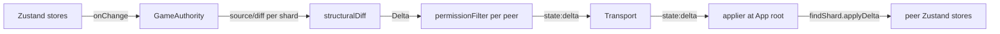

# Phase 31 — Live-state sync overhaul

## Context

The dnd-app sync model has grown organically: every synced piece of state has its own ad-hoc pair of broadcaster (somewhere in `network/game-sync.ts` or inline at the action site) and receiver (a bridge hook or a switch case in `stores/network-store/client-handlers.ts`). That has produced three recurring failure modes:

1. **Forgot the broadcaster.** State changes locally, never goes on the wire. (map switch not syncing, DM drawings dropping, shared journals not syncing — all patched individually.)
2. **Forgot the receiver.** Broadcaster fires, message hits the wire, nothing listens. The in-game chat one-way bug (commit `b2bb1e0`) is the canonical example: `useChatBridge` was scoped to `LobbyPage` and tore down on `/lobby` to `/game` navigation.
3. **Forgot the dep.** A Zustand subscriber's reference-equality check misses a mutation that didn't create a fresh array; rapid drawings collapsed into one tick.

This phase replaces N independent broadcaster/receiver pairs with one shard registry: one broadcaster per shard (registered once), one always-mounted receiver, one diff engine, one `state:delta` transport message. Adding a new synced field becomes "add a shard descriptor." The three failure modes become structurally impossible.

User-invisible. Pays off in future bug prevention plus shrinking Phase 32 (Cloud host) by ~30% because the Pi only needs to implement one sync protocol instead of porting 30 feature-specific handlers.

## Depends on / blocks

- Depends on: Phase 30 (Player-as-Host rewrite — provides `GameAuthority` and `TransportAdapter`)
- Blocks: Phase 32 (Cloud host), Phase 36 (Library shard wiring for homebrew sync)

## Files touched

| Path | Role |
|------|------|
| `src/renderer/src/network/sync/shard.ts` | New — `Shard<T>` and `Delta<T>` interfaces |
| `src/renderer/src/network/sync/registry.ts` | New — `registerShard`, `getShards`, `findShard` |
| `src/renderer/src/network/sync/diff.ts` | New — `structuralDiff`, `applyDelta` |
| `src/renderer/src/network/sync/applier.ts` | New — `startShardApplier` mounted at App root |
| `src/renderer/src/network/sync/shards/*.ts` | New — ~20 shard descriptors |
| `src/renderer/src/network/sync/README.md` | New — add-a-shard guide |
| `src/renderer/src/network/authority/game-authority.ts` | Modify — gains `startShardBroadcasting()` |
| `src/renderer/src/network/message-types.ts` | Modify — add `state:delta`, `state:resync-request`, `state:delta-replay`, `state:snapshot-full` |
| `src/renderer/src/network/schemas.ts` | Modify — schemas for above |
| `src/renderer/src/network/game-sync.ts` | Strip — most file deleted, keep only event broadcasts |
| `src/renderer/src/stores/network-store/host-handlers.ts` | Strip — drop migrated `dm:*` cases |
| `src/renderer/src/stores/network-store/client-handlers.ts` | Strip — drop migrated `dm:*` cases |
| `src/renderer/src/stores/network-store/index.ts` | Strip — drop `filterGameStateForRole`, `transformUpdatePayloadForPeer` |
| `src/renderer/src/pages/lobby/use-lobby-bridges.ts` | Strip — drop chat/character/moderation/timeout bridges |
| `src/renderer/src/components/game/GameLayout.tsx` | Modify — drop `useChatBridge` call |
| `src/renderer/src/App.tsx` | Modify — mount applier at root |

## Sub-phase summary

| # | Sub-phase | Theme |
|---|-----------|-------|
| 31a | Shard interface + registry | Define `Shard<T>` + module-level registry |
| 31b | Diff engine | Generic structural diff with reversible apply |
| 31c | Host-side shard broadcaster | Subscriber per shard inside `GameAuthority` |
| 31d | Client-side shard applier | Always-mounted at App level |
| 31e | Migrate chat shard | First feature ported; pattern established |
| 31f | Migrate map shards | activeMapId, tokens, drawings, fog, pins, walls, regions |
| 31g | Migrate initiative + conditions + custom effects | Drop bespoke broadcasters |
| 31h | Migrate journals + sidebar + handouts | Drop bespoke broadcasters |
| 31i | Migrate remaining state | Presence, color, characters, vision, weather, calendar, ambient, shop |
| 31j | Permission-aware shard filtering | Per-shard `permissionFilter` replaces global filter |
| 31k | Sequence + replay support | Monotonic seq numbers, bounded log, since-N resync |
| 31l | Drop unused bridges + switch cases | Big subtractive commit |
| 31m | Verify-don't-assume sweep | 2-peer end-to-end across every shard |
| 31n | Add-a-shard documentation | One-page guide for future features |

14 sub-phases. Each ends with the 4-gate suite. One release: **v5.0.0** (major bump for internal protocol change).

## Architecture / data flow

## Sub-phase details

### 31a — Shard interface + registry
**Files:** `src/renderer/src/network/sync/shard.ts` (new), `src/renderer/src/network/sync/registry.ts` (new)
**Steps:**
1. Define `Shard<TValue>` with `name`, `source`, `onChange`, `diff`, `applyDelta`, optional `permissionFilter` in `shard.ts`.
2. Define `Delta<TValue>` with `kind: 'replace' | 'patch'`, `payload: unknown`, `sequence: number` in `shard.ts`.
3. Add module-level array in `registry.ts` plus `registerShard(shard)`, `getShards(): Shard[]`, `findShard(name): Shard | undefined`. Initialize at import time.
**Acceptance:** Interface compiles; registry reachable from renderer; no shards registered yet (deferred to 31e+).

### 31b — Diff engine
**Files:** `src/renderer/src/network/sync/diff.ts` (new)
**Steps:**
1. Export `structuralDiff<T>(prev, next): Delta<T> | null` — `null` when deep-equal; primitives produce `{kind:'replace'}`; arrays of `{id}` records produce `{kind:'patch', payload:{added, removed, updated}}`; plain objects recurse.
2. Export `applyDelta<T>(target, delta): T` as a pure function.
3. Add unit tests covering primitives, arrays-of-records, nested objects, edge cases (empty→populated, undefined↔value).
4. Add a property-based round-trip test: `applyDelta(prev, structuralDiff(prev, next)) === next` for random JSON-shaped inputs.
**Acceptance:** Test suite passes; round-trip property holds for fuzzed inputs.

### 31c — Host-side shard broadcaster
**Files:** `src/renderer/src/network/authority/game-authority.ts` (modify — from Phase 30), `src/renderer/src/network/message-types.ts` (modify), `src/renderer/src/network/schemas.ts` (modify)
**Steps:**
1. Add `state:delta` message type to `message-types.ts` and matching zod schema in `schemas.ts`.
2. Add `startShardBroadcasting()` to `GameAuthority` that iterates `getShards()`, snapshots `source()` into `lastBroadcast[shard.name]`, subscribes via `shard.onChange`, on change diffs and (if non-null) emits `state:delta` per peer applying `permissionFilter`, then updates `lastBroadcast`.
**Acceptance:** Boilerplate compiles and is wired into authority startup; no shards registered yet so nothing actually broadcasts; unit test confirms subscription wiring + no-op when registry is empty.

### 31d — Client-side shard applier
**Files:** `src/renderer/src/network/sync/applier.ts` (new), `src/renderer/src/App.tsx` (modify)
**Steps:**
1. Implement `startShardApplier(transport)` in `applier.ts`: subscribe to `transport.onMessage` for `state:delta`, route to `findShard(msg.payload.shardName).applyDelta(msg.payload.delta)`, maintain `lastAppliedSequence[shardName]` for 31k.
2. Mount applier ONCE at App root in `App.tsx` via a hook that survives page navigation. The `b2bb1e0` bug class becomes structurally impossible.
**Acceptance:** Applier mounted at app root; subscribes to transport; route table works (verified with a fake shard in test); survives `/lobby → /game` navigation.

### 31e — Migrate chat shard
**Files:** `src/renderer/src/network/sync/shards/chat.ts` (new), `src/renderer/src/pages/lobby/use-lobby-bridges.ts` (modify), `src/renderer/src/components/game/GameLayout.tsx` (modify), `src/renderer/src/stores/network-store/host-handlers.ts` (modify), `src/renderer/src/stores/network-store/client-handlers.ts` (modify)
**Steps:**
1. Create chat shard: `source` reads `useLobbyStore.getState().chatMessages`; `onChange` subscribes to the lobby store; `diff` uses the array-of-records path; `applyDelta` calls `addChatMessage` for added entries; `permissionFilter` strips whispers not addressed to peer.
2. Convert `useChatBridge` in `use-lobby-bridges.ts` to a deprecation shim that warns if called; leave call sites intact until 31l.
3. Remove `useChatBridge` call from `GameLayout.tsx`.
4. Remove `case 'chat:message'` block from `host-handlers.ts` and `client-handlers.ts`.
**Acceptance:** Chat works in lobby; chat works in `/game`; lobby↔game navigation mid-session keeps messages flowing on both ends; the `b2bb1e0` bug class is structurally impossible.

### 31f — Migrate map shards
**Files:** new `src/renderer/src/network/sync/shards/{active-map,map-tokens,map-drawings,map-fog,map-pins,map-walls,map-regions}.ts`; modify `src/renderer/src/network/game-sync.ts`, host/client-handlers.
**Steps:**
1. Each shard reads from `useGameStore.maps.find(m => m.id === activeMapId)?.X`.
2. Drop `dm:map-change`, `dm:drawing-add`, `dm:drawing-remove`, `dm:drawings-clear`, `dm:fog-reveal`, `dm:region-add`, `dm:region-update`, `dm:region-remove` broadcasters in `game-sync.ts` and the matching cases in client/host handlers.
3. Remove the belt-and-suspenders direct broadcasts from prior fix work — the subscriber path is now reliable.
**Acceptance:** DM switches map → all clients render new map; DM draws 20 lines rapidly → all clients see all 20; all map-tied features behave as before.

### 31g — Migrate initiative + conditions + custom effects
**Files:** new `src/renderer/src/network/sync/shards/{initiative,conditions,custom-effects}.ts`; modify `game-sync.ts`, host/client-handlers.
**Steps:**
1. Add three shards reading from their respective stores.
2. Drop `dm:initiative-delta`, `dm:condition-delta`, and the custom-effects broadcasters/handlers.
**Acceptance:** Initiative add/advance/remove syncs; conditions apply/remove sync; custom effects sync.

### 31h — Migrate journals + sidebar entries + handouts
**Files:** new `src/renderer/src/network/sync/shards/{shared-journal,sidebar-allies,sidebar-enemies,sidebar-places,handouts}.ts`; modify `game-sync.ts`, host/client-handlers.
**Steps:**
1. Add five shards.
2. Drop matching broadcasters/handlers; remove the explicit sharedJournal watcher from `game-sync.ts`.
**Acceptance:** Journals, allies, enemies, places, handouts all sync.

### 31i — Migrate remaining state
**Files:** new shards for player presence/role, color preview, remoteCharacters, party vision cells, weather override, calendar/in-game time, ambient light, shop inventory, saved weather presets; modify `game-sync.ts`, host/client-handlers.
**Steps:**
1. Add one shard per item above. Exclude transient fields (e.g. `latencyMs`) from presence shard `source`.
2. Leave one-shot events as bespoke message types: whispers, dice roll triggers, AI prompts, toast notifications, reaction prompts (counterspell/shield/OA). Document the boundary in the new README (31n).
**Acceptance:** Every former state-update path is a shard; one-shot events still function unchanged.

### 31j — Permission-aware shard filtering
**Files:** modify each shard's `permissionFilter` where relevant; modify `src/renderer/src/stores/network-store/index.ts` (currently hosts `filterGameStateForRole`).
**Steps:**
1. `map-tokens` shard filters tokens with `isHidden === true` for peers lacking `view_hidden_tokens`.
2. `shared-journal` filters private entries by other authors for peers lacking `view_dm_journal_entries`.
3. `handouts` filters `visibility: 'dm-only'` for peers lacking that permission.
4. Convert `filterGameStateForRole` to a deprecated shim no longer called from the broadcaster; delete in 31l.
**Acceptance:** DM hides a token → players see it disappear; unhide → reappears with full data; CoDM sees what DM sees (matches Phase 17b behavior, now from shard filter).

### 31k — Sequence + replay support
**Files:** modify `GameAuthority`; modify `message-types.ts` + `schemas.ts` for new messages.
**Steps:**
1. Add bounded per-shard log inside `GameAuthority` (last 500 deltas or 30s, whichever is greater).
2. Add `state:resync-request` (client → host) carrying `{ lastSequenceByShard: Record<string, number> }`.
3. Host responds with `state:delta-replay` if all cursors are within window, else `state:snapshot-full` for any shard out of window.
**Acceptance:** Brief disconnect → reconnect → missed deltas replayed without state-flash; long disconnect → full snapshot for affected shards.

### 31l — Drop the now-unused bridges + switch cases
**Files:** strip `src/renderer/src/pages/lobby/use-lobby-bridges.ts`, `src/renderer/src/stores/network-store/client-handlers.ts`, `src/renderer/src/stores/network-store/host-handlers.ts`, `src/renderer/src/network/game-sync.ts`, `src/renderer/src/stores/network-store/index.ts`.
**Steps:**
1. Delete `useChatBridge`, `useCharacterUpdateBridge`, `useModerationBridge`, `useChatTimeoutBridge`. Keep `usePeerSync` if presence shard still needs a hook to update lobby store `players`.
2. Strip every `case 'dm:foo':` replaced by shard sync from client/host handlers; keep one-shot event cases (whispers, dice, AI, reactions).
3. Reduce `game-sync.ts` to one-shot event broadcasts only.
4. Delete `filterGameStateForRole` and `transformUpdatePayloadForPeer` from `network-store/index.ts`.
**Acceptance:** `git diff --stat` shows large net deletion; all tests still pass.

### 31m — Verify-don't-assume sweep
**Files:** test plan document
**Steps:**
1. With at least 2 peers: chat in lobby + game + cross-page navigation.
2. DM draws rapidly with observer count > 1.
3. DM map switch + rapid switches.
4. Initiative add/advance/remove; conditions; custom effects.
5. Shared journal entries from multiple peers.
6. Sidebar entry add/remove.
7. DM disconnect → reconnect → state catches up via replay.
8. DM host-transfer (Phase 30 feature) → shards continue through new host.
**Acceptance:** Each item documented + verified pass.

### 31n — Add-a-shard documentation
**Files:** `src/renderer/src/network/sync/README.md` (new)
**Steps:**
1. Write one-page guide covering: what a shard is; anatomy of a `Shard<T>` descriptor; how to register; how to write a `permissionFilter`; shard vs. one-shot event; common pitfalls (don't reference Zustand state inside `diff` — use the passed snapshots).
**Acceptance:** README committed; new contributor can add a synced feature without asking.

## Constraints & edge cases

- **Shards live inside `GameAuthority`** (Phase 30). Authority owns the state, runs the diffs, emits deltas.
- **Diff is structural, not reference-equality.** Eliminates the rapid-mutation-collapse bug class.
- **Permission filtering is per-shard, not global.** Filtering rules live next to the data they filter.
- **One-shot events stay bespoke.** Whispers, dice, AI, reaction prompts are events, not state.
- **Replay is bounded.** Default window: 500 deltas globally, no per-shard tuning. Out-of-window → full snapshot.
- **Schema evolution out of scope.** Shards are versioned by `name`; schema changes require a new name + deprecation of the old shard.
- **Open questions to lock before starting:**
  1. Any synced state genuinely needing per-peer broadcasting that isn't covered by a permission filter? (Default: no.)
  2. Replay window size (default: 500 deltas / 30s whichever larger; not per-shard tunable).
  3. Snapshot version concept for migrations (default: out of scope — new shard name on schema change).

## Verification

- 4-gate suite (lint + tsc web + tsc node + vitest) at every sub-phase.
- Unit tests for diff engine (31b) including round-trip property test.
- Manual 2-peer end-to-end sweep documented in 31m.
- `npm run check:release` (lint + tsc + tests) green before the v5.0.0 cut.
- Plans superseded by this phase (track for follow-up tickets after landing):
  - Phase 16 Sub-Phase B map-pins broadcast → `map-pins` shard
  - Phase 23 Sub-Phase C `dm:character-update` handler → character shard; Sub-Phase D conflict-resolution moves into applier
  - Phase 24 level-up character mutations → picked up by character shard
  - Phase 25 Sub-Phase E campaign-scoped homebrew sync → library shard + per-shard filter
  - Phase 26 token broadcasts → map-tokens shard; encounter becomes its own shard in 31i
  - Phase 27 Sub-Phase D duplicate handlers → eliminated structurally
  - Phase 27 Sub-Phase E ambient sync → ambient shard
  - Phase 27 Sub-Phase I late-joiner ambient → absorbed by initial snapshot ship
  - Phase 17 NET-21–NET-50 medium items → re-scope after Phase 31
  - Phase 15 library shard + `useLibraryStore` mutation broadcast → registers library shard
  - Phase 23 `lobbyStore.remoteCharacters` + `dm:character-update` → fully absorbed
  - Phase 36 library shard wiring for homebrew sync → hooks `upsertHomebrew` into library shard broadcast

## Completed

(None — Phase 31 has not been started. Phase 30 dependency `GameAuthority` is also absent from the codebase as of 2026-05-19; cannot proceed until it lands.)

> **PHASE 31 DEFERRED — 2026-05-29 (overnight autonomous pass).** Live-state sync overhaul: shard registry + diff engine replacing every bespoke broadcaster; depends on Phase 30's GameAuthority. This is a large architectural rewrite whose correctness can only be verified with two live peers exchanging shard diffs, which isn't available in this headless session. Attempting it blind would rewrite/delete the working networking core and very likely break multiplayer + the 6500-test gate. Per the "log confusion and move on" directive it is deferred intact for a focused, app-verified follow-up. No code changed; depends-on chain (29→30→31→32) and 36's Pi dependency remain the blockers.
