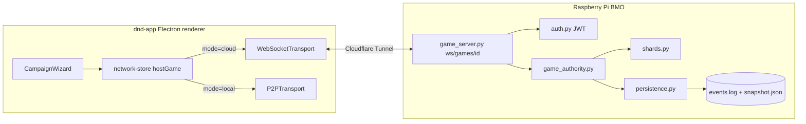

# Phase 32 — Cloud Host (Pi-as-host)

## Context

Pi implements `GameAuthority` (Phase 30) speaking the shard protocol (Phase 31). Game creators get a "Local (P2P)" vs "Cloud (Pi)" toggle. Cloud mode = game persists across all client disconnects, accessible from anywhere, hosted by infrastructure instead of a player's machine.

By the time this phase starts, the prerequisites are in place: Phase 29 has made permissions data-driven (no hardcoded role checks). Phase 30 has consolidated host-side logic into a `GameAuthority` module behind a `TransportAdapter` interface. Phase 31 has unified all state sync into one shard protocol — adding cloud sync means implementing ONE protocol on the Pi, not 30 feature-specific message handlers.

Trade-offs: game survives DM disconnect; cross-network via Cloudflare Tunnel is the default; spectator fan-out scales better; event log enables audit/replay. Costs: +20-50ms RTT vs LAN-direct P2P; Pi is a single point of failure (Local P2P stays as fallback); voice chat remains peer-to-peer (does NOT route through Pi).

## Depends on / blocks
- Depends on: Phase 29 (permissions), Phase 30 (Player-as-Host rewrite + `GameAuthority` / `TransportAdapter`), Phase 31 (live-state sync overhaul + shard protocol)
- Blocks: Phase 36 (reuses JWT model for `library:write:homebrew` scope and reuses `bmoPiBaseUrl` plumbing)

## Files touched
| Path | Role |
|------|------|
| `bmo/pi/services/game_server.py` | New — Flask-SocketIO service, REST + WS endpoints, room management |
| `bmo/pi/services/game_authority.py` | New — Python port of TS `GameAuthority` (apply_action, snapshot, peers, validate) |
| `bmo/pi/services/room.py` | New — per-campaign in-memory room state |
| `bmo/pi/services/shards.py` | New — Python shard registry (source / diff / apply_delta / permission_filter) |
| `bmo/pi/services/shards/*.py` | New — one file per shard (chat, map_tokens, ...), mirrors TS layout |
| `bmo/pi/services/persistence.py` | New — write-behind snapshot + JSONL event log |
| `bmo/pi/services/auth.py` | New — JWT issuance + WS-frame validation |
| `bmo/pi/data/games/<campaign_id>/` | New data dir — `snapshot.json` + `events.log` |
| `bmo/pi/app.py` | Register `game_server` blueprint, CORS for WS upgrade |
| `bmo/setup-bmo.sh` | systemd unit update, `flask-socketio` dep, signing secret generation |
| `bmo/docs/SERVICES.md` | Document the new service |
| `bmo/web/templates/` | New "Hosted Games" admin tab |
| `dnd-app/src/renderer/src/network/transport/websocket-transport.ts` | New — `TransportAdapter` implementation |
| `dnd-app/src/renderer/src/network/index.ts` | `hostGame` action gains `{ mode: 'local' \| 'cloud' }` |
| `dnd-app/src/renderer/src/components/campaign/CampaignWizard.tsx` | Local-vs-Cloud host toggle in create flow |
| `dnd-app/src/renderer/src/pages/SettingsPage.tsx` | Reuse existing `bmoPiBaseUrl` for cloud connection |
| `docs/ARCHITECTURE-VOICE.md` | New — documents voice-stays-P2P boundary |
| `/etc/cloudflared/config.yml` | Verify `/ws/games/*` reachable over Tunnel |

## Sub-phase summary
| # | Sub-phase | Theme |
|---|-----------|-------|
| 32a | Pi-side `GameAuthority` service skeleton | New Python service, REST endpoints, same external contract as TS authority |
| 32b | WebSocket transport — Pi side | Flask-SocketIO endpoint + room/peer lifecycle |
| 32c | WebSocket transport — client side | `WebSocketTransport` adapter slotting into Phase 30's `TransportAdapter` |
| 32d | Shard protocol port — Pi side | Python shard registry, per-shard files mirroring TS |
| 32e | Pi-side persistence | Event sourcing — JSONL delta log + periodic snapshots + restart replay |
| 32f | Authentication | Per-campaign JWT issued via invite code; validated on every WS frame |
| 32g | Game-creation UI: Local vs Cloud toggle | New wizard step picking host destination, Local default |
| 32h | Migrate-running-game flow | "Move to cloud" button on Phase 30 host-transfer protocol |
| 32i | Pi admin surface in BMO | Hosted Games tab — list rooms, view logs, archive / kick |
| 32j | Auto-resume / catch-up | Verify Phase 31k resync protocol end-to-end against Pi authority |
| 32k | Voice transport boundary | ADR doc: voice stays P2P even when game state is cloud-hosted |
| 32l | Stability + monitoring | Prometheus-style metrics + idle-room auto-archive |

12 sub-phases. Each ends with the 4-gate suite (lint + tsc-web + tsc-node + vitest) AND the BMO pytest suite. One release: **v6.0.0** (major bump for new opt-in deployment mode).

## Architecture / data flow

## Sub-phase details

### 32a — Pi-side `GameAuthority` service skeleton
**Files:** `bmo/pi/services/game_server.py` (new), `bmo/pi/services/game_authority.py` (new), `bmo/pi/services/room.py` (new), `bmo/pi/app.py`, `bmo/setup-bmo.sh`, `bmo/docs/SERVICES.md`
**Steps:**
1. Create `bmo/pi/services/game_server.py` exposing REST: `GET /api/games/<campaign_id>` (status), `POST /api/games/<campaign_id>/start` (provision with snapshot), `POST /api/games/<campaign_id>/stop` (graceful shutdown), `GET /api/games/<campaign_id>/log` (paged event log).
2. Create `game_authority.py` with the same external contract as the TS `GameAuthority` from Phase 30: `apply_action(actor, action) -> {accepted, broadcast}`, `get_snapshot(for_peer)`, `add_peer(peer_info)`, `remove_peer(peer_id)`, `validate(actor, action) -> bool` (Python port of `hasPermission`).
3. Create `room.py` — per-campaign in-memory state (authority + connected peer list + log handle).
4. Register the blueprint in `bmo/pi/app.py` with CORS allowance for the WS upgrade path.
5. Update `bmo/setup-bmo.sh` to add `flask-socketio` (or `gevent-websocket`) dependency and ensure the systemd unit picks up the game-server.
6. Document the service in `bmo/docs/SERVICES.md`.
**Acceptance:** Service starts on Pi boot. `curl http://pi-host/api/games/foo` returns 404 (no rooms). `pytest bmo/pi/tests/test_game_server.py` covers create / stop / status.

### 32b — WebSocket transport — Pi side
**Files:** `bmo/pi/services/game_server.py` (modify)
**Steps:**
1. Add Flask-SocketIO endpoint at `/ws/games/<campaign_id>`. Connection handshake includes the session token from 32f.
2. Wire per-campaign Socket.IO room mapping. Inbound message → `GameAuthority.apply_action`; authority result's `broadcast` payload → `socketio.emit(...)` to room.
3. Peer join handler: `socketio.join_room(campaign_id)` + `authority.add_peer(peer_info)` + send initial snapshot.
4. Peer leave handler: graceful disconnect + `authority.remove_peer(peer_id)`.
**Acceptance:** `wscat -c ws://pi-host/ws/games/<id>` connects (auth permitting). Multiple peers in same campaign see each other's messages. Peer disconnect cleans up room state.

### 32c — WebSocket transport — client side
**Files:** `dnd-app/src/renderer/src/network/transport/websocket-transport.ts` (new), `dnd-app/src/renderer/src/network/index.ts` (modify)
**Steps:**
1. Create `websocket-transport.ts` implementing the Phase 30 `TransportAdapter` interface (`send / broadcast / onMessage / onPeerJoin / onPeerLeave / disconnect / close`). Use native `WebSocket` or `socket.io-client` matching the server choice from 32b.
2. Modify `network/index.ts` so `hostGame` takes `{ mode: 'local' | 'cloud' }` and instantiates `P2PTransport` vs `WebSocketTransport`.
3. Wire connection URL from existing `bmoPiBaseUrl` setting (`src/renderer/src/pages/SettingsPage.tsx`).
**Acceptance:** Client connects to Pi-hosted game via WebSocket. Authority logic on Pi invoked correctly. Same gameplay as in local P2P mode.

### 32d — Shard protocol port — Pi side
**Files:** `bmo/pi/services/shards.py` (new), `bmo/pi/services/shards/*.py` (new), `bmo/pi/services/game_authority.py` (modify)
**Steps:**
1. Create `shards.py` — Python port of the Phase 31 shard registry. Each shard class implements: `source`, `diff`, `apply_delta`, `permission_filter` (Python port reading Phase 29 permissions from campaign data).
2. Create one file per shard mirroring the TS structure.
3. In `game_authority.py`, run the registry: subscribe to state mutations, diff, emit `state:delta` over WebSocket per-peer.
**Acceptance:** All Phase 31 shards have Python counterparts. Round-trip: client sends chat → Pi receives → shards diff → broadcast → all peers see message. Permission filter hides DM-only tokens from non-DM peers.

### 32e — Pi-side persistence
**Files:** `bmo/pi/services/persistence.py` (new), `bmo/pi/data/games/<campaign_id>/` (new), `bmo/pi/services/game_authority.py` (modify)
**Steps:**
1. Define per-campaign data dir `bmo/pi/data/games/<campaign_id>/` containing `snapshot.json` + `events.log` (append-only JSONL with sequence numbers).
2. Create `persistence.py` with write-behind snapshotting (every N=100 events OR every 60s) and tail-event reads for resync.
3. Modify `game_authority.py` to write delta to `events.log` on accept; snapshot periodically; on restart replay events from last snapshot to current.
**Acceptance:** Pi reboots mid-game; on restart, game resumes from last snapshot + tail events; nothing lost beyond the unwritten tail. `events.log` is human-readable JSONL.

### 32f — Authentication
**Files:** `bmo/pi/services/auth.py` (new), `bmo/pi/services/game_server.py` (modify), `bmo/setup-bmo.sh` (modify), `/etc/cloudflared/config.yml` (verify)
**Steps:**
1. Create `auth.py` issuing per-campaign session JWTs signed with a Pi-side secret. Validation hook for every WS frame.
2. Token issuance flow: client calls `POST /api/games/<id>/join` with displayName + invite code → Pi validates invite → returns JWT.
3. Modify the WS handshake in `game_server.py` to require a valid JWT.
4. Update `bmo/setup-bmo.sh` to generate the signing secret on first install if missing.
5. Verify Cloudflare Tunnel config exposes `/ws/games/*`.
6. Coordinate JWT secret/issuer with the Phase 28a.4 BMO Bearer-auth path so one credential covers both transports.
**Acceptance:** Token issued only after valid invite-code check. WS frame with missing/expired/invalid token is rejected. Cross-WAN game works (friend on a different network via Cloudflare Tunnel, no VPN).

### 32g — Game-creation UI: Local vs Cloud toggle
**Files:** `dnd-app/src/renderer/src/components/campaign/CampaignWizard.tsx` (modify)
**Steps:**
1. Add a new wizard step "Where should this game be hosted?" with two options: Local (P2P) [default] and Cloud (Pi).
2. Feed the selection into the modified `hostGame(displayName, { mode })` action from 32c.
3. Disable the Cloud option (with tooltip) if `bmoPiBaseUrl` is unset in settings.
**Acceptance:** New game flow exposes the toggle. Local mode unchanged. Cloud mode connects to Pi via 32c transport.

### 32h — Migrate-running-game flow
**Files:** Campaign settings page (modify), reuses Phase 30 host-transfer protocol
**Steps:**
1. Add "Move this game to cloud" button on the campaign settings page. Visible only when game is currently Local AND Pi is reachable.
2. Flow: current host serializes authority state → Pi accepts via `POST /api/games/<id>/start` with snapshot → all peers receive `host:transfer-broadcast` pointing at Pi WS endpoint → peers reconnect to Pi → local-host's authority shuts down.
3. Reverse path (cloud → local) is intentionally NOT supported in this phase.
**Acceptance:** Game in progress → DM clicks "Move to cloud" → after a brief pause, everyone is connected to Pi and the game continues seamlessly.

### 32i — Pi admin surface in BMO
**Files:** `bmo/web/templates/` (new "Hosted Games" tab)
**Steps:**
1. Add "Hosted Games" tab listing active rooms with: campaign name, peer count, last activity timestamp, event count.
2. Per-row actions: "View Log" (paged event display), "Archive" (graceful shutdown + snapshot), "Force Kick All" (emergency).
3. Use the existing Flask template path (`web/templates/`).
**Acceptance:** Admin page lists running games. Event log is paginated.

### 32j — Auto-resume / catch-up
**Files:** No new files — verification of Phase 31k resync against Pi authority
**Steps:**
1. Run end-to-end test: client disconnects mid-session, reconnects 30s later → server replays missed deltas, no state flash.
2. Run long-disconnect test: client disconnects for 1h, reconnects → server detects out-of-window cursor, ships full snapshot, game catches up gracefully.
**Acceptance:** Both scenarios pass against the Pi authority with identical behaviour to the local-host authority.

### 32k — Voice transport boundary
**Files:** `docs/ARCHITECTURE-VOICE.md` (new)
**Steps:**
1. Document the design boundary: voice chat does NOT route through Pi. Stays peer-to-peer.
2. State the rationale explicitly: audio latency budget is tighter than game-state RTT, and Pi CPU is not sized for N-way audio mixing.
3. Cross-reference Phase 27 Sub-Phase J (custom audio sync stays P2P per this doc).
**Acceptance:** Architecture doc committed. When voice ships, its transport choice references this doc.

### 32l — Stability + monitoring
**Files:** `bmo/pi/services/game_server.py` (modify), Grafana dashboard
**Steps:**
1. Expose Prometheus-style metrics at `/api/games/metrics`: `active_rooms_total`, `connected_peers_total`, `deltas_emitted_total`, `messages_rejected_total`, `room_age_seconds`.
2. Implement idle-room auto-archive: rooms with zero peers for >1 hour get snapshotted to disk and removed from memory.
3. Add a "Pi-Hosted-Games" row to the existing BMO Grafana board.
**Acceptance:** Metrics scrapeable. Idle rooms do not accumulate in memory forever.

## Constraints & edge cases

- **Local P2P stays first-class.** Cloud is opt-in. Both modes supported indefinitely.
- **One-way migration this phase.** Local → Cloud only; reverse not shipped until requested.
- **Cloudflare Tunnel handles WAN reach.** Already in place — no new infra.
- **Pi is a single point of failure.** Mitigations: Local P2P fallback, systemd auto-restart, snapshot replay survives crashes.
- **No multi-tenant resource limits this phase.** Single Pi serving the owner's games.
- **Voice does NOT migrate.** Even in cloud mode, voice transport stays P2P/SFU (see 32k).
- **Known package gotchas:** Python `calendar` stdlib already shadowed by `services.calendar_service` — follow the same pattern. Discord bots live in `bots/` (never `discord/`).

## Verification

Per sub-phase: run the 4-gate dnd-app suite (`npm run lint`, `tsc --noEmit` web + node configs, `npm test`) AND `pytest bmo/pi/tests/` from `bmo/pi/`.

Pre-release smoke (after 32l, before cutting v6.0.0):
1. Local-only flow — create game with mode=local, multi-peer LAN play, no regression.
2. Cloud-only flow — create game with mode=cloud, two peers on different networks, persistent across DM laptop close.
3. Migration flow — start local, move to cloud, peers reconnect, gameplay resumes.
4. Pi restart — game running, `sudo systemctl restart bmo`, all peers auto-resync within 30s.
5. Auth negatives — bad invite code rejected, expired JWT rejected, valid JWT accepted.
6. Idle archive — leave a room idle 1h, confirm snapshot + memory release, reopen.

Release: `cd dnd-app && npm run check:release` then `node dnd-app/scripts/release/cut.mjs 6.0.0 --notes-file /tmp/v6.0.0-notes.md`.

## Plans superseded or modified by Phase 32

| Plan | Item | Disposition |
|------|------|-------------|
| Phase 20 (deprioritized "no authentication") | Auth gap for cloud surface | Covered by Phase 32 JWT on WS frames. Local-P2P invite-code auth unchanged. |
| Phase 27 Sub-Phase J (A9 custom audio sync) | File transfer transport | Stays peer-to-peer per 32k. |
| Phase 28 Step 28a.4 (Auth Bearer to BMO) | Token shape for BMO bridge | Reconcile JWT issuer/secret so one credential covers both LAN sync Bearer and cloud WS frame auth. |
| Phase 28 Step 28a.2 (BMO sync receiver hardening) | LAN sync receiver | Hardening still applies to local-P2P mode. Cloud-host uses the new WS path. Both code paths need their own hardening. |
| Phase 36 | JWT scope for `library:write:homebrew` | Phase 36 reuses Phase 32's JWT model. |
| Phase 36 | Pi `bmoPiBaseUrl` reuse | Phase 36's library fetch uses the same `bmoPiBaseUrl` Phase 32 plumbs through. |

## Open questions

1. Flask-SocketIO vs raw WebSocket? Default: Flask-SocketIO for consistency with existing Flask gevent pattern on Pi. Confirm at 32b.
2. Cloudflare Tunnel `/ws/*` upgrade verified? Quick test before 32f.
3. Per-campaign event-log size limit? Default: unlimited on disk, compaction only on game-archive.
4. Pi restart UX — silent auto-resync via 32j, or explicit "Pi rebooted, reconnecting..." toast?

## Completed

(none — Phase 32 is entirely unimplemented as of 2026-05-19. Verified: no `game_server.py` / `game_authority.py` / `shards.py` / `persistence.py` / `auth.py` in `bmo/pi/services/`; no `transport/` directory or `websocket-transport.ts` under `dnd-app/src/renderer/src/network/`; `CampaignWizard.tsx` has no Local-vs-Cloud step; no `docs/ARCHITECTURE-VOICE.md`. `bmoPiBaseUrl` setting exists in `SettingsPage.tsx` and is reusable.)
