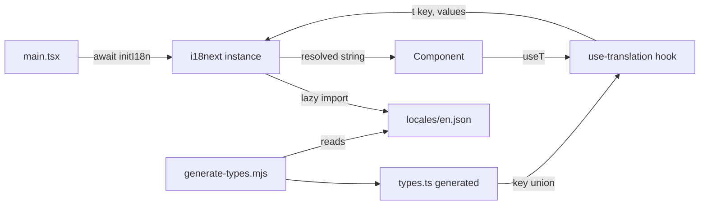

# Phase 34 — Internationalization (i18n) foundation and full sweep

## Context
Phase 34 wires i18n into the dnd-app renderer end-to-end. Every user-visible string moves through `t('key', { values })`. A baseline English locale ships with the app; future locales drop in as JSON files. A lint rule prevents new untranslated strings from landing.

This is the full sweep, not a no-op `t()` placeholder. Every string in the renderer — lobby, game UI, character builder, character sheet, level-up, settings, library, campaign, AI DM prompts, toasts, error messages — moves into the locale registry. Phase 34 ships English-only; per-language translation is a future phase.

Entirely client-side (Windows / dnd-app renderer). No BMO / Pi work.

## Depends on / blocks
- Depends on: none (independent foundation work; touches nearly every component but doesn't require prior phase output)
- Blocks: any future per-language translation phase; partially supersedes Phase 18's aria-label sweep portion (34j absorbs that goal)

## Files touched
| Path | Role |
|------|------|
| `dnd-app/package.json` | Add `i18next`, `react-i18next`, `i18next-resources-to-backend` deps; add `i18n:*` scripts |
| `src/renderer/src/i18n/config.ts` | i18next config (fallback, namespace, lazy loader, interpolation, plural rules) |
| `src/renderer/src/i18n/index.ts` | `initI18n()` + provider export |
| `src/renderer/src/i18n/use-translation.ts` | Typed `useT()` wrapper |
| `src/renderer/src/i18n/types.ts` | Generated TypeScript key union |
| `src/renderer/src/i18n/locales/en.json` | Baseline English locale (sweep populates) |
| `src/renderer/src/i18n/i18n.test.ts` | Vitest spec for core behavior |
| `src/renderer/src/main.tsx` | Mount provider / await init before render |
| `src/renderer/src/components/lobby/*.tsx` | 34b sweep |
| `src/renderer/src/pages/{Lobby,JoinGame}Page.tsx` | 34b sweep |
| `src/renderer/src/components/game/{top,bottom}/*.tsx` | 34c sweep |
| `src/renderer/src/components/game/overlays/*.tsx` | 34c sweep |
| `src/renderer/src/components/game/sidebar/*.tsx` | 34c sweep |
| `src/renderer/src/components/game/map/*.tsx` | 34d sweep |
| `src/renderer/src/services/chat-commands/*.ts` | 34c + 34i sweep |
| `src/renderer/src/pages/CreateCharacterPage.tsx` + builder components | 34e sweep |
| `src/renderer/src/pages/CharacterSheet5ePage.tsx` + sheet components | 34f sweep |
| `src/renderer/src/pages/LevelUp5ePage.tsx` + level-up components | 34g sweep |
| `src/renderer/src/pages/{Settings,Library,CampaignDetail,Bastion}Page.tsx` | 34h sweep |
| AI DM service files | 34i sweep (wrapper text only; Claude prompts stay English) |
| Toast/Tooltip/ErrorBoundary helpers + consumers | 34j sweep |
| `scripts/i18n/generate-types.mjs` | 34k key-union generator |
| `scripts/i18n/find-missing-keys.mjs` | 34k missing-key audit |
| `scripts/i18n/find-unused-keys.mjs` | 34k unused-key audit |
| `biome.json` or pre-commit hook | 34k untranslated-string lint rule |
| `.github/workflows/dnd-app-ci.yml` | 34k CI gate |
| `dnd-app/CONTRIBUTING.md`, `AGENTS.md`, `CLAUDE.md`, `README.md` | 34l docs |

## Sub-phase summary
| # | Sub-phase | Theme |
|---|-----------|-------|
| 34a | i18n foundation | Setup |
| 34b | Lobby + Join + Public registry sweep | Strings |
| 34c | In-game core UI sweep (HUD, chat, top/bottom bars, side panels) | Strings |
| 34d | Map + initiative + tokens + drawing sweep | Strings |
| 34e | Character builder sweep | Strings |
| 34f | Character sheet sweep | Strings |
| 34g | Level-up flow sweep | Strings |
| 34h | Settings + Library + Campaign + Bastion sweep | Strings |
| 34i | AI DM wrapper + system messages + chat commands sweep | Strings |
| 34j | Toasts + tooltips + aria-labels + error messages sweep | Strings |
| 34k | Lint rule + CI gate | Enforcement |
| 34l | Tests + docs | Verification |

## Architecture / data flow

## Sub-phase details

### 34a — i18n foundation
**Files:** `dnd-app/package.json`, `src/renderer/src/i18n/{config,index,use-translation,types}.ts`, `src/renderer/src/i18n/locales/en.json`, `src/renderer/src/main.tsx`
**Steps:**
1. Add `i18next@^23.x`, `react-i18next@^14.x`, `i18next-resources-to-backend@^1.x` to `dnd-app/package.json` dependencies; `npm install`.
2. Create `src/renderer/src/i18n/config.ts` with `fallbackLng: 'en'`, `defaultNS: 'common'`, lazy `import(\`./locales/${lng}.json\`)`, `interpolation.escapeValue: false`, default plural rules.
3. Create `src/renderer/src/i18n/index.ts` exporting `initI18n()` that initializes i18next and resolves once English is loaded.
4. Create `src/renderer/src/i18n/use-translation.ts` exporting `useT()` that wraps `useTranslation` from `react-i18next` and types the key against `TranslationKeys` from `types.ts`.
5. Create stub `src/renderer/src/i18n/types.ts` exporting `TranslationKeys = string` until 34k's generator replaces it.
6. Seed `src/renderer/src/i18n/locales/en.json` with `common.actions.{save,cancel,close,delete,confirm}` and `common.states.{loading,empty,error}`.
7. In `src/renderer/src/main.tsx`, `await initI18n()` before `ReactDOM.createRoot(...).render(<App />)`.
8. Wire one sentinel string through `useT()` to confirm wiring.
**Acceptance:** App boots; sentinel string renders from `en.json`. `npx tsc --noEmit -p tsconfig.web.json` clean. `npx vitest run` passes including a new spec confirming `t('common.actions.save')` returns "Save".

### 34b — Lobby + Join + Public registry sweep
**Files:** `src/renderer/src/components/lobby/*.tsx`, `src/renderer/src/pages/{Lobby,JoinGame}Page.tsx`, `src/renderer/src/pages/lobby/**`
**Steps:**
1. Inventory every user-visible string across all files above.
2. Add a `lobby` namespace block to `en.json` with semantic keys (`lobby.title`, `lobby.join.button`, `lobby.publicGames.title`, etc.).
3. In each file, `import { useT } from '@renderer/i18n/use-translation'` and replace hardcoded strings with `t('lobby.<key>')`.
4. Route `addSystemMessage(...)` and toast strings through `t()` keys.
**Acceptance:** Every visible string in lobby/join/public-game flow sourced from `en.json`. App renders identically.

### 34c — In-game core UI sweep
**Files:** `src/renderer/src/components/game/top/*`, `src/renderer/src/components/game/bottom/*`, `src/renderer/src/components/game/overlays/*.tsx`, `src/renderer/src/components/game/sidebar/*`, `src/renderer/src/services/chat-commands/*`
**Steps:**
1. Sweep top-bar (DM controls, scene name) and bottom-bar (`PlayerBottomBar`, `DMAudioPanel`, `ChatPanel`, `DiceTray`) into `game.topBar.*` / `game.bottomBar.*` keys.
2. Sweep `ChatPanel.tsx` and slash-command help text (`/help` output) into `game.chat.*` / `chat.commands.<name>.help` keys.
3. Sweep `overlays/*.tsx` (initiative overlay, lair-action prompt, narration banner, turn notifications, settings dropdown, view-mode toggle, reaction prompts, action economy bar) into `game.overlays.*`.
4. Sweep side panels and DM-tools panels into `game.sidebar.*`.
**Acceptance:** Every visible in-game core string sourced from `en.json`.

### 34d — Map + initiative + tokens + drawing sweep
**Files:** `src/renderer/src/components/game/map/**` (DM toolbar, drawing tools, fog controls, pin creation, `EmptyCellContextMenu`, `TokenContextMenu`), initiative tracker UI
**Steps:**
1. Sweep map controls into `game.map.*`.
2. Sweep initiative tracker per-entry buttons, status pills, NPC HP labels into `game.initiative.*`.
3. Sweep pin creation flow into `game.map.pins.*`.
**Acceptance:** All map-area strings localized.

### 34e — Character builder sweep
**Files:** `src/renderer/src/pages/CreateCharacterPage.tsx` + builder step components
**Steps:**
1. Sweep ~12 builder step headings and intro paragraphs into `builder.steps.<id>.{title,description}`.
2. Sweep form labels, placeholders, helper text into `builder.fields.*`.
3. Sweep validation error messages ("Name required", "ASI total exceeds budget") into `builder.errors.*`.
4. Sweep modal copy (library deep-link, summary review) into `builder.modals.*`.
**Acceptance:** Every builder string localized. Builder round-trips a character without crashing.

### 34f — Character sheet sweep
**Files:** `src/renderer/src/pages/CharacterSheet5ePage.tsx` + sheet section components
**Steps:**
1. Sweep section headings into `sheet.sections.*`.
2. Sweep inline labels and helper text into `sheet.fields.*`.
3. Extend tooltip coverage on every modifier/value into `sheet.tooltips.*`.
4. Sweep magic-item and spell-card UI into `sheet.magicItems.*` and `sheet.spells.*`.
5. Sweep attunement tracker + death-saves UI into `sheet.attunement.*` / `sheet.deathSaves.*`.
6. Sweep notes/journal entry creation into `sheet.notes.*`.
**Acceptance:** Every sheet string localized; renders identically across all character types.

### 34g — Level-up flow sweep
**Files:** `src/renderer/src/pages/LevelUp5ePage.tsx` + level-up step components
**Steps:**
1. Sweep wizard step headings and intro copy into `levelUp.steps.<id>.*`.
2. Sweep ASI/feat picker labels, tooltips, waste warnings into `levelUp.asi.*` / `levelUp.feat.*`.
3. Sweep subclass picker descriptions and selection summary into `levelUp.subclass.*`.
4. Sweep spell selection counts ("you must pick N more") into `levelUp.spells.*` with `count` pluralization.
5. Sweep HP roll section labels and "use average" toggle into `levelUp.hp.*`.
**Acceptance:** Every level-up string localized; wizard completes end-to-end.

### 34h — Settings + Library + Campaign + Bastion sweep
**Files:** `src/renderer/src/pages/{Settings,Library,CampaignDetail,Bastion}Page.tsx` + supporting components
**Steps:**
1. Sweep `SettingsPage` sections into `settings.*`.
2. Sweep `LibraryPage` (search, filters, categories, detail panel, homebrew creation modal) into `library.*`.
3. Sweep `CampaignDetailPage` + `CampaignWizard` + AI provider setup into `campaign.*`.
4. Sweep Bastion UI (facilities, services, hirelings, rooms) into `bastion.*`.
**Acceptance:** Every page-level string localized.

### 34i — AI DM wrapper + system messages + chat commands sweep
**Files:** AI DM service consumers in `src/renderer/src/services/` and overlays, plus `src/renderer/src/services/chat-commands/*`
**Steps:**
1. Sweep player-facing AI wrapper text into `ai.wrapper.*`. Prompts SENT to Claude stay in English.
2. Sweep system chat messages into `system.messages.*`.
3. Sweep slash-command output into `chat.commands.<name>.output.*`.
**Acceptance:** Every player-facing AI/system/slash-command string localized. AI prompts to Claude remain English.

### 34j — Toasts + tooltips + aria-labels + error messages sweep
**Files:** `useToast` hook + ~50+ consumers, Tooltip component + consumers, icon buttons with `aria-label`, `ErrorBoundary` consumers, zod/form validators
**Steps:**
1. Refactor `useToast()` so every consumer passes a key + values; migrate all ~50+ call sites.
2. Migrate every `<Tooltip>` consumer to keys.
3. Sweep `aria-label=` on every icon-button into keys (also fills Phase 18 aria-label coverage gap).
4. Migrate `<ErrorBoundary fallback={...}>` text into keys.
5. Route validator user-visible error text through `t()`.
**Acceptance:** Every toast, tooltip, aria-label, error message keyed.

### 34k — Lint rule + CI gate
**Files:** `biome.json` (or pre-commit hook), `scripts/i18n/generate-types.mjs`, `scripts/i18n/find-missing-keys.mjs`, `scripts/i18n/find-unused-keys.mjs`, `dnd-app/package.json` (scripts), `.github/workflows/dnd-app-ci.yml`
**Steps:**
1. Author Biome rule (or grep-based pre-commit hook) flagging JSX text nodes with English words not wrapped in `t()`, and string literals in `aria-label=` / `title=` / `placeholder=` that look like sentences. Allowlist: technical strings via `// i18n-allow: <reason>`.
2. Write `scripts/i18n/generate-types.mjs` that walks `en.json` and emits `src/renderer/src/i18n/types.ts` with a literal union of every key path.
3. Write `scripts/i18n/find-missing-keys.mjs` that scans `t('...')` usages, cross-references `en.json`, and fails on undefined keys.
4. Write `scripts/i18n/find-unused-keys.mjs` (inverse) flagging dead keys in `en.json`.
5. Add `dnd-app-ci.yml` step running lint + missing-key + unused-key checks.
**Acceptance:** Lint rule flags untranslated strings in a sample PR. `npm run check:full` fails when keys are out of sync.

### 34l — Tests + docs
**Files:** `src/renderer/src/i18n/i18n.test.ts`, `dnd-app/CONTRIBUTING.md`, `AGENTS.md`, `CLAUDE.md`, `dnd-app/README.md`
**Steps:**
1. Add vitest spec covering: `t()` returns English string; missing key falls back to key string; interpolation produces expected text; pluralization differs.
2. Add a round-trip render test: a sample component using `useT()` renders correctly via vitest render.
3. Add "i18n" section to `CONTRIBUTING.md`.
4. Mirror rule in `AGENTS.md` and `CLAUDE.md`.
5. Add `dnd-app/README.md` note that the app is i18n-ready, ships English only, and explain how to add a new locale.
**Acceptance:** All i18n specs pass; docs cover contribution path.

## Constraints & edge cases
- Use i18next + react-i18next (standard ecosystem) rather than a custom abstraction.
- Locales load lazily; English ships with the app bundle.
- `initI18n()` must complete before `<App />` mounts to avoid first-render flicker.
- Do not auto-extract keys; manual semantic naming ages better than positional.
- Use i18next plural rules from day one: `t('item.count', { count: n })` only.
- Inline JSX such as `<b>{count}</b> items` uses `<Trans i18nKey="..." values={{ count }} components={{ b: <b /> }} />`, not string concatenation.
- Prompts sent to Claude stay in English; only player-facing wrapper UI gets translated.
- Locale-aware AI responses are a different future feature.
- Lint allowlist stays narrow (paths, identifiers, numbers, dice notation, code blocks) and every allow comment must include a reason.
- CI must fail PRs that add untranslated strings; without enforcement the sweep regresses.

## Verification
- After each sub-phase: `npm run lint`, `npx tsc --noEmit -p tsconfig.web.json`, `npx tsc --noEmit -p tsconfig.node.json`, `npx vitest run`.
- End-to-end: `npm run i18n:audit` reports zero untranslated strings, zero missing keys, zero unused keys.
- Execution order: 34a first; 34b-34j independent (recommended lobby -> game UI -> builder -> sheet -> level-up -> settings -> AI -> toasts); 34k after at least 34b + 34c land; 34l last.
- One release at end of Phase 34.

## Completed
(none — Phase 34 unstarted as of 2026-05-19: no `src/renderer/src/i18n/` directory, no `i18next`/`react-i18next` in `dnd-app/package.json` dependencies, no `scripts/i18n/` directory, zero `useTranslation`/`useT` usages anywhere in `src/renderer/src/`.)

> **PHASE 34 DEFERRED — 2026-05-29 (overnight autonomous pass).** i18n is a whole-app sweep: install a framework (34a), then externalize every hardcoded English string across lobby, in-game, builder, sheet, level-up, settings, library, AI, toasts/aria (34b–34j), plus a lint rule + CI gate (34k). The foundation alone (34a) adds an unused framework (knip would flag it) and every subsequent sub-phase rewrites user-visible rendering that needs visual/locale verification. No safe standalone slice exists. Deferred intact for a focused pass; no code changed.

> **34a FOUNDATION LANDED — 2026-05-29 (resumed "do them all").** i18next + react-i18next + resources-to-backend installed; `src/renderer/src/i18n/{config,index,use-translation,types}.ts` + `locales/en.json` created; `main.tsx` awaits `initI18n()` before render; tests confirm `t('common.actions.save')`==="Save". The string sweeps (34b–j), lint rule + CI gate (34k), and key-type generator (34l) remain — each is a large per-area sweep.
