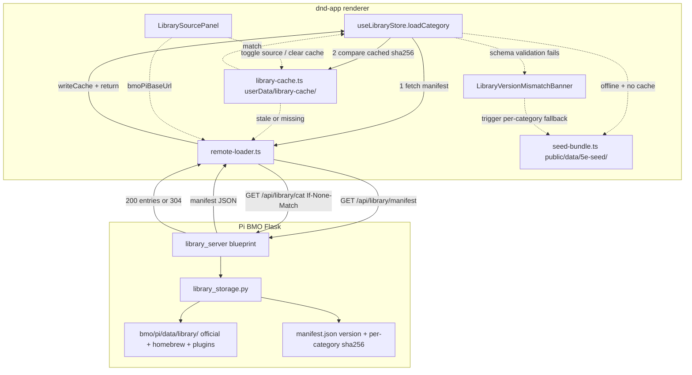

# Phase 36 — Pi-hosted library + offline cache

## Context

Phase 36 moves the canonical D&D content library off the app bundle and onto the Pi. Players fetch library data live from the Pi on each launch, cache it locally, and fall back to the cache when offline. Library edits (errata, balance changes, homebrew adds) propagate to every player without re-distributing the app installer.

Phase 15 architecture (the truth store, hydration hooks, schemas, override discipline, migration) is unchanged — Phase 36 only swaps the loader's source. The library still validates through the same `SCHEMA_REGISTRY`; consumers still read via `useLibraryEntry` / `useHydratedRef`. Only the raw-JSON origin moves.

The installer ships a slim seed slice so first-run offline still renders a usable UI; the full library fetches on first online launch and caches under `userData/library-cache/`. Auth reuses Phase 32's JWT — public-read for `source: 'official'`, JWT-gated for homebrew/plugin.

## Depends on / blocks

- Depends on: Phase 15 (library store architecture, schema registry, atomic-write), Phase 31 (library shard for peer propagation of homebrew), Phase 32 (JWT auth surface, `bmoPiBaseUrl` settings field).
- Blocks: none. Phase 25 H1 (homebrew export/import) is reframed by this phase but not blocked. Phase 33d (bundle-size baseline) needs a recompute after 36a but is not gated.

## Files touched

| Path | Role |
|------|------|
| `bmo/pi/services/library_server.py` *(new)* | Flask blueprint: `/api/library/manifest` + `/api/library/<category>` + ETag |
| `bmo/pi/services/library_storage.py` *(new)* | Read + canonical-stringify + sha256 + manifest generator |
| `bmo/pi/data/library/` *(new)* | Authoritative copy of `public/data/5e/**` + homebrew + plugin entries |
| `bmo/pi/scripts/sync-library-from-app.sh` *(new)* | Bootstrap: copy `public/data/5e/**` from app repo to Pi |
| `bmo/pi/tests/test_library_server.py` *(new)* | pytest: manifest, per-category, ETag, 304, JWT-gated paths |
| `dnd-app/src/renderer/src/services/library/remote-loader.ts` *(new)* | Manifest + per-category fetch + offline detection |
| `dnd-app/src/renderer/src/services/library/library-cache.ts` *(new)* | Disk cache reader/writer under `userData/library-cache/` |
| `dnd-app/src/renderer/src/services/library/seed-bundle.ts` *(new)* | First-run fallback reader for the bundled seed |
| `dnd-app/src/renderer/src/stores/use-library-store.ts` | `loadCategory` rewires to remote-loader + cache + seed |
| `dnd-app/src/renderer/src/components/library/LibraryDownloadProgress.tsx` *(new)* | Chunked download UX with per-category progress |
| `dnd-app/src/renderer/src/components/library/LibraryVersionMismatchBanner.tsx` *(new)* | Schema-skew banner |
| `dnd-app/src/renderer/src/components/settings/LibrarySourcePanel.tsx` *(new)* | Settings UI: bundled / Pi / hybrid + cache management |
| `dnd-app/src/renderer/src/pages/SettingsPage.tsx` | Mount the new `LibrarySourcePanel` |
| `dnd-app/src/renderer/public/data/5e-seed/` *(new)* | Slim bundled seed (species, classes, conditions, ~100 spells, ~50 monsters, backgrounds) |
| `dnd-app/package.json` | electron-builder `files.exclude` drops non-seed `public/data/5e/**` |
| `dnd-app/docs/decisions/ADR-002-pi-hosted-library.md` *(new)* | Architecture decision record |
| `bmo/docs/SERVICES.md` | Document `library_server` blueprint |

## Sub-phase summary

| # | Sub-phase | Theme |
|---|-----------|-------|
| 36a | Seed bundle + electron-builder exclude | App ships a slim seed; rest of `5e/**` excluded from installer |
| 36b | Pi-side library API | Flask blueprint, manifest + per-category GET + ETag + JWT |
| 36c | App-side remote-loader + cache | `remote-loader.ts`, `library-cache.ts`, `loadCategory` rewire |
| 36d | Cache invalidation flow | Manifest-with-checksums, background revalidation, staleness UI |
| 36e | Schema version mismatch | Detection, per-category seed fallback, banner UI |
| 36f | Homebrew sync via Pi | `upsertHomebrew` writes to Pi + Phase 31 shard propagation |
| 36g | Settings UI — library source | Bundled / Pi / hybrid radio + cache management actions |
| 36h | Chunked download UX + offline detection | Progress UI, online/offline indicator, background sync |
| 36i | Tests + docs + sync script | vitest + pytest, ADR-002, `sync-library-from-app.sh` |
| 36j | Cleanup + release | Verify installer shrinks; cut v4.0.0 |

One release at end: **v4.0.0** (installer-shape change is breaking — upgraders see a "downloading library" step on first launch).

## Architecture / data flow



## Sub-phase details

### 36a — Seed bundle + electron-builder exclude
**Files:** `src/renderer/public/data/5e-seed/`, `dnd-app/package.json`, `src/renderer/src/services/library/seed-bundle.ts`
**Steps:**
1. Define the seed slice: all PHB 2024 species (~10), 12 base classes (no subclasses), all RAW conditions (~15), 100 most-common spells (cantrips through 3rd), starter equipment (~50), starter bestiary CR 0-5 (~50 monsters), all PHB 2024 backgrounds (~14), no feats. Target ~3-5 MB compressed under `src/renderer/public/data/5e-seed/`.
2. Edit `dnd-app/package.json` `build.files` to exclude `src/renderer/public/data/5e/**` while keeping `src/renderer/public/data/5e-seed/**`.
3. Write `seed-bundle.ts` `loadSeedCategory(category)` that fetches `/data/5e-seed/${category}.json` and validates through Phase 15's `SCHEMA_REGISTRY`; return `[]` on any failure.
4. First-run UX: mount UI immediately; show "Loading library" placeholders; remote-loader runs in background; on Pi failure, surface "Working with limited offline library — connect to network to download full library" toast.
**Acceptance:** Installer size drops by the documented amount. Fresh install with no network shows the seed library; builder lets the user create a level-1 character end-to-end with seed content.

### 36b — Pi-side library API
**Files:** `bmo/pi/services/library_server.py`, `bmo/pi/services/library_storage.py`, `bmo/pi/data/library/`
**Steps:**
1. Lay out Pi storage: `bmo/pi/data/library/{official,homebrew/<campaign-id>,plugins/<plugin-id>}/`.
2. `GET /api/library/manifest` returns `{ version, schemaVersion, categories: [{ name, sha256, count, bytes }] }`. Public-read. Cached 60s; regenerate on file change.
3. `GET /api/library/<category>` returns the validated JSON array. Headers: `ETag: "<sha256>"`, `Cache-Control: max-age=60`. Honour `If-None-Match` with `304 Not Modified`. Public-read for official categories.
4. `GET /api/library/homebrew/<campaign-id>/<category>` and `POST /api/library/homebrew/<campaign-id>` — gated by Phase 32 JWT with `campaign-id` scope.
5. `library_storage.py` computes `sha256(json.dumps(content, separators=(',',':'), sort_keys=True))` per category — canonical no-whitespace form so app and Pi agree on hashes deterministically.
**Acceptance:** `curl http://pi.local:5000/api/library/manifest` returns valid JSON. `curl -H 'If-None-Match: <hash>' http://pi.local:5000/api/library/species` returns 304 when matching. Homebrew GET without JWT returns 401.

### 36c — App-side remote-loader + cache
**Files:** `src/renderer/src/services/library/remote-loader.ts`, `src/renderer/src/services/library/library-cache.ts`, `src/renderer/src/stores/use-library-store.ts`
**Steps:**
1. Implement `library-cache.ts`: `readCache(category)`, `writeCache(category, entries, sha256)`, `clearCache()`. Sidecar tracks `{ sha256, bytes, cachedAt }`. All writes go through Phase 15's atomic-write helper.
2. Implement `remote-loader.ts` `fetchManifest()` with 10s timeout against `${getBmoBaseUrl()}/api/library/manifest` and Zod-validate the response.
3. Implement `fetchCategory(category, ifNoneMatch?)` with 30s timeout; return `{ status: 'fresh' | 'cached' | 'fallback', entries }` and pass response through `validateEntries(category, raw)`.
4. Rewire `useLibraryStore.loadCategory` to the 5-path flow: (a) try manifest, (b) read cache, (c) manifest+cache sha256 match → use cache, (d) manifest mismatch or cache miss → fetch + write cache, (e) no manifest but cache exists → use cache, (f) nothing → `loadSeedCategory`.
**Acceptance:** Online launch fetches manifest, hits cache where fresh, fetches deltas where stale. Offline with cache skips manifest. Offline without cache falls back to seed.

### 36d — Cache invalidation flow
**Files:** `src/renderer/src/stores/use-library-store.ts`, `src/renderer/src/components/library/LibraryCategoryGrid.tsx`
**Steps:**
1. After first render with cache or seed, schedule background `loadCategory` for each category to pull fresh content. Don't block UI.
2. Track per-category `cachedAt` and surface a "Cached as of <date>" timestamp on the category header.
**Acceptance:** Background revalidation runs after first render and cache updates propagate without user action.

### 36e — Schema version mismatch
**Files:** `src/renderer/src/services/library/schemas/registry.ts` (Phase 15 file; add the version constant here), `src/renderer/src/services/library/remote-loader.ts`, `src/renderer/src/stores/use-library-store.ts`, `src/renderer/src/components/library/LibraryVersionMismatchBanner.tsx`, `bmo/pi/services/library_storage.py`
**Steps:**
1. **Define the constant.** Add `export const CURRENT_LIBRARY_SCHEMA_VERSION = 1` to `src/renderer/src/services/library/schemas/registry.ts` (Phase 15's schema-registry file). This is the **library entry schema version** — distinct from Phase 15's `CURRENT_SCHEMA_VERSION` in `src/main/storage/migrations.ts` (which governs save-file shape). Library schema version starts at 1; bump whenever any per-category schema in `services/library/schemas/*.schema.ts` adds, removes, or changes the type of a required field.
2. **Pi-side mirror.** `bmo/pi/services/library_storage.py` reads the same version. Two options for keeping them in sync (pick one and document in ADR-002):
   - **(Recommended) Pi reads from a shared constants file.** Sync script (`sync-library-from-app.sh`) copies `src/renderer/src/services/library/schemas/registry.ts` → `bmo/pi/data/library/SCHEMA_VERSION` (a single integer file) at sync time. Pi reads the file; manifest endpoint includes it.
   - **(Alternative) Pi hardcodes its own version, devs bump both manually.** Simpler but invites drift; only pick if option 1 is impractical.
3. **Bump rule.** Any PR that modifies a `*.schema.ts` file under `services/library/schemas/` MUST bump `CURRENT_LIBRARY_SCHEMA_VERSION` by 1 in the same commit. A CI guard (script in `scripts/audit/check-schema-version-bumped.mjs`, similar to 28e.9 IPC-SURFACE drift gate) compares the schema files' git diff against the constant's diff and fails if schema files changed without a version bump. Add to `dnd-app-ci.yml` preflight.
4. **Comparison + fallback.** In `remote-loader.ts`, when fetching manifest, compare `manifest.schemaVersion` to `CURRENT_LIBRARY_SCHEMA_VERSION`. If mismatched OR per-category `validateEntries` throws (Zod): `logger.warn`, fall back to `loadSeedCategory(category)`, set `useLibraryStore.versionSkew[category] = { piVersion, appVersion }`.
5. Build `LibraryVersionMismatchBanner.tsx`: dismissible per-session banner listing skewed categories.

**Acceptance:** Synthetic test (app schema v1 vs Pi manifest schema v2) triggers per-category seed fallback; banner appears. CI fails a PR that modifies a `*.schema.ts` without bumping `CURRENT_LIBRARY_SCHEMA_VERSION`. ADR-002 documents the sync mechanism between app constant and Pi mirror.

### 36f — Homebrew sync via Pi
**Files:** `src/renderer/src/stores/use-library-store.ts`, `src/renderer/src/services/library/remote-loader.ts`
**Steps:**
1. Rewrite `upsertHomebrew(category, entry)` to: (a) `SCHEMA_REGISTRY[category].parse(entry)`, (b) `POST /api/library/homebrew/<campaign-id>` with JWT, (c) write to local cache for offline use, (d) update local store so Phase 31's `library` shard emits `state:delta` to peers.
2. Offline path: queue to `userData/library-cache/pending-homebrew.json`; on next online transition, flush queue to Pi in order.
**Acceptance:** Player creates a homebrew spell: Pi has it; local cache holds it; other clients see it via Phase 31 shard.

### 36g — Settings UI — library source
**Files:** `src/renderer/src/components/settings/LibrarySourcePanel.tsx`, `src/renderer/src/pages/SettingsPage.tsx`
**Steps:**
1. Build `LibrarySourcePanel.tsx`: radio for Bundled-only / Pi (with URL field) / Hybrid (default); Pi URL pre-fills from `settings.bmoPiBaseUrl`; JWT status display; "Clear cache" button; cache-size display; "Re-sync now" button.
2. Mount the panel inside `SettingsPage.tsx`.
**Acceptance:** Settings panel renders. Toggling source persists. Clear-cache and re-sync actions wire correctly.

### 36h — Chunked download UX + offline detection
**Files:** `src/renderer/src/components/library/LibraryDownloadProgress.tsx`, `src/renderer/src/hooks/use-online-state.ts` *(new)*
**Steps:**
1. Build `LibraryDownloadProgress.tsx`: modal/toast on first online launch showing per-category progress; sequential downloads bounded at concurrency 3.
2. Build `use-online-state.ts` hook subscribing to `window.addEventListener('online' | 'offline')`. Render a small offline indicator in the app header.
**Acceptance:** First online launch shows progress UI; offline indicator updates on network change; transition back online triggers background re-sync.

### 36i — Tests + docs + sync script
**Files:** `bmo/pi/scripts/sync-library-from-app.sh`, `src/renderer/src/services/library/*.test.ts`, `bmo/pi/tests/test_library_server.py`, `dnd-app/docs/decisions/ADR-002-pi-hosted-library.md`, `bmo/docs/SERVICES.md`, `dnd-app/README.md`, `src/renderer/src/services/library/README.md`
**Steps:**
1. Write `sync-library-from-app.sh`: copies `~/home-lab/dnd-app/src/renderer/public/data/5e/` into `~/home-lab/bmo/pi/data/library/official/`, then invokes `library_storage.py --regenerate-manifest`.
2. vitest specs: `remote-loader.test.ts` (5 loadCategory paths), `library-cache.test.ts`, `seed-bundle.test.ts`, `library-version-mismatch.test.tsx`, `homebrew-pending-sync.test.ts`.
3. pytest: `bmo/pi/tests/test_library_server.py`.
4. Docs: ADR-002, `bmo/docs/SERVICES.md`, dnd-app README "Library source" section.
**Acceptance:** All new vitest + pytest specs pass. ADR-002 committed.

### 36j — Cleanup + release
**Files:** `dnd-app/package.json`, release notes
**Steps:**
1. Run `npm run build` + `electron-builder --dir`; compare installer size before/after.
2. Cut v4.0.0 per `CLAUDE.md` release flow.
**Acceptance:** Installer size drop documented. v4.0.0 release shipped with assets verified.

## Constraints & edge cases

**First-run UX**
- Seed-only path is tested before every release.
- Seed entries validate through the same `SCHEMA_REGISTRY` as Pi content.

**Caching**
- All cache writes go through Phase 15's `atomic-write.ts` (Phase 28e.4 lint rule).
- If cached JSON fails to parse, treat as missing → fresh Pi fetch → seed.
- Cache size bounded per category at ~50MB.

**Auth**
- Public-read for `source: 'official'` by design — no privacy cost, removes the auth gate on first launch.
- JWT scope must include `library:write:homebrew:<campaign-id>` for upsert paths. Phase 32 owns the token format.

**Multi-Pi / forks**
- Reuse the existing `bmoPiBaseUrl` settings field. No per-source URL.
- Cross-Pi homebrew sync is out of scope.

**Bandwidth**
- Concurrent fetches bounded at 3.

**Schema skew**
- Per-category fallback, not whole-library.
- Banner is dismissible per-session.

**Cache directory**
- `app.getPath('userData') + '/library-cache/'`.

**Pi outage**
- Pi unreachable → cache, or seed if no cache.

## Verification

End-to-end checks per sub-phase:

- 36a: installer size drops; fresh install with no network shows seed.
- 36b: `curl` returns expected shapes; 304 path works; JWT-gated paths reject anonymous; pytest green.
- 36c: app loads library from Pi; cache populates; offline relaunch uses cache; 5 vitest paths green.
- 36d: manifest mismatch triggers re-fetch; matched manifest uses cache.
- 36e: synthetic schema-mismatch test triggers banner + per-category seed fallback.
- 36f: homebrew create propagates to Pi and peers via Phase 31 shard.
- 36g: settings panel toggles source, persists, clear-cache + re-sync actions wired.
- 36h: download progress UI shows; cancel + resume works; offline indicator reflects network changes.
- 36i: all new vitest + pytest specs pass.
- 36j: installer size drop documented; v4.0.0 release shipped.

Each commit must pass:
```
npm run lint
npx tsc --noEmit -p tsconfig.web.json
npx tsc --noEmit -p tsconfig.node.json
npx vitest run
pytest bmo/pi/tests/   # Pi-side sub-phases only
```

## Completed

None. As of 2026-05-19, no Phase 36 artifacts exist:
- `bmo/pi/services/library_server.py`, `library_storage.py`, `bmo/pi/data/library/`, `bmo/pi/scripts/sync-library-from-app.sh` — absent.
- `src/renderer/src/services/library/` only contains `content-index.ts` + `drag-data.ts` (no `remote-loader.ts`, `library-cache.ts`, `seed-bundle.ts`).
- `src/renderer/public/data/5e-seed/` — absent.
- `src/renderer/src/components/library/LibraryDownloadProgress.tsx`, `LibraryVersionMismatchBanner.tsx` — absent.
- `src/renderer/src/components/settings/LibrarySourcePanel.tsx` — absent.
- `use-library-store.ts` has no `loadCategory` / `fetchManifest` / `library-cache` / `remote-loader` references.
- `dnd-app/docs/decisions/` — directory does not exist.

`bmoPiBaseUrl` settings plumbing from Phase 32 already exists (`SettingsPage.tsx:667`, `bmo-config.ts:48`) and is the intended hook point for the remote-loader's base URL.
